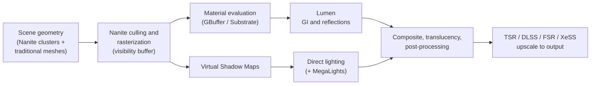
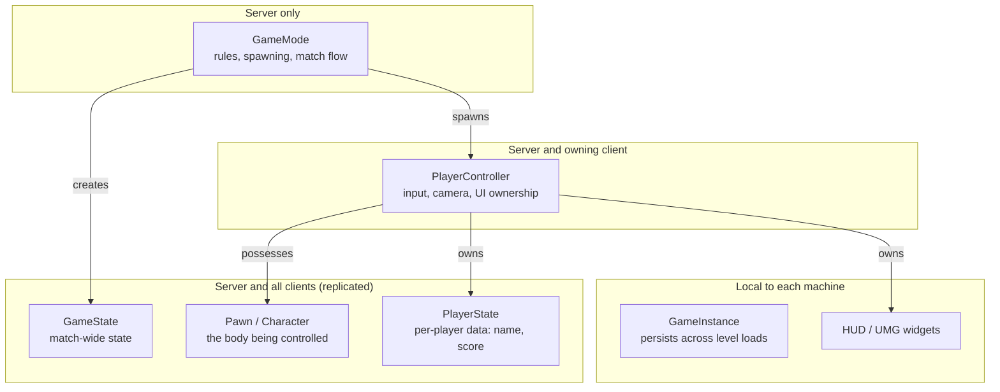
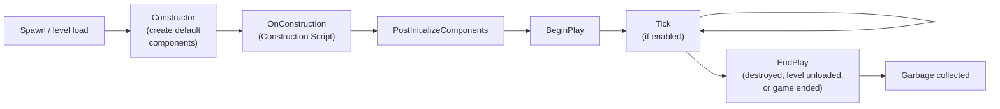
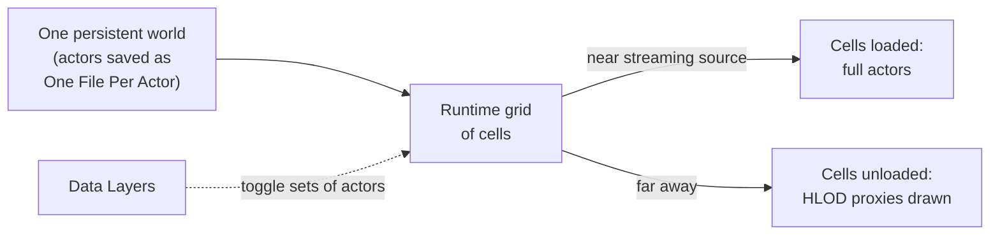
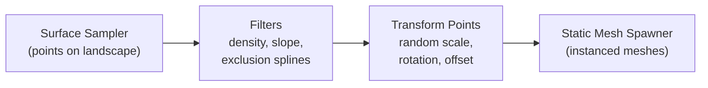
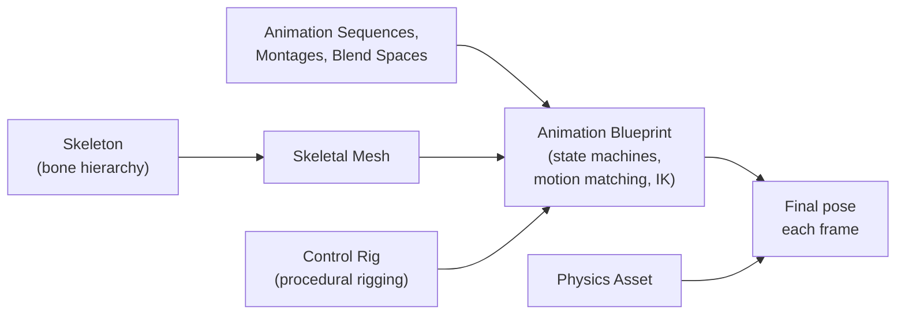

**Unreal Engine** is Epic Games' real-time 3D engine and editor. It is used for games from indie titles to large open worlds, and outside games for film and television virtual production, architectural visualization, automotive design, and simulation. The current generation, **Unreal Engine 5** (UE5), was released in April 2022; the latest version as of September 2026 is **UE 5.8** (June 2026). UE5's defining technologies are **Nanite** virtualized geometry, **Lumen** dynamic global illumination, **Virtual Shadow Maps**, and **World Partition** streaming. Together they remove the manual level-of-detail authoring and lightmap baking that dominated UE4 production. Gameplay is written in C++ and the **Blueprint** visual scripting language. Epic announced **Unreal Engine 6** in May 2026 and targets early access in late 2027.

This page covers UE5 from the renderer through the gameplay framework, scripting, content tools, networking, and performance.

<div class="notice--info" markdown="1">
**Scope.** This is an Unreal-specific reference. Engine-agnostic foundations (the game loop, state machines, ECS versus object-oriented design) are in the [Game Development hub](../gamedev/); [Audio Design](../gamedev/audio-design.html), [Multiplayer Networking](../gamedev/multiplayer-networking.html), and [AI in Games](../ai-ml/game-ai.html) cover their topics independently of any engine; and [3D Graphics & Rendering](../graphics/3d-rendering.html) covers the rendering theory behind Nanite and Lumen. This page describes how Unreal implements those ideas.
</div>

## Versions and licensing

### Release history

Epic ships roughly two feature releases a year. Features move through three maturity levels: **Experimental** (for evaluation; may change or be removed), **Beta** (stable API, not yet proven in large productions), and **Production-Ready**.

| Version | Released | Notable additions |
|---------|----------|-------------------|
| 5.0 | April 2022 | Nanite, Lumen, Virtual Shadow Maps, World Partition, MetaSounds, Temporal Super Resolution; Chaos replaces PhysX |
| 5.1 | November 2022 | Nanite support for masked materials and World Position Offset (enables Nanite foliage); Lumen and Nanite at 60 fps on current consoles |
| 5.2 | May 2023 | Procedural Content Generation (PCG) framework and Substrate materials (both Experimental) |
| 5.3 | September 2023 | Sparse volume textures, Skeletal Editor, continued PCG and Lumen work |
| 5.4 | April 2024 | Motion Matching, Nanite Tessellation (Experimental), faster rendering and cooking |
| 5.5 | November 2024 | MegaLights (Experimental), Substrate to Beta, Path Tracer and Choosers Production-Ready, animation authoring in Sequencer, Mobile Forward renderer improvements |
| 5.6 | June 2025 | In-editor MetaHuman Creator, faster hardware-ray-traced Lumen for 60 Hz on consoles, Fast Geometry Streaming (Experimental) |
| 5.7 | November 2025 | Substrate and PCG Production-Ready, Nanite Foliage (Experimental), MegaLights to Beta |
| 5.8 | June 2026 | MegaLights, Iris replication, Movie Render Graph, Mutable, and Chaos Cloth Production-Ready; Lumen Lite (Beta); Mesh Terrain, Substrate toon shading, and an editor MCP server (Experimental) |

Feature status changes between releases, so always check the release notes and the Experimental/Beta feature lists for the exact version a project targets.

### Licensing

The engine is free to download and its C++ source is available on GitHub to anyone who links a GitHub account to an Epic account.

| Use | Terms |
|-----|-------|
| Games and other interactive products sold to end users | 5% royalty on lifetime gross revenue above US$1 million per product. Revenue through the Epic Games Store is exempt, and since 2025 the rate is 3.5% for games that also launch on the Epic Games Store. |
| Non-game use (film, visualization, training) by companies with over US$1 million in annual revenue | Per-seat subscription, US$1,850 per seat per year (introduced April 2024) |
| Students, educators, hobbyists, and companies under US$1 million revenue | Free |

Assets are distributed through **Fab**, Epic's unified marketplace, launched in October 2024. It replaced the Unreal Engine Marketplace and absorbed the Sketchfab store, the ArtStation Marketplace, and Quixel's Megascans photogrammetry library.

### System requirements

For UE 5.8 on Windows, Epic recommends Windows 11, a quad-core 2.5 GHz or faster CPU, 32 GB of RAM, and a DirectX 12 GPU with 8 GB or more of VRAM. Hardware-accelerated Lumen and ray tracing need a GPU with ray-tracing support and Shader Model 6 (NVIDIA RTX 2000 series, AMD RX 6000 series, Intel Arc A-series, or newer). C++ development on Windows uses Visual Studio 2022 17.14 or later (Visual Studio 2026 is supported) or JetBrains Rider. macOS and Linux are supported as editor hosts with their own toolchain requirements. Plan for well over 100 GB of fast SSD space for the engine, derived data cache, and project.

Engine versions are installed through the Epic Games Launcher, or built from source for studios that modify the engine.

## Rendering

UE5's renderer is built around a few cooperating systems. Nanite decides which triangles to draw; Virtual Shadow Maps and Lumen use Nanite's output for shadows and indirect light; MegaLights handles many shadowed local lights; and Temporal Super Resolution reconstructs a full-resolution image from a lower-resolution render.



### Nanite virtualized geometry

Nanite renders very dense meshes without hand-made level-of-detail (LOD) models. At import it splits a mesh into clusters of up to 128 triangles and builds a hierarchy in which groups of detailed clusters are replaced by simplified parent clusters. Each frame a GPU compute pass traverses this hierarchy, culls clusters that are off-screen or occluded, and selects detail so that triangles are roughly pixel-sized. Adjacent clusters at different detail levels are stitched without cracks. Small triangles are rasterized in a compute shader, which is faster than the hardware rasterizer for pixel-sized triangles; large ones go through the hardware path. Compressed geometry streams from disk on demand, so memory stays bounded.

The practical results:

- **Source-quality assets.** Photogrammetry scans, ZBrush sculpts, and CAD data can be used directly, without a manual LOD chain or baked normal maps for detail.
- **Cost tracks screen resolution, not triangle count.** Two versions of a statue with 1 million and 10 million triangles cost about the same when they cover the same pixels.
- **Instancing at scale.** Many instances of Nanite meshes are cheap, which suits kitbashed environments.

Nanite initially supported only rigid, opaque static meshes. Later releases added masked materials and World Position Offset (5.1), displacement through **Nanite Tessellation** (5.4, Experimental), skinned (skeletal) meshes, and dense foliage through **Nanite Foliage** (5.7, Experimental). Translucent materials still render through the traditional path. Nanite also expects a GPU with modern features; mobile platforms use traditional meshes.

### Lumen global illumination and reflections

Lumen computes diffuse indirect lighting (bounce light) and reflections every frame, so lighting responds immediately to moving objects, opening doors, and time-of-day changes without a lightmap bake.

- **Software ray tracing** traces against signed distance fields of the scene's meshes. It runs on any GPU that meets UE5's requirements, at lower precision.
- **Hardware ray tracing** traces against the triangle geometry using the GPU's ray-tracing units. It is more accurate, supports skinned meshes, and gives sharper reflections; since 5.6 it is efficient enough for 60 Hz targets on current consoles.
- A **surface cache** stores lighting on simplified cards around each mesh so that rays can look up lighting instead of re-evaluating materials.
- **Lumen Lite** (5.8, Beta) is a medium-quality mode based on irradiance fields with probe occlusion. Epic reports it as about twice as fast as Lumen's high-quality mode, and it is the default on current-generation handheld consoles.

Lumen's cost is significant. Projects targeting mobile or low-end PCs, or with fully static scenes, often still use baked lighting through **GPU Lightmass**.

### Shadows and many-light rendering

**Virtual Shadow Maps (VSM)** give each light a very large virtual shadow map (16k × 16k texels) that is allocated and rendered only where visible surfaces need it. This replaces cascaded shadow maps, removing cascade transitions and giving consistent detail for Nanite geometry. VSMs cache pages between frames, so static geometry is not re-rendered every frame.

**MegaLights** (Experimental in 5.5, Beta in 5.7, Production-Ready in 5.8) makes the cost of shadowed local lights roughly independent of their number. Instead of evaluating every light at every pixel, it stochastically samples a small number of important lights per pixel, traces shadow rays for them, and denoises the result. This allows hundreds of shadow-casting point, spot, and textured area lights in a scene.

### Upscaling and anti-aliasing

**Temporal Super Resolution (TSR)** is Unreal's built-in temporal upscaler and the default anti-aliasing method. It renders at a lower internal resolution, reprojects previous frames using motion vectors, and reconstructs a full-resolution image. TSR runs on any supported GPU. Vendor upscalers and frame generation (NVIDIA DLSS, AMD FSR, Intel XeSS) are available as plugins. Temporal methods can soften fine detail and produce ghosting on fast motion; this is one of the most common criticisms of UE5 image quality and should be tuned per project.

### Materials

A **material** defines how a surface responds to light. Materials are authored as node graphs in the **Material Editor** and compiled to shaders for each platform and feature combination. Unreal uses a physically based rendering (PBR) model:

| Input | Controls | Typical source |
|-------|----------|----------------|
| Base Color | Albedo (surface color without lighting) | Color texture |
| Metallic | Metal (1) or dielectric (0) | Mask channel |
| Roughness | Microsurface roughness: 0 is a mirror, 1 is fully diffuse | Mask channel |
| Normal | Fine surface detail without extra geometry | Normal map |
| Emissive | Light emitted by the surface | Emissive texture |
| Ambient Occlusion | Small-scale occlusion in crevices | Mask channel |

Common practice is to pack single-channel masks (for example roughness, metallic, and ambient occlusion) into the channels of one texture, and to create a **parent material** with exposed parameters from which many **Material Instances** are derived. Instances change parameter values without creating new shaders, which keeps both iteration time and shader count down. Uncontrolled static switches and material permutations are a leading cause of long shader compile times and large shader caches.

**Substrate** (Experimental in 5.2, Beta in 5.5, Production-Ready in 5.7) replaces the fixed list of shading models (Default Lit, Clear Coat, Subsurface, and so on) with composable material layers called slabs. It can express surfaces the legacy models cannot, such as coated metal with thin-film iridescence or layered car paint, and 5.8 adds measured-material import (X-Rite AxF) and experimental toon shading. New projects should evaluate Substrate; existing projects can convert legacy materials automatically but should budget time to check cost and appearance.

### Lighting

Light types describe the shape of emission; **mobility** determines how the light is computed.

| Light | Emission | Typical use |
|-------|----------|-------------|
| Directional | Parallel rays from infinitely far away | Sun or moon; usually one per scene |
| Sky Light | Captured or HDRI environment | Ambient fill and sky contribution to GI |
| Point | All directions from a point | Bulbs, torches |
| Spot | A cone | Flashlights, stage lights |
| Rect | A rectangular area | Windows, screens, softboxes |

| Mobility | Behavior | Cost |
|----------|----------|------|
| Static | Fully baked into lightmaps; cannot change at runtime | Cheapest at runtime; needs a bake |
| Stationary | Indirect light baked; direct light and shadows dynamic | Medium |
| Movable | Fully dynamic; with Lumen, indirect light is dynamic too | Highest; the default workflow with Lumen |

With Lumen, the usual setup is a directional light, a sky light, and a Sky Atmosphere with volumetric clouds for exteriors, with local lights left movable.

## Editor and project structure

### The editor

The **Level Editor** is organized around four linked panels: selecting an actor in the viewport or Outliner shows its properties in the Details panel.

| Panel | Shows | Used to |
|-------|-------|---------|
| Viewport | The level in 3D | Navigate; place, transform, and preview actors; play in editor |
| Content Browser | Every asset in the project | Import, organize, and drag assets into the level |
| Outliner | The actors in the current level, hierarchically | Select, group, and filter actors; manage Data Layers |
| Details | Properties of the selected actor and its components | Edit transforms, components, and exposed variables |

Other editors open for specific asset types: the Blueprint Editor, Material Editor, Niagara editor, Animation and Control Rig editors, the Sequencer cinematic timeline, and the MetaSound editor. **Modeling Mode** provides in-editor polygon modeling, UV, and mesh-repair tools for blockouts and fixes that would otherwise need a round trip to a DCC tool.

### Project templates

New projects start from a template (First Person, Third Person, Top Down, Vehicle, Virtual Reality, or film, architecture, and automotive templates) as either a **Blueprint** or **C++** project. C++ can be added to a Blueprint project at any time, so the choice is not permanent. The target platform and quality preset set default scalability: the Maximum preset enables Lumen, Nanite, and Virtual Shadow Maps, and the Scalable preset targets lower-end hardware. **Lyra** is Epic's sample project demonstrating current practice for a full game (modular gameplay features, the Gameplay Ability System, Common UI, and Enhanced Input).

### Modules, plugins, and builds

A project consists of **modules** (units of C++ code with a `.Build.cs` file listing dependencies) and **plugins** (packages of modules and content that can be enabled per project). **Unreal Build Tool** compiles modules and **Unreal Header Tool** generates the reflection code for `UCLASS`, `UPROPERTY`, and `UFUNCTION` declarations. Assets are converted to platform formats by **cooking** and packaged into IoStore container files. The **Zen** storage server (production-ready as a shared derived-data cache since 5.5) and **Unreal Build Accelerator** speed up builds for teams, and **Incremental Cooking** (Beta) recooks only changed assets. **Horde** is Epic's continuous-integration and remote-execution system.

## The gameplay framework

### Actors and components

Everything placed in a level is an **Actor** (`AActor`). An actor's behavior and appearance come from **components** (`UActorComponent`, or `USceneComponent` when it has a transform): a Static Mesh Component renders geometry, a Capsule Component provides collision, a Camera Component provides a view, a Character Movement Component implements walking, swimming, and flying. Scene components form an attachment hierarchy under the actor's root component. Composition, rather than deep inheritance, is the main way behavior is reused.

All engine objects derive from `UObject`, which provides reflection, serialization, garbage collection, and Blueprint exposure. Objects are referenced through `TObjectPtr` or `UPROPERTY` members so that the garbage collector can see them.

### Framework classes

The engine defines a fixed set of classes that give each gameplay responsibility a home. Where each class exists matters in multiplayer:



| Class | Responsibility | Exists on |
|-------|----------------|-----------|
| GameMode | Rules of the match: spawning, scoring, win conditions | Server only |
| GameState | Match-wide state that clients need (time remaining, team scores) | Server and all clients |
| PlayerController | A player's will: input handling, camera, possession | Server and owning client |
| PlayerState | Per-player state visible to everyone (name, score, team) | Server and all clients |
| Pawn / Character | The possessed body in the world; Character adds a capsule, skeletal mesh, and movement | Server and relevant clients |
| GameInstance | State that survives level changes (settings, session info) | Each machine |
| Subsystems | Auto-instanced singletons scoped to the engine, editor, game instance, world, or local player | Depends on scope |

**Subsystems** (`UGameInstanceSubsystem`, `UWorldSubsystem`, and so on) are the recommended place for global services such as save management, analytics, or quest tracking, instead of global variables or bloated GameInstance classes.

### Actor lifecycle



The constructor runs for the class default object as well as for each instance, so it should only set defaults and create components. Gameplay logic that touches other actors belongs in `BeginPlay`.

### Input

**Enhanced Input** is the input system in UE5; the legacy action and axis mappings are deprecated. Input Actions describe what the player can do (Jump, Move, Look), Input Mapping Contexts bind keys and controller buttons to those actions, and contexts can be added or removed at runtime (for example, a vehicle context while driving). Modifiers and triggers handle dead zones, axis swizzling, hold, tap, and chorded inputs. UE 5.8 unifies Enhanced Input with Common UI's input handling.

### Gameplay Ability System

The **Gameplay Ability System (GAS)** is a framework for abilities, attributes, and effects, used in Fortnite and Lyra. Abilities are replicated, predicted actions (a dash, a spell); attributes are numeric stats (health, stamina); gameplay effects modify attributes instantly, over time, or permanently; and gameplay tags label state (`State.Stunned`, `Ability.Cooldown.Dash`). GAS has a steep learning curve but provides client prediction and replication that would otherwise have to be written by hand.

## Scripting: Blueprints, C++, and Verse

### Choosing a language

| | Blueprints | C++ | Verse |
|---|-----------|-----|-------|
| Form | Visual node graphs | Native code compiled with the engine | Text language with functional-logic semantics |
| Where | All of Unreal Engine | All of Unreal Engine | Unreal Editor for Fortnite today; planned for UE6 |
| Strengths | Fast iteration, accessible to designers, tight editor integration | Performance, full engine access, source control and code review, complex systems | Transactional semantics, concurrency primitives, designed for large shared codebases |
| Weaknesses | VM overhead per node; binary assets are hard to diff and merge; large graphs become unreadable | Slower iteration (compiles, restarts); steeper learning curve | Not available for standalone UE5 projects |

The standard architecture is **C++ for systems, Blueprints for content**: foundational classes, performance-critical code, and data structures are written in C++ and exposed through `UPROPERTY` and `UFUNCTION`, and designers subclass them in Blueprint to wire up specific behavior, tune values, and assign assets. **Blueprint Nativization**, which converted Blueprints to C++ at cook time in UE4, was removed in UE5; move hot paths to C++ by hand instead. **Live Coding** (Ctrl+Alt+F11) patches C++ changes into a running editor for fast iteration on function bodies, though changes to class layouts still need an editor restart.

### A C++ actor exposed to Blueprint

This pickup actor shows the usual pattern: components created in the constructor, properties and events exposed to the editor and Blueprints, and gameplay logic that runs only on the server.

```cpp
// Pickup.h
#pragma once

#include "CoreMinimal.h"
#include "GameFramework/Actor.h"
#include "Pickup.generated.h"

class USphereComponent;
class UStaticMeshComponent;

DECLARE_DYNAMIC_MULTICAST_DELEGATE_OneParam(FOnPickedUp, AActor*, Collector);

UCLASS()
class MYGAME_API APickup : public AActor
{
    GENERATED_BODY()

public:
    APickup();

    // Editable per instance in the Details panel, readable from Blueprints.
    UPROPERTY(EditAnywhere, BlueprintReadOnly, Category = "Pickup")
    float Value = 10.f;

    // An event dispatcher that Blueprints can bind to.
    UPROPERTY(BlueprintAssignable, Category = "Pickup")
    FOnPickedUp OnPickedUp;

protected:
    virtual void BeginPlay() override;

    UPROPERTY(VisibleAnywhere, Category = "Components")
    TObjectPtr<USphereComponent> Trigger;

    UPROPERTY(VisibleAnywhere, Category = "Components")
    TObjectPtr<UStaticMeshComponent> Mesh;

    UFUNCTION()
    void HandleOverlap(UPrimitiveComponent* OverlappedComp, AActor* OtherActor,
                       UPrimitiveComponent* OtherComp, int32 OtherBodyIndex,
                       bool bFromSweep, const FHitResult& SweepResult);
};
```

```cpp
// Pickup.cpp
#include "Pickup.h"
#include "Components/SphereComponent.h"
#include "Components/StaticMeshComponent.h"

APickup::APickup()
{
    PrimaryActorTick.bCanEverTick = false;  // event-driven, so no per-frame cost
    bReplicates = true;

    Trigger = CreateDefaultSubobject<USphereComponent>(TEXT("Trigger"));
    Trigger->InitSphereRadius(64.f);
    RootComponent = Trigger;

    Mesh = CreateDefaultSubobject<UStaticMeshComponent>(TEXT("Mesh"));
    Mesh->SetupAttachment(Trigger);
    Mesh->SetCollisionEnabled(ECollisionEnabled::NoCollision);
}

void APickup::BeginPlay()
{
    Super::BeginPlay();
    Trigger->OnComponentBeginOverlap.AddDynamic(this, &APickup::HandleOverlap);
}

void APickup::HandleOverlap(UPrimitiveComponent*, AActor* OtherActor,
                            UPrimitiveComponent*, int32, bool, const FHitResult&)
{
    if (!HasAuthority() || OtherActor == nullptr)
    {
        return;  // gameplay state changes only on the server
    }
    OnPickedUp.Broadcast(OtherActor);
    Destroy();  // destruction replicates to clients
}
```

A designer can then create a Blueprint subclass of `APickup`, assign a mesh, set `Value`, and bind `OnPickedUp` to play a sound or update the UI, without touching C++.

### Blueprint types

| Type | Purpose |
|------|---------|
| Blueprint Class | A reusable actor or object type (character, weapon, door), usually subclassing a C++ class |
| Level Blueprint | Logic specific to one level (scripted events, triggers). Hard to reuse; prefer actors or level instances |
| Animation Blueprint | Per-character animation logic: state machines, blend spaces, IK |
| Widget Blueprint | User interface built with UMG (Unreal Motion Graphics) |
| Blueprint Interface | A set of function signatures that unrelated Blueprints can implement |
| Blueprint Function Library | Static utility functions callable from any Blueprint |
| Data-only Blueprint | A subclass that only overrides default values |

### Communication between objects

| Mechanism | Coupling | Use when |
|-----------|----------|----------|
| Direct reference and cast | Tight; casting loads the target class | The relationship is fixed (a weapon talking to its owning character) |
| Blueprint Interface | Loose | Many unrelated classes respond to the same message ("Interact", "TakeDamage") |
| Event Dispatcher (multicast delegate) | Loose, one-to-many | Listeners subscribe to an event (a door opened, health changed) |
| Subsystem | Global service | Game-wide managers accessed from anywhere |
| Gameplay Tags and Gameplay Messages | Very loose | Large projects where systems should not know about each other |

A common performance and memory mistake is casting to large Blueprint classes everywhere: each cast creates a hard reference, so loading one asset loads everything it references. Interfaces, soft object references (`TSoftObjectPtr`), and C++ base classes break these chains.

### Blueprint practice

- **Avoid Tick where possible.** Use events, timers, and dispatchers; if a Blueprint must tick, lower its tick interval.
- **Keep graphs small.** Collapse logic into functions and macros; move loops over large arrays and heavy math into C++.
- **Use data assets and tables for content.** Data Tables (imported from CSV or JSON), Primary Data Assets, and Curve Tables keep tunable values out of graphs.
- **Debug with the built-in tools.** Breakpoints and step-through in the Blueprint debugger, watch values, Print String, the **Visual Logger** (records gameplay state for scrubbing afterwards), and the **Gameplay Debugger** (an in-game overlay of AI and ability state).
- **Plan for source control.** Blueprints are binary assets that cannot be merged; use Perforce or Git LFS with file locking, and use the editor's Blueprint diff tool to review changes.

### Verse and the Scene Graph

**Verse** is Epic's programming language, created with Unreal Editor for Fortnite (UEFN) and first shipped there in March 2023. It is a statically typed functional-logic language with built-in concurrency and transactional semantics (failure rolls back effects). Its design team includes Simon Peyton Jones and Lennart Augustsson. The **Scene Graph** is a new entity-and-component model developed alongside it in UEFN. Verse is not available in standalone UE5; Epic has said that Verse and the Scene Graph will eventually replace Blueprints and Actors in Unreal Engine 6, with Blueprints and Actors retained in early UE6 versions.

## World building

### World Partition

**World Partition** replaces UE4's manual sublevel streaming with a single persistent world divided into a grid. At runtime the engine loads cells near streaming sources (usually the player) and unloads distant ones.



- **One File Per Actor (OFPA)** saves each actor in its own file, so several people can edit the same area and source control conflicts are per actor, not per level.
- **Data Layers** group actors that can be loaded or unloaded together, in the editor or at runtime (for example, a quest-dependent version of a village).
- **Hierarchical LODs (HLODs)** are generated proxy meshes that stand in for unloaded cells at a distance.
- **Level Instances** and **Packed Level Actors** let a group of actors be authored once and placed many times.

Large open worlds must also manage **traversal stutter**, frame-time spikes caused by loading and initializing actors as the player moves; see [Performance and profiling](#performance-and-profiling).

### Landscape and terrain

The **Landscape** system provides heightmap terrain with non-destructive edit layers, sculpting and painting tools, landscape splines for roads and rivers, and runtime virtual texturing to blend terrain materials efficiently. The **Water** plugin adds oceans, lakes, and rivers that shape the landscape and interact with buoyancy. **Mesh Terrain** (5.8, Experimental) is a next-generation mesh-based terrain system intended to support overhangs, caves, and other shapes a heightmap cannot represent.

### Procedural Content Generation (PCG)

The **PCG framework** (Experimental in 5.2, Production-Ready in 5.7) generates content from rule graphs rather than manual placement. A typical scattering graph samples points on a surface, filters them by density, slope, height, or distance to splines, randomizes transforms, and spawns meshes or actors at the surviving points:



Graphs can be regenerated in the editor when their inputs change or executed at runtime around the player (**PCG runtime generation**), and can use GPU execution for large point counts. Graphs are reusable across levels, and subgraphs package common steps. UE 5.8 adds non-destructive manual edits on top of generated results. The **Procedural Vegetation Editor** (Experimental) generates tree and plant meshes, including Nanite foliage, inside the engine.

## Animation and characters

Character animation flows through a chain of assets:



| Asset or system | Role |
|-----------------|------|
| Skeleton and Skeletal Mesh | The bone hierarchy and the mesh skinned to it |
| Animation Sequence | A single clip (idle, run, jump) |
| Animation Montage | A clip with sections and notifies, triggered from gameplay (attacks, reloads) |
| Blend Space | Blends clips over one or two parameters, such as speed and direction |
| Animation Blueprint | Runtime logic that selects and blends animations each frame |
| Control Rig | Node-based rigging and procedural animation in engine; also used to animate in Sequencer |
| IK Rig and IK Retargeter | Retarget animations between skeletons with different proportions |
| Physics Asset | Collision bodies per bone for ragdolls and physical reactions |

**Motion Matching** (introduced in 5.4) replaces much of a hand-built state machine with a search: each frame it finds the pose in an animation database whose pose and future trajectory best match the character's current state and desired movement, producing natural transitions without authoring every blend. **Choosers** (Production-Ready in 5.5) select assets from tables of conditions. Animators can also keyframe directly in the editor using Control Rig and Sequencer's animation mode, reducing round trips to external DCC tools.

**MetaHuman** creates realistic digital humans with facial rigs. Since 5.6, **MetaHuman Creator** runs inside the editor, and **MetaHuman Animator** captures facial performance from video, including from a single camera. **Mutable** (Production-Ready in 5.8) generates customizable skeletal meshes, materials, and textures at runtime for character creators.

## Visual effects: Niagara

**Niagara** is Unreal's particle and simulation system; it replaced the older Cascade system.

| Concept | Role |
|---------|------|
| System | A complete effect placed in the world (an explosion) |
| Emitter | One particle source within a system (debris, smoke, sparks) |
| Module | A stackable script on an emitter (spawn rate, initial velocity, gravity, color over life, collision) |
| Parameter | A value passed in from gameplay or between emitters |

Emitters can simulate on the CPU or GPU; GPU simulation handles millions of particles. Effects can sample scene depth, collide with geometry, read skeletal meshes, and receive events from gameplay through **Niagara Data Channels**. **Niagara Fluids** provides grid-based 2D and 3D fluid simulation for smoke, fire, and water effects.

## Audio: MetaSounds

The general theory of game audio (buses, attenuation, occlusion, the listener model, adaptive music) is covered in [Audio Design](../gamedev/audio-design.html). In Unreal, that theory is implemented through **Sound Waves** (imported audio), **Sound Cues** (legacy node graphs for simple randomization and mixing), and **MetaSounds**.

**MetaSounds** are node-based digital signal processing graphs that run on the audio render thread with sample-accurate timing. A MetaSound can synthesize sound (oscillators, filters, envelopes) and manipulate samples, driven by parameters set from Blueprint or C++:

- An engine sound whose pitch and timbre follow RPM continuously, instead of crossfading recorded loops.
- Footsteps and weapon sounds that vary procedurally from a few samples, reducing the memory budget.
- Presets that inherit a MetaSound graph and override only exposed parameters, in the same way as Material Instances.

MetaSounds are the recommended choice for new audio work; Sound Cues remain adequate for basic playback. Related systems include **Quartz** (a sample-accurate musical clock for quantizing gameplay events to the beat), **Audio Modulation** (control buses for mixing and ducking), **Submixes** for bus routing and effects, and **Audio Insights** (Production-Ready in 5.8) for profiling and debugging audio.

Sounds are placed in the world through an **Audio Component** on an actor, with an **Attenuation** asset defining distance falloff, spatialization (including HRTF binaural plugins), occlusion, and reverb sends.

## Physics: Chaos

**Chaos** is Unreal's physics engine and has been the default since UE 5.0, replacing NVIDIA PhysX.

| Feature | Description |
|---------|-------------|
| Rigid bodies and collision | Core simulation for physics-driven actors and ragdolls |
| Chaos Destruction | Geometry Collections pre-fractured into hierarchical pieces that break under strain, with caching for cinematic destruction |
| Chaos Vehicles | Wheeled vehicle simulation with suspension, tire, and drivetrain models; 5.8 adds a Modular Vehicle system built from components |
| Chaos Cloth | Cloth simulation for characters; Production-Ready in 5.8, with the Panel Cloth editor for authoring garments |
| Chaos Flesh | Finite-element simulation of soft tissue deformation |
| Physics Control | Physically driven animation that blends simulation with animated targets |
| Networked physics | Replication modes for physics objects, including predictive interpolation and resimulation |

## Networking and multiplayer

Unreal uses an **authoritative server** model. The server owns the game state, and **replication** sends changes to clients.

- **Actor replication** sends actors and their replicated properties (`UPROPERTY(Replicated)` or `ReplicatedUsing` to trigger a callback on change) to clients for which the actor is relevant.
- **Remote procedure calls** (`UFUNCTION(Server)`, `Client`, `NetMulticast`) send function calls across the network, reliably or unreliably.
- **Ownership and roles** (`HasAuthority()`, local role and remote role) determine which machine may run which logic.
- **Relevancy and priority** limit what each client receives, and **dormancy** stops checking actors that rarely change.
- **Character Movement Component** and the newer **Mover** plugin provide client-side movement prediction with server correction.

**Iris** is the new replication system, designed for higher player and object counts with less CPU cost per connection. It is Production-Ready in 5.8 and integrates with the Scene Graph. The engine-agnostic techniques behind all of this (prediction, reconciliation, lag compensation, interest management) are covered in [Multiplayer Networking](../gamedev/multiplayer-networking.html).

## Performance and profiling

UE5 games are frequently criticized for two kinds of hitching: **shader compilation stutter** (a pipeline state object is compiled the first time a material and mesh combination is drawn) and **traversal stutter** (actors are loaded and initialized as the player moves through a streamed world). Both are addressable but need deliberate work.

| Tool or technique | Purpose |
|-------------------|---------|
| `stat unit`, `stat fps`, `stat gpu` | Quick on-screen frame, game thread, render thread, and GPU timings |
| Unreal Insights | Timeline profiler for CPU, GPU, memory, loading, and networking; the main profiling tool |
| GPU Visualizer (`ProfileGPU`) and RenderDoc or PIX | Per-pass GPU cost and draw inspection |
| Nanite, Lumen, and VSM visualization modes | Show overdraw, cluster counts, cache misses, and shadow page use |
| PSO precaching and bundled PSO caches | Compile shader pipelines ahead of first use to reduce stutter |
| Scalability settings and device profiles | Quality tiers per platform and user setting |
| Significance Manager, tick intervals, and object pooling | Reduce game-thread cost for many actors |
| Mass Entity | Data-oriented framework for simulating thousands of agents (crowds, traffic) |
| Size Map and Reference Viewer | Find hard references that inflate memory and load times |

Profile on target hardware in packaged (Test or Shipping) builds; editor timings are not representative. General techniques are covered in [Performance Optimization](../optimization/) and [GPU Optimization](../optimization/gpu-optimization.html).

## Platforms and industries

Unreal targets Windows, macOS, Linux, iOS, Android, PlayStation 5, Xbox Series X|S, Nintendo platforms, and XR headsets through OpenXR. Mobile and standalone VR typically use the forward renderer without Nanite and Lumen; the **Mobile Forward** renderer is being brought to feature parity with the desktop forward renderer for PC VR.

| Industry | Unreal features used |
|----------|---------------------|
| Film and television | In-camera VFX on LED volumes with nDisplay, Live Link camera tracking, Sequencer, Movie Render Graph (Production-Ready in 5.8), Path Tracer (Production-Ready in 5.5), USD interchange |
| Architecture and design | Datasmith and Interchange import from CAD and BIM tools, Twinmotion, path-traced stills, VR reviews |
| Automotive | Real-time configurators with hardware ray tracing, HMI prototyping, driving simulation |
| Simulation and training | Geospatial data through Cesium, Pixel Streaming for browser delivery, Learning Agents for reinforcement-learning-based AI |

### AI tooling in the editor

UE 5.8 adds an experimental **Unreal MCP** plugin, a Model Context Protocol server that lets agentic AI tools inspect a project and create assets or systems in the editor. The **Neural Network Engine (NNE)** runs trained models (for example, ML deformers for muscle and cloth deformation) at runtime, and **Learning Agents** trains game agents with reinforcement and imitation learning.

## Unreal Engine 6

Epic announced **Unreal Engine 6** on May 24, 2026, with *Rocket League* as the first announced title to move to it. Details given at the State of Unreal 2026:

- UE6 merges Unreal Engine and Unreal Editor for Fortnite into one toolchain.
- **Verse** and the **Scene Graph** are intended to eventually replace Blueprints and Actors; early UE6 versions retain both.
- Early access is targeted for "late 2027-ish", with a full release roughly 12 to 18 months after that.

UE5 remains the engine for projects shipping before then. Designing gameplay around components, data assets, and clean C++ interfaces, rather than large monolithic Blueprints, is the most practical way to prepare a UE5 codebase for the transition.

## Resources

- [Unreal Engine documentation](https://dev.epicgames.com/documentation/en-us/unreal-engine) — reference, release notes, and feature status lists for each version
- [Epic Developer Community](https://dev.epicgames.com/community/) — tutorials, courses, and learning paths
- [Unreal Engine public roadmap](https://portal.productboard.com/epicgames/) — planned and in-progress features
- *Nanite: A Deep Dive* (Brian Karis, SIGGRAPH 2021 Advances in Real-Time Rendering course) — the design of Nanite in detail

## See also

- [Game Development hub](../gamedev/) — engine-agnostic foundations: the game loop, ECS versus object-oriented design, state machines
- [Multiplayer Networking](../gamedev/multiplayer-networking.html) — prediction, reconciliation, and lag compensation behind Unreal's replication
- [Audio Design](../gamedev/audio-design.html) — the theory behind MetaSounds: mixing, attenuation, occlusion, adaptive music
- [AI in Games](../ai-ml/game-ai.html) — pathfinding, behavior trees, and decision-making that Unreal's Behavior Trees, State Tree, and Smart Objects implement
- [3D Graphics & Rendering](../graphics/3d-rendering.html) — the rendering pipeline, global illumination, and virtual shadow maps in general terms
- [Shaders](../graphics/shaders.html) — how material graphs become GPU programs
- [Virtual Reality](../vr-ar/) — VR and AR development
- [Performance Optimization](../optimization/) — profiling and optimization techniques
