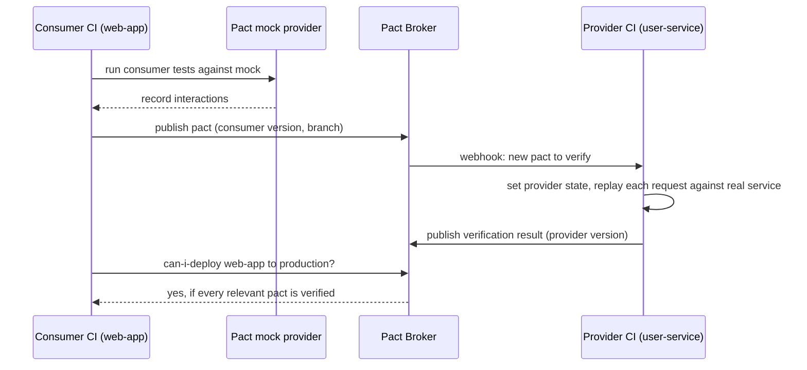
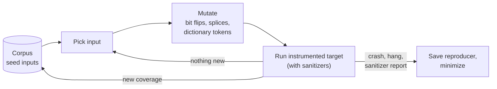
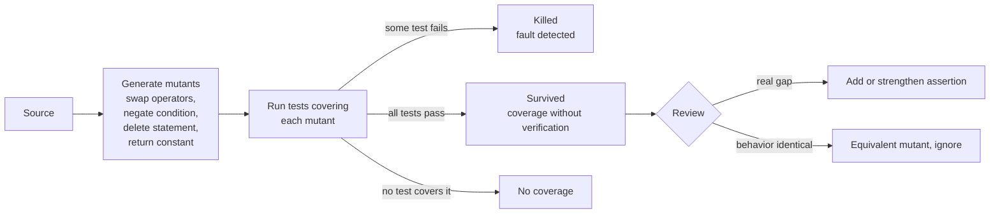
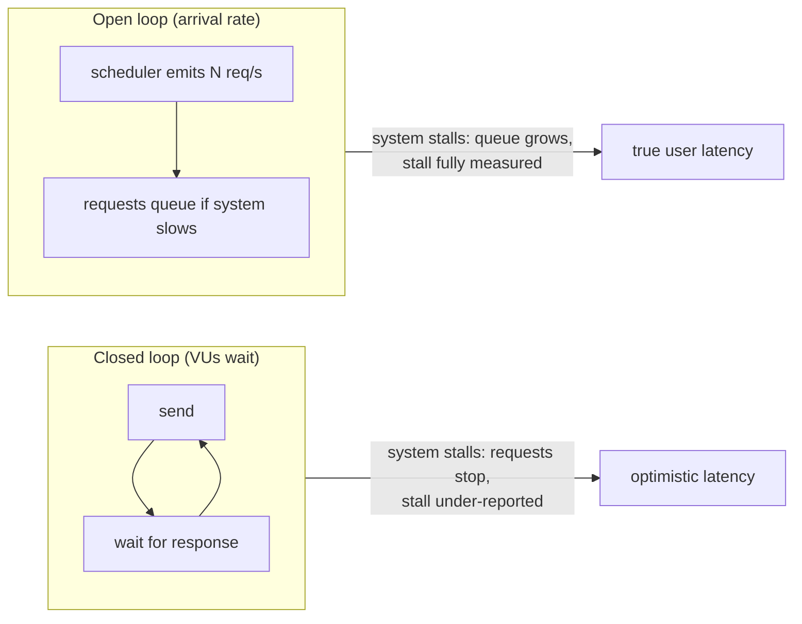
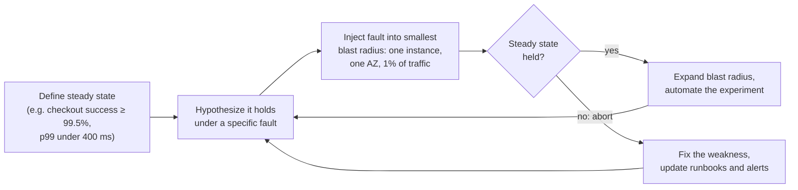
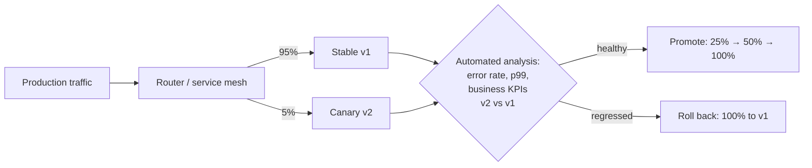

[Testing Hub](./) &raquo; Advanced Strategies

Once a codebase has solid example-based [unit and integration tests](unit-and-integration.html), the remaining bugs are harder to reach: they live in inputs nobody thought to write down, in the boundary between two services that each pass their own tests, in tail latency at saturation, in failure modes that never occur in CI, or in the tests themselves. This page covers the techniques aimed at those bugs — **contract testing**, **property-based testing**, **fuzzing**, **mutation testing**, **end-to-end and snapshot testing**, **load and performance testing**, **chaos engineering**, **testing in production**, and **AI-assisted test generation** — with what each catches, how it works, and current tooling.

## Table of contents
{: .no_toc .text-delta }

1. TOC
{:toc}

---

## Where These Techniques Fit

Example tests check individual *points* in a program's behavior. The techniques here check *regions* of the input space, *boundaries* between deployables, *the quality of the suite itself*, and *operating conditions* that cannot be reproduced in CI.

| Axis | Question | Techniques |
|------|----------|------------|
| Input space | Which inputs break the code? | Property-based testing, fuzzing |
| Test quality | Would the suite notice a bug? | Mutation testing |
| Service boundaries | Do independently deployed services still agree? | Contract testing |
| Whole system | Does the assembled product work, and did its output change? | End-to-end, snapshot, visual regression |
| Stress | What happens at peak load and in the tail? | Load, stress, spike, soak testing |
| Failure | What happens when infrastructure breaks? | Chaos engineering |
| Reality | Does it work on real traffic and data? | Feature flags, canaries, shadow traffic |

---

## Contract Testing

When services are deployed independently, a test that runs the real consumer against the real provider is slow, flaky, and pushes teams toward lock-step releases. **Contract testing** replaces it with two fast, independent checks against a shared artifact, the **contract**: the consumer verifies it only relies on what the contract describes, and the provider verifies it satisfies the contract. If both pass, the pair is compatible without ever being deployed together in a test.

### Consumer-Driven Contracts (Pact)

**Pact** is the most widely used implementation. In the consumer-driven style, the consumer defines the contract from what it actually uses:



The consumer test uses the `Pact` class (the PactV4 API, current in Pact JS):

```javascript
// Consumer side (Pact JS) — the contract is derived from what the consumer uses
import { Pact, MatchersV3 } from '@pact-foundation/pact';
const { like, eachLike } = MatchersV3;

const provider = new Pact({ consumer: 'web-app', provider: 'user-service' });

it('fetches a user', () =>
  provider
    .addInteraction()
    .given('a user with id 42 exists')              // provider state
    .uponReceiving('a request for user 42')
    .withRequest('GET', '/users/42')
    .willRespondWith(200, (b) => {
      b.headers({ 'Content-Type': 'application/json' });
      // Matchers assert type and shape, not literal values
      b.jsonBody({ id: like(42), name: like('Ada Lovelace'), roles: eachLike('admin') });
    })
    .executeTest(async (mockServer) => {
      const user = await getUser(mockServer.url, 42); // real client code
      expect(user.name).toBe('Ada Lovelace');
    }));
// Produces a pact file: web-app-user-service.json
```

The provider replays the pacts against its running implementation, using **state handlers** to set up each interaction's preconditions:

```javascript
// Provider side (Pact JS)
import { Verifier } from '@pact-foundation/pact';

await new Verifier({
  provider: 'user-service',
  providerBaseUrl: 'http://localhost:8080',
  pactBrokerUrl: 'https://broker.example.com',
  consumerVersionSelectors: [{ mainBranch: true }, { deployedOrReleased: true }],
  stateHandlers: {
    'a user with id 42 exists': () => db.users.insert({ id: 42, name: 'Ada Lovelace', roles: ['admin'] }),
  },
  publishVerificationResult: process.env.CI === 'true',
  providerVersion: process.env.GIT_SHA,
  providerVersionBranch: process.env.GIT_BRANCH,
}).verifyProvider();
```

Key properties:

- **Contracts contain only what consumers use.** The provider can add fields and endpoints freely; only removing or changing something a consumer depends on breaks verification.
- **Matchers, not literals.** `like`, `eachLike`, `regex`, `integer`, and `datetime` assert type and structure. A contract pinned to literal seed data would break on every data change.
- **Consumer version selectors** choose which pacts the provider verifies — typically the consumer's main branch plus whatever is currently deployed or released.

### The Deployment Gate: `can-i-deploy`

The broker records which versions of each application have verified which contracts, and which versions are deployed in each environment. Before deploying, a pipeline asks whether the new version is compatible with everything already there:

```bash
pact-broker can-i-deploy \
  --pacticipant user-service --version "$GIT_SHA" \
  --to-environment production
# non-zero exit blocks the deploy if any contract with a deployed consumer is unverified or failing
pact-broker record-deployment \
  --pacticipant user-service --version "$GIT_SHA" --environment production
```

### Provider-Driven and Schema-Based Contracts

In **bi-directional** (schema-based) contract testing, supported by PactFlow, the provider publishes its OpenAPI document along with evidence that its implementation conforms to it, consumers publish their pacts, and the broker checks that each pact is a compatible subset of the schema. This scales to providers with many consumers and an existing spec, at the cost of verifying the *documented* surface rather than behavior in specific provider states. For gRPC and GraphQL, schema-compatibility checkers (such as `buf breaking` for Protobuf) cover much of the same ground. Contract testing complements the [API design](../api-design/) discipline of versioning and additive change; it does not replace it.

---

## Property-Based Testing

An example-based test asserts that one input produces one output. A **property-based test** (PBT) states a property that must hold for *all* inputs in a domain, and a framework generates hundreds of inputs trying to falsify it. The change in mindset is from "for 3, the output is 9" to "for every list, sorting preserves length and yields ascending order."

### Finding Properties

The hard part is stating properties. Reusable patterns:

| Pattern | Form | Examples |
|---------|------|----------|
| Round trip | `decode(encode(x)) == x` | Serialization, compression, parsers and printers |
| Invariant | Some fact about the output holds for any input | Sorting preserves length and multiset of elements; a balanced tree stays balanced |
| Idempotence | `f(f(x)) == f(x)` | Normalization, deduplication, formatting, `PUT` handlers |
| Oracle / model | `fast(x) == reference(x)` | Optimized implementation vs. a simple, obviously correct one |
| Metamorphic | A relation between outputs for related inputs | Adding a filter never *adds* search results; permuting rows doesn't change an aggregate |
| Algebraic | Commutativity, associativity, identity | Merge functions, CRDTs, set operations |

Metamorphic properties are especially useful when no oracle exists — numerical code, search ranking, ML models — because they relate outputs to each other instead of to a known right answer.

### Hypothesis (Python)

```python
import json
from hypothesis import given, strategies as st

@given(st.lists(st.integers()))
def test_json_roundtrip(xs):
    assert json.loads(json.dumps(xs)) == xs

@given(st.lists(st.integers()))
def test_sort_properties(xs):
    s = sorted(xs)
    assert len(s) == len(xs)                       # invariant
    assert all(a <= b for a, b in zip(s, s[1:]))   # ordered
    assert sorted(s) == s                          # idempotent

@st.composite
def users(draw):
    return User(id=draw(st.integers(min_value=1)),
                name=draw(st.text(min_size=1)),
                age=draw(st.integers(min_value=0, max_value=130)))

@given(users())
def test_user_serialization_roundtrip(u):
    assert User.from_dict(u.to_dict()) == u
```

Hypothesis stores every failing example in a local database and replays it first on the next run, so a found bug stays reproduced until fixed.

### Shrinking

A randomly found counterexample is usually large and noisy. **Shrinking** repeatedly simplifies the failing input — dropping list elements, moving numbers toward zero, shortening strings — while the property still fails, then reports the minimal case. "Fails on some 200-element list" becomes "fails on `[0, -1]`." Shrinking is what makes PBT output actionable.

### Stateful (Model-Based) Testing

Stateful PBT generates *sequences of operations* against a system and an executable model, and checks they agree after every step. It finds bugs that need a specific history to trigger — the classic case being a cache or a storage engine that misbehaves only after a particular interleaving of writes, deletes, and compactions.

```python
from hypothesis.stateful import RuleBasedStateMachine, rule, invariant
from hypothesis import strategies as st

class KVStoreMachine(RuleBasedStateMachine):
    def __init__(self):
        super().__init__()
        self.real = KVStore()     # system under test
        self.model = {}           # obviously correct model

    @rule(k=st.text(), v=st.integers())
    def put(self, k, v):
        self.real.put(k, v)
        self.model[k] = v

    @rule(k=st.text())
    def delete(self, k):
        self.real.delete(k)
        self.model.pop(k, None)

    @invariant()
    def agrees_with_model(self):
        assert dict(self.real.items()) == self.model

TestKVStore = KVStoreMachine.TestCase
```

### Frameworks

PBT began with **QuickCheck** for Haskell (Claessen and Hughes, 2000), where types derive generators almost for free:

```haskell
prop_reverseInvolution :: [Int] -> Bool
prop_reverseInvolution xs = reverse (reverse xs) == xs
-- quickCheck prop_reverseInvolution  ==>  +++ OK, passed 100 tests.
```

| Language | Libraries |
|----------|-----------|
| Python | Hypothesis |
| JavaScript / TypeScript | fast-check |
| Java / Kotlin | jqwik, Kotest property testing |
| Rust | proptest, quickcheck |
| Go | `rapid`, gopter |
| Scala / .NET / Erlang | ScalaCheck, FsCheck / CsCheck, PropEr |

Stateful PBT applied to distributed systems — with simulated networks and injected faults — is covered in [Testing Distributed Systems](../distributed-systems/testing-distributed-systems.html#property-based-testing).

---

## Fuzzing

**Fuzzing** feeds a program large volumes of generated, often malformed input and watches for crashes, hangs, memory-safety violations, and failed assertions. Where property-based tests usually target logical properties with hand-written generators, fuzzers target *robustness* and generate inputs largely automatically, evolving them toward unexplored code.

### Coverage-Guided Fuzzing

Modern fuzzers instrument the target to record which branches each input reaches, and keep inputs that reach new code as seeds for further mutation:



Over millions of executions this feedback loop steers generation deep into parsers and state machines, producing inputs no human would write. Go has this built into its toolchain:

```go
// go test -fuzz=FuzzParseConfig -fuzztime=60s
func FuzzParseConfig(f *testing.F) {
    f.Add([]byte("key = value\n"))   // seed corpus
    f.Add([]byte("[section]\n"))
    f.Fuzz(func(t *testing.T, data []byte) {
        cfg, err := ParseConfig(data)
        if err != nil {
            return // rejecting bad input is fine; panicking is the bug
        }
        // Property: anything that parses must survive a round trip
        again, err := ParseConfig(cfg.Marshal())
        if err != nil || !again.Equal(cfg) {
            t.Errorf("round trip failed for %q", data)
        }
    })
}
```

Failing inputs are written to `testdata/fuzz/FuzzParseConfig/` and replayed by plain `go test` as regression tests from then on.

### Sanitizers

Without instrumentation, a fuzzer only notices bugs that crash outright. Compiling the target with **sanitizers** turns silent corruption into immediate, diagnosable failures: **AddressSanitizer** (out-of-bounds access, use-after-free), **UndefinedBehaviorSanitizer** (integer overflow, invalid shifts, misaligned pointers), and **MemorySanitizer** (reads of uninitialized memory). This combination is why fuzzing is a primary technique for finding exploitable bugs in C and C++ code.

### Structure-Aware Fuzzing

Byte-level mutation wastes most executions on inputs that fail the first validity check. **Structure-aware** fuzzers generate inputs that are already syntactically valid — protobuf messages via `libprotobuf-mutator`, typed values via Rust's `arbitrary` crate or libFuzzer's `FuzzedDataProvider`, grammar-based generators for languages — so effort goes into semantic logic. At that point a fuzzer is effectively a coverage-guided property-based tester.

### Tooling

| Tool | Targets | Notes |
|------|---------|-------|
| AFL++ | C/C++, binaries (QEMU / Frida modes) | Actively developed community successor to AFL |
| libFuzzer | C/C++ (in-process, LLVM) | In maintenance mode: bug fixes only; its authors moved to Centipede, now part of Google's FuzzTest |
| FuzzTest | C++ | Google's property-style fuzzing framework integrated with GoogleTest |
| Go native fuzzing | Go | `testing.F`, since Go 1.18 |
| cargo-fuzz | Rust | libFuzzer-based; pairs with `arbitrary` |
| Atheris | Python (and native extensions) | Coverage-guided, libFuzzer-based |
| Jazzer | JVM | Coverage-guided; also detects injection-style bugs |
| OSS-Fuzz / ClusterFuzzLite | Open-source projects / your own CI | Continuous fuzzing infrastructure from Google; ClusterFuzzLite runs in CI |

**OSS-Fuzz** has run continuous fuzzing for over a thousand open-source projects and found many thousands of bugs, a large share of them security vulnerabilities in parsers, codecs, and network stacks. Since 2023 Google has also used LLMs to write new fuzz harnesses for OSS-Fuzz projects, reporting previously unknown vulnerabilities (including one in OpenSSL) in code that existing harnesses did not reach.

---

## Mutation Testing

Coverage says whether a test *executed* a line; it cannot say whether a test would *notice a bug* on that line. **Mutation testing** measures that directly and is the only mainstream technique that grades the test suite itself.

### How It Works

The tool creates **mutants** — copies of the program with one small fault each — and runs the relevant tests against every mutant:



$$
\text{mutation score} = \frac{\text{killed mutants}}{\text{total mutants} - \text{equivalent mutants}}
$$

A surviving mutant is a precise, actionable finding: this exact change to this exact line went unnoticed.

```python
def apply_discount(price, pct):
    if pct > 50:          # mutants: > to >=, 50 to 51
        pct = 50          # mutant: delete this line
    return price * (1 - pct / 100)

# A suite that only checks apply_discount(100, 10) == 90 leaves every
# clamp mutant alive. Adding apply_discount(100, 50) == 50 and
# apply_discount(100, 51) == 50 kills them.
```

### Cost and the Equivalent-Mutant Problem

Mutation testing is expensive — roughly one test run per mutant — so tools restrict each mutant to the tests that cover it, run in parallel, and support **incremental** mode that only mutates changed code. A common CI pattern is mutation testing on the diff of each pull request, with a full run nightly or weekly on critical modules.

Some mutants are **equivalent**: they change the code without changing behavior (for instance, mutating a bound that a later `break` makes irrelevant). No test can kill them, and detecting them is undecidable in general. Treat the score as a guide rather than a target, and review survivors instead of chasing 100%.

| Language | Tools |
|----------|-------|
| Java / JVM | PIT (Pitest) |
| JavaScript / TypeScript, C#, Scala | Stryker (StrykerJS, Stryker.NET, Stryker4s) |
| Python | mutmut, cosmic-ray |
| Rust | cargo-mutants |
| C / C++ | Mull |
| Go | go-mutesting, Gremlins |

---

## End-to-End and Snapshot Testing

### End-to-End Tests

**End-to-end (E2E) tests** drive the assembled system as a user would — through a real browser or the public API, against real backends. They catch integration gaps that lower levels structurally miss: a broken redirect, a CORS misconfiguration, a front-end/back-end field mismatch, a missing environment variable in the deployed build.

```javascript
// Playwright
import { test, expect } from '@playwright/test';

test('user can sign in and reach the dashboard', async ({ page }) => {
  await page.goto('/login');
  await page.getByLabel('Email').fill('ada@example.com');
  await page.getByLabel('Password').fill('correct-horse');
  await page.getByRole('button', { name: 'Sign in' }).click();
  // Web-first assertions retry until they pass or time out
  await expect(page).toHaveURL('/dashboard');
  await expect(page.getByRole('heading', { name: 'Welcome, Ada' })).toBeVisible();
});
```

Keeping E2E suites reliable:

- Use **auto-waiting, auto-retrying assertions** (Playwright, Cypress) instead of fixed sleeps.
- Select elements by **role, label, or test ID** — what users and assistive technology see — rather than CSS paths that change with styling.
- Give each test its own data (create a fresh account via the API in setup) so parallel runs don't collide; log in once and reuse the authenticated storage state.
- Keep the suite **small**: critical user journeys only. Use traces (Playwright's trace viewer) to debug failures instead of re-running blind.

### Snapshot Testing

**Snapshot testing** stores a serialized output on first run and fails when later output differs. It gives broad, cheap coverage for anything serializable: rendered component markup, API responses, generated code, CLI output, compiler IR.

```javascript
import { render } from '@testing-library/react';

test('renders the invoice', () => {
  const { asFragment } = render(<Invoice amount={42} customer="Ada" />);
  expect(asFragment()).toMatchSnapshot();   // stored in __snapshots__/
});

test('formats a currency amount', () => {
  // Inline snapshots live in the test file and are easier to review
  expect(formatAmount(1234.5, 'EUR')).toMatchInlineSnapshot(`"€1,234.50"`);
});
```

(React's own `react-test-renderer` is deprecated as of React 19; the React team recommends React Testing Library for rendering in tests.)

The weakness is **rubber-stamping**: when a snapshot fails, the easy path is to re-record it without reading the diff, silently accepting a regression. Keep snapshots small and focused, review snapshot diffs in code review like any other change, scrub volatile values (timestamps, IDs), and prefer explicit assertions for anything with a precise expected value. Language-agnostic equivalents include `insta` (Rust), `syrupy` (Python), and golden-file tests (common in Go).

**Visual regression testing** — Playwright's `toHaveScreenshot`, Chromatic, Percy — compares rendered pixels instead, catching CSS and layout regressions that markup snapshots miss. Run it in a pinned browser and OS image; font rendering differences between machines are the main source of false positives.

---

## Load and Performance Testing

Functional tests ask whether the system is correct; **performance tests** ask whether it stays correct, fast, and available under realistic and extreme load.

| Test type | Question | Method |
|-----------|----------|--------|
| Load | Does it meet SLOs at expected peak? | Hold expected peak traffic; check latency and error SLOs |
| Stress | Where and how does it break? | Ramp beyond capacity; observe the failure mode and recovery |
| Spike | Does it survive sudden surges? | Step load up sharply, then down |
| Soak / endurance | Does it degrade over time? | Moderate load for hours; look for leaks, growing queues, disk fill |
| Scalability | Does adding capacity add throughput? | Measure throughput as instances are added |

### Measure the Tail, and Avoid Coordinated Omission

Report **percentiles**, not averages: the mean hides the slow requests users complain about, and p99 is the experience of one request in a hundred. Tail latency also amplifies with fan-out — if a request calls 100 backends in parallel and each is slow 1% of the time, the request is slow with probability $1 - 0.99^{100} \approx 0.63$. Set SLOs on p95/p99 and watch p99.9.

**Coordinated omission** is the classic measurement bug: a *closed-loop* generator (each virtual user waits for a response before sending the next request) stops sending while the system is stalled, so it never records the latency that queued requests would have experienced. *Open-loop* generators that schedule requests at a fixed arrival rate regardless of responses avoid this bias.



### Tools

**k6** (Grafana Labs; JavaScript scripts, Go engine, now in its 2.x release line) expresses SLOs as **thresholds** that fail the run — and therefore the CI job — when breached:

```javascript
import http from 'k6/http';
import { check } from 'k6';

export const options = {
  scenarios: {
    steady: {
      executor: 'constant-arrival-rate',   // open model
      rate: 500, timeUnit: '1s', duration: '5m',
      preAllocatedVUs: 100, maxVUs: 500,
    },
  },
  thresholds: {
    http_req_duration: ['p(95)<300', 'p(99)<800'],
    http_req_failed: ['rate<0.01'],
  },
};

export default function () {
  const res = http.get('https://api.example.com/products');
  check(res, { 'status is 200': (r) => r.status === 200 });
}
```

**Locust** defines users as Python classes, which suits stateful journeys:

```python
from locust import HttpUser, task, between

class Shopper(HttpUser):
    wait_time = between(1, 3)            # think time

    def on_start(self):
        self.client.post("/login", json={"user": "ada", "pass": "x"})

    @task(3)                             # browsing is 3x as common as checkout
    def browse(self):
        self.client.get("/products")

    @task(1)
    def checkout(self):
        self.client.post("/cart/checkout", json={"item": 42})
```

| Tool | Scripting | Load model | Notes |
|------|-----------|-----------|-------|
| k6 | JavaScript | Open and closed executors | Thresholds as CI gates; browser module for front-end metrics |
| Locust | Python | Closed (users with wait time) | Easy distributed workers; expressive user journeys |
| Gatling | Java, Kotlin, Scala, JavaScript DSLs | Open and closed injection profiles | Detailed HTML reports |
| Apache JMeter | GUI / XML test plans | Thread groups (closed); plugins for arrival rate | Broad protocol support (HTTP, JDBC, JMS); mature enterprise tooling |
| wrk2, Vegeta | CLI | Constant rate (open) | Quick HTTP benchmarks with correct latency measurement |

Whatever the tool: generate realistic, skewed traffic (real access patterns are rarely uniform), test in an environment that resembles production, and collect server-side metrics — CPU, memory, connection pools, GC, queue depth — alongside client latency, to find the bottleneck and not just the symptom. See [Performance Optimization](../optimization/) for analyzing the results.

---

## Chaos Engineering

**Chaos engineering** deliberately injects failures into a system — often in production — to verify it tolerates them before they happen for real. Many severe outages are failures of *recovery* paths (a failover that was never exercised, retries that amplify load, a timeout that cascades), and the only way to exercise a recovery path is to trigger the failure.

### The Experiment Loop

A chaos experiment is run like a hypothesis test, which distinguishes it from breaking things at random:



### Faults and Tooling

| Fault | Real incident it simulates | Tools |
|-------|----------------------------|-------|
| Kill instance / pod / process | Crash, host loss, scale-in | Chaos Monkey, `kubectl delete pod`, LitmusChaos, Chaos Mesh |
| Add latency or errors to calls | Slow or failing dependency | Toxiproxy, Istio / Envoy fault injection |
| Partition or degrade the network | Switch failure, AZ isolation, packet loss | `tc netem`, Chaos Mesh, Toxiproxy |
| Exhaust CPU, memory, disk | Leak, noisy neighbor, full volume | stress-ng, Gremlin |
| Fail a zone or managed service | Cloud provider incident | AWS Fault Injection Service, Azure Chaos Studio |

Netflix's **Chaos Monkey**, which terminates production instances during business hours when engineers are present, popularized the practice. **LitmusChaos** and **Chaos Mesh** are CNCF projects for Kubernetes; **Gremlin** is a commercial platform; AWS and Azure offer managed fault-injection services with built-in stop conditions tied to alarms.

### Safety and Game Days

Chaos in production is responsible only with guardrails: a minimal initial blast radius, automatic **stop conditions** tied to the steady-state metrics, a manual abort, and scheduling when responders are available. Teams often start with **game days** — supervised exercises in which a failure is injected and the team practices detection and response. Their output is frequently a fixed alert, dashboard, or runbook rather than a code change. Fault injection across many interacting nodes is covered in depth in [Testing Distributed Systems](../distributed-systems/testing-distributed-systems.html#chaos-engineering).

---

## Testing in Production

Some bugs only exist in production: real traffic mixes, real data skew, real third-party behavior, real scale. **Testing in production** accepts that staging is always a lower-fidelity copy and adds the controls — incremental exposure, observability, fast rollback — that make production exposure safe.

### Feature Flags

A **feature flag** separates *deploying* code from *releasing* it. Code ships dark behind a flag and is enabled at runtime for chosen audiences without redeploying:

```python
if flags.is_enabled("new-checkout-flow", user=current_user):
    return new_checkout(cart)
return legacy_checkout(cart)
```

Flags provide **kill switches** (turn a feature off in seconds), **progressive rollout** (employees, then 1%, 10%, 100%), and support **trunk-based development** (merge unfinished work behind an off flag). **OpenFeature**, a CNCF project, defines a vendor-neutral flag-evaluation API with SDKs for most languages, so application code does not depend on a particular flag vendor. Flags multiply the number of code paths, so each needs an owner and a removal date; stale flags are technical debt.

### Canary Releases

A **canary release** sends a small share of real traffic to the new version and compares it with the stable version on the same traffic at the same time:



Tools such as **Argo Rollouts**, **Flagger**, and **Spinnaker** (with Kayenta) automate the analysis and the promote-or-rollback decision. Comparing against the concurrent baseline controls for time-of-day and traffic-mix effects that make before/after comparisons unreliable.

### Related Techniques

| Technique | How it works | Trade-off |
|-----------|--------------|-----------|
| Blue-green deployment | Two full environments; switch all traffic at once | Instant rollback, but no gradual exposure; double capacity during switch |
| Shadow (mirrored) traffic | Copy live requests to the new version and discard its responses | Zero user impact; side effects (writes, emails) must be suppressed |
| A/B testing | Split users between variants to measure a product metric | Same machinery as canaries, but the goal is a business decision, not regression detection |
| Synthetic monitoring | Scripted user journeys run continuously against production | Detects breakage between deploys; covers only scripted paths |

All of these depend on **observability**: they are only safe if the steady-state signal is visible in real time and tied to automatic rollback.

---

## AI-Assisted Test Generation

Large language models are increasingly used to write tests, with results that depend heavily on how their output is checked. Generated tests that are only required to *pass* tend to encode whatever the code currently does, bugs included, and add coverage without adding verification. The more robust approaches couple generation to an objective signal:

- **Mutation-guided generation.** Meta's ACH system (2025) has an LLM generate realistic faults of a kind engineers are concerned about, then generate tests and keep only those that pass on the real code and fail on the mutant — tests are guaranteed to catch at least one plausible bug. Meta reported deploying it across products including Facebook, Instagram, Messenger, and WhatsApp.
- **Fuzz-harness generation.** LLM-written fuzz targets (as in OSS-Fuzz's work described [above](#tooling)) are validated by whether they compile, run, and reach new coverage, and their findings are crashes that can be verified independently.
- **Property suggestion.** Models can propose candidate properties or metamorphic relations from code and documentation; a human decides whether each is a real requirement.

The common rule: treat generated tests as proposals, keep them only when a mechanical check (a killed mutant, new coverage, a reproducible crash) shows they detect something, and review their assertions as you would a colleague's.

---

## Putting It Together

| Technique | Catches | Misses | When to run |
|-----------|---------|--------|-------------|
| Property-based | Logic bugs across the input space, edge cases | Cross-service mismatches, infrastructure faults | Every CI run |
| Fuzzing | Crashes, memory-safety and robustness bugs | High-level logical correctness | Continuously, plus short CI runs |
| Mutation | Weak or missing assertions | Bugs in code with no tests at all (shown as no coverage) | Changed code per PR; full sweep nightly |
| Contract | Incompatible service boundaries | Behavior inside a service | Every CI run; `can-i-deploy` gates deploys |
| E2E / snapshot / visual | Integration gaps, unintended output changes | Rare interleavings, scale | Critical journeys per PR; broader suite nightly |
| Load / performance | Saturation, tail amplification, leaks | Functional correctness | Before releases and capacity changes |
| Chaos | Unhandled failures, recovery and runbook gaps | Faults nobody thought to inject | Continuously at low blast radius, plus game days |
| Production (flags, canaries) | Bugs that only real traffic and data reveal | What metrics cannot see | Every release |

No single technique is sufficient; each catches what the others structurally miss. A mature program runs property, contract, and a small E2E suite on every change, mutation-tests changed code, fuzzes continuously, load-tests before capacity-relevant changes, releases behind flags and automated canaries, and runs low-blast-radius chaos experiments continuously.

## See Also

- [Testing Hub](./) — the shape of a test suite and how the testing pages fit together
- [Unit & Integration Testing](unit-and-integration.html) — the example-based foundation these techniques build on
- [Testing Distributed Systems](../distributed-systems/testing-distributed-systems.html) — deterministic simulation, Jepsen-style checking, and chaos across many nodes
- [API Design](../api-design/) — the versioning and compatibility discipline that contract testing enforces
- [Performance Optimization](../optimization/) — interpreting latency distributions and saturation curves
- [CI/CD Pipelines](../technology/ci-cd/) — where these checks run, gate deploys, and drive canary promotion
- [Kubernetes](../technology/kubernetes/) — where pod-kill experiments and canary rollouts typically run
