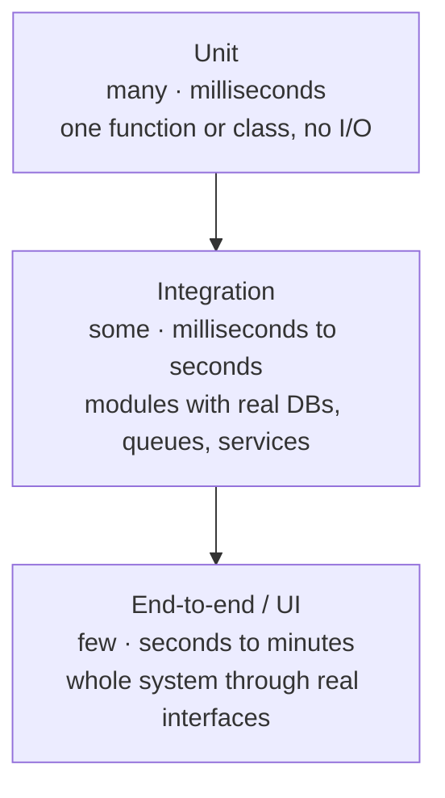
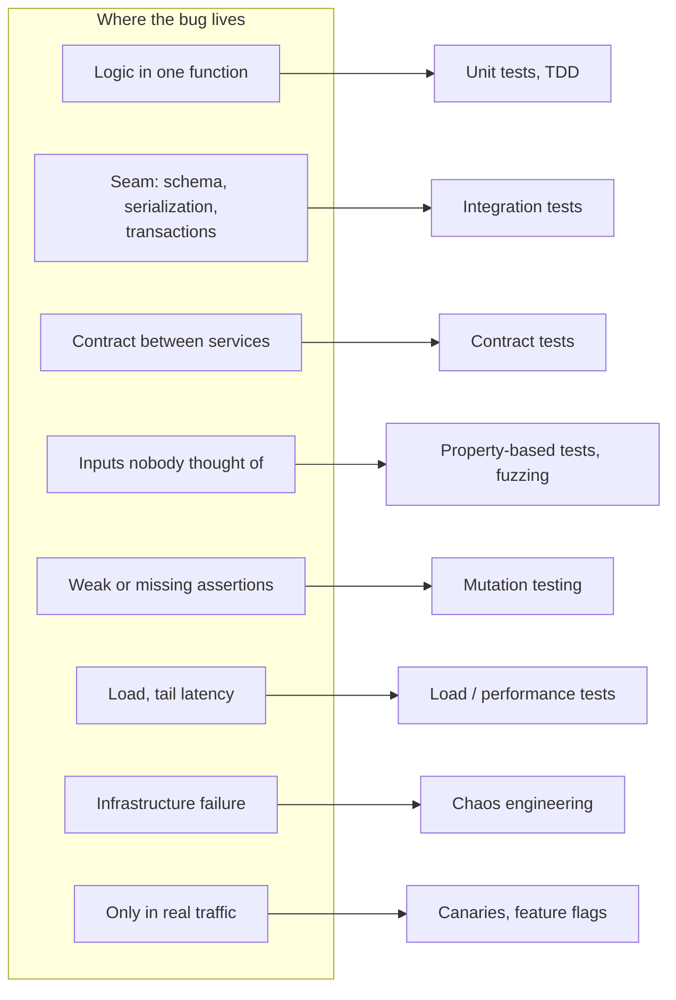

  <h1 style="color: white; margin: 0; font-size: 2.5rem;">Software Testing &amp; QA</h1>
  
Build confidence in software through disciplined testing — from unit assertions to chaos engineering

**Software testing** is the practice of building justified confidence that software behaves as intended and keeps doing so as it changes. Testing cannot prove the absence of bugs; it reduces their probability and blast radius, and — just as importantly — makes change safe, because a trustworthy suite lets a team refactor and ship continuously. This hub introduces the vocabulary and the shape of a healthy test suite, then routes to focused pages on everyday unit and integration testing and on advanced techniques.

## Section Pages

| Page | Covers |
|------|--------|
| [Unit & Integration Testing](unit-and-integration.html) | Anatomy of a unit test, test doubles (stubs, fakes, spies, mocks), TDD, fixtures and test data, integration tests against real dependencies (Testcontainers), coverage and its misuse, running tests in CI, flaky tests |
| [Advanced Testing](advanced-testing.html) | Contract testing, property-based testing, fuzzing, mutation testing, end-to-end and snapshot/visual testing, load and performance testing, chaos engineering, testing in production, AI-assisted test generation |

Related material elsewhere: [CI/CD Pipelines](../technology/ci-cd/) for where tests run and gate releases, and [Testing Distributed Systems](../distributed-systems/testing-distributed-systems.html) for deterministic simulation, Jepsen-style consistency checking, and fault injection across many nodes.

## The Shape of a Test Suite

### The Testing Pyramid

The **testing pyramid** (Mike Cohn, *Succeeding with Agile*, 2009) sorts tests by scope. The lower a layer, the smaller the unit under test and the faster, more deterministic, and more numerous its tests; the higher a layer, the more of the real system each test exercises and the slower and flakier it becomes.

| Level | Scope | Typical speed | Flakiness | Failure points to… |
|-------|-------|---------------|-----------|--------------------|
| Unit | One function or class, collaborators replaced | Milliseconds | Very low | A specific function |
| Integration | Several components, or one component plus a real database/queue/HTTP server | Milliseconds to seconds | Moderate | A seam between components |
| End-to-end | The deployed system via its UI or public API | Seconds to minutes | High | "Somewhere in the system" |

The argument is economic: catch each bug at the cheapest level that *can* catch it. Pricing arithmetic belongs in a unit test; "the order endpoint persists an order" belongs in an integration test; "a customer can check out" deserves one of a handful of end-to-end tests.

### Alternative Shapes

The pyramid predates cheap containers and component-level frameworks, and two widely cited alternatives shift weight toward the middle:

| Model | Proposed by | Emphasis | Best fit |
|-------|-------------|----------|----------|
| Pyramid | Mike Cohn (2009) | Mostly unit tests | Logic-heavy code, libraries |
| Testing trophy | Kent C. Dodds (2018) | Static analysis at the base, then mostly integration tests | Front-end applications, where most bugs are in how components combine |
| Testing honeycomb | Spotify engineering (2018) | Mostly integration tests of each service through its API, few implementation-detail unit tests | Microservices whose own logic is thin compared with their I/O |

All three agree on the fundamentals: keep end-to-end tests few, avoid tests coupled to implementation details, and make the bulk of the suite fast and deterministic. Two failure shapes are worth naming: the **ice-cream cone** (mostly manual and end-to-end tests over a thin base — slow and unreliable) and the **hourglass** (many unit and end-to-end tests but a starved integration layer, so wiring bugs slip through).

### Matching Techniques to Bug Classes

Different techniques catch structurally different bugs. Example-based tests only verify the cases someone thought of; the rest of the toolbox exists to find the ones nobody did.

## Properties of Good Tests

Whatever the level, trustworthy tests share the properties abbreviated **F.I.R.S.T.**:

| Property | Meaning |
|----------|---------|
| **Fast** | Quick enough to run on every change, so a failure is attributed to the change that caused it |
| **Independent** | No reliance on another test's side effects or on execution order |
| **Repeatable** | Same verdict in every run and environment: no uncontrolled clock, network, randomness, or shared state |
| **Self-validating** | Pass or fail via assertions, never by a human reading output |
| **Timely** | Written with (or before, in TDD) the code, while intent is fresh |

A **flaky** test — one that passes and fails nondeterministically on the same code — is worse than a missing test: it teaches the team that red builds can be ignored. Treat flakiness as a defect with an owner, not background noise ([details](unit-and-integration.html#flaky-tests)).

**Coverage** tells you what code the suite *executed*, not what it *verified*. Use it to find untested code and as a ratchet that must not fall, not as a target to maximize; the direct measure of assertion strength is [mutation testing](advanced-testing.html#mutation-testing).

## Glossary

| Term | Definition |
|------|------------|
| System under test (SUT) | The code a test exercises and makes assertions about |
| Test double | Any stand-in for a real collaborator: dummy, stub, fake, spy, or mock |
| Fixture | The known baseline state a test runs against, plus its setup and teardown |
| Regression test | A test added to make sure a fixed bug stays fixed |
| Smoke test | A small, fast check that a build or deployment is basically working |
| Oracle | The mechanism that decides whether an output is correct (an expected value, a reference implementation, a property) |
| Hermetic test | A test with no dependencies outside what it starts itself, so it cannot be affected by other runs or external services |
| Shift-left / shift-right | Moving verification earlier (static analysis, unit tests) or into production (canaries, observability) |

## Further Reading

- Kent Beck, *Test-Driven Development: By Example* (2002)
- Gerard Meszaros, *xUnit Test Patterns* (2007)
- Steve Freeman and Nat Pryce, *Growing Object-Oriented Software, Guided by Tests* (2009)
- Michael Feathers, *Working Effectively with Legacy Code* (2004)
- Titus Winters, Tom Manshreck, and Hyrum Wright (eds.), *Software Engineering at Google* (2020), chapters 11–14 on testing
- Casey Rosenthal and Nora Jones, *Chaos Engineering* (2020)

## See Also

- [CI/CD Pipelines](../technology/ci-cd/) — running tests automatically as a merge and release gate
- [Testing Distributed Systems](../distributed-systems/testing-distributed-systems.html) — simulation, Jepsen-style checking, and fault injection for multi-node systems
- [Git](../technology/git/) — the version-control workflow that tests guard
- [Cybersecurity](../technology/cybersecurity/) — security testing, including fuzzing for exploitable defects
