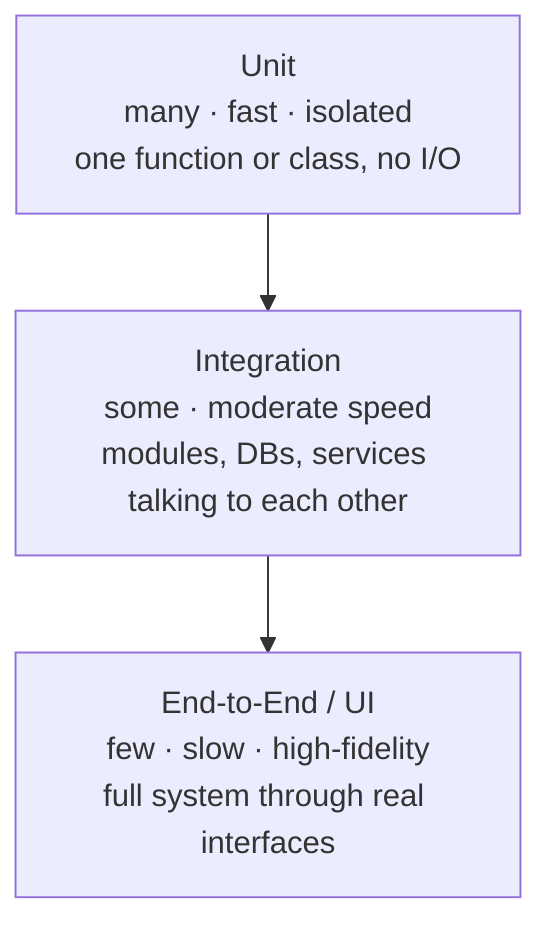

  <h1 style="color: white; margin: 0; font-size: 2.5rem;">Software Testing &amp; QA</h1>
  
Build confidence in software through disciplined testing — from unit assertions to chaos engineering

Comprehensive documentation for software testing and quality assurance, from the fast unit tests at the base of the pyramid to the property-based, fuzz, and chaos techniques that find the bugs nothing else can. This hub frames the testing discipline as a whole and routes you into focused pages for the everyday practices and the advanced ones.

  
<i class="fas fa-layer-group"></i><h4>Shape your suite like a pyramid</h4>
Many fast, isolated unit tests at the base; fewer integration tests in the middle; a thin layer of slow end-to-end tests on top. Inverting it makes suites brittle and glacially slow.

  
<i class="fas fa-bolt"></i><h4>Fast feedback drives quality</h4>
A test suite that runs in seconds gets run on every save; one that takes an hour gets skipped. Speed at the base is what makes testing a habit rather than a chore.

  
<i class="fas fa-bug"></i><h4>Tests encode intent, not just correctness</h4>
A good test is executable documentation of what the code is <em>supposed</em> to do. When it fails, it should tell you which behavior broke — not merely that something did.

  
<i class="fas fa-dice"></i><h4>Examples miss; generators find</h4>
Hand-picked example tests only cover the cases you imagined. Property-based testing, fuzzing, and chaos engineering explore the space you didn't — where the real bugs hide.

## Overview

Testing is the engineering discipline of building justified confidence that software behaves as intended — and keeps doing so as it changes. It is not about proving the absence of bugs (which is generally impossible) but about systematically reducing the probability and blast radius of the bugs that remain. A good test suite is a safety net that lets a team refactor aggressively, ship continuously, and sleep at night.

**What you'll get:** a working model of the testing pyramid and the trade-offs between test levels, the everyday craft of writing fast and trustworthy unit and integration tests, and the advanced techniques — property-based testing, fuzzing, mutation testing, and chaos engineering — that go beyond hand-written examples.

**Assumed background:** comfort with at least one programming language and version control. No prior testing experience required; we build from first principles and motivate each technique by the class of bug it catches.

### The Testing Pyramid

The pyramid is the central heuristic for *shaping* a test suite. It sorts tests by scope and speed: the lower a layer, the smaller the unit under test, the faster and more deterministic the test, and the more of them you should have. The higher a layer, the more of the real system it exercises, the slower and flakier it gets, and the fewer you should keep.

The reasoning behind the shape is economic. A unit test failure points at a single function; an end-to-end failure could be anything from a CSS change to a database outage, so it costs far more to diagnose. Unit tests run in milliseconds and rarely flake; end-to-end tests run in seconds-to-minutes and flake on timing, network, and environment. You therefore want most of your coverage to come from the cheap, precise layer.

| Level | Scope | Speed | Flakiness | How many |
|-------|-------|-------|-----------|----------|
| **Unit** | One function/class, dependencies stubbed | Milliseconds | Very low | Many (the broad base) |
| **Integration** | Several units, or a unit + real DB/queue/service | Tens of ms to seconds | Moderate | Some (the middle) |
| **End-to-end** | The whole system through its real interface | Seconds to minutes | High | Few (the thin top) |

Two well-known anti-patterns invert this shape. The **ice-cream cone** piles most coverage into slow, brittle end-to-end tests with little unit coverage underneath — the suite becomes slow and unreliable. The **testing hourglass** has lots of unit and end-to-end tests but a starved integration layer, so wiring bugs between components slip through. The fix in both cases is to push coverage down to the cheapest level that can still catch the bug.

### What "Good" Looks Like: the F.I.R.S.T. Properties

Independent of level, trustworthy tests share a set of properties often abbreviated **F.I.R.S.T.**:

- **Fast** — fast enough to run constantly, so failures are caught the moment they're introduced.
- **Independent** — no test depends on another's side effects or ordering; each sets up and tears down its own state.
- **Repeatable** — the same result every run, in any environment, with no reliance on wall-clock time, network, or random seeds you don't control.
- **Self-validating** — a test passes or fails with a clear assertion, never requiring a human to eyeball output.
- **Timely** — written alongside (or before, in TDD) the code, while the intended behavior is still fresh.

A test that violates these — slow, order-dependent, or *flaky* (non-deterministically passing and failing) — actively erodes confidence: teams learn to ignore it, and a red build stops meaning anything. Eliminating flakiness is therefore a first-class quality concern, not housekeeping.

### Coverage Is a Floor, Not a Goal

Line and branch **coverage** tell you which code the suite *executed*, not whether it *verified the right behavior*. It is entirely possible to have 100% coverage with assertions that test nothing. Coverage is best used as a floor — "no new code below X%" — and as a map of untested regions, not as the metric you optimize. The techniques that actually measure test *quality* (does the suite detect injected faults?) live in mutation testing, covered in [Advanced Testing](advanced-testing.html).

## Explore the Topics

The two areas below are ordered so that **everyday craft comes before advanced techniques**: master fast, trustworthy unit and integration tests first, then layer on the generative and resilience techniques that find what example-based tests cannot.

  <a href="unit-and-integration.html" class="nav-card">
    <h4><i class="fas fa-vial"></i> Unit &amp; Integration Testing</h4>
    
The base and middle of the pyramid: writing fast, isolated unit tests, test doubles (mocks, stubs, fakes, spies), TDD, integration testing against real databases and services, and the F.I.R.S.T. discipline that keeps a suite trustworthy.

  </a>
  <a href="advanced-testing.html" class="nav-card">
    <h4><i class="fas fa-flask"></i> Advanced Testing</h4>
    
Beyond hand-written examples: property-based testing, fuzzing, mutation testing, snapshot and contract testing, performance and load testing, and chaos engineering for distributed systems.

  </a>

### What You'll Find

| Page | What it covers |
|------|----------------|
| [Unit & Integration Testing](unit-and-integration.html) | The testing pyramid in practice, test structure (Arrange-Act-Assert), test doubles, test-driven development, integration testing with real dependencies, fixtures, and managing flakiness |
| [Advanced Testing](advanced-testing.html) | Property-based testing, fuzzing, mutation testing, snapshot and contract testing, performance/load testing, and chaos engineering |

## Learning Path

There is no single correct route, but the following order builds each idea on the one before it:

1. **Get the shape right.** Internalize the testing pyramid above so you push coverage to the cheapest level that catches each bug.
2. **Master the base.** Read [Unit & Integration Testing](unit-and-integration.html) for the everyday craft — fast isolated tests, the right test double for each seam, and integration tests that exercise real wiring without becoming slow and flaky.
3. **Make tests drive design.** Practice test-driven development to let tests shape the interfaces you write, not just verify them after the fact.
4. **Find what examples miss.** Move to [Advanced Testing](advanced-testing.html): let property-based testing and fuzzing generate the inputs you'd never think of, and use mutation testing to measure whether your assertions actually bite.
5. **Test the system, not just the code.** Apply performance, load, and chaos techniques to verify behavior under stress, partition, and failure — the conditions production will eventually impose.

To see how these practices slot into an automated pipeline, see [CI/CD Pipelines](../technology/ci-cd/); for the failure-injection techniques specific to multi-node systems, see [Testing & Chaos Engineering](../distributed-systems/testing-distributed-systems.html) in the Distributed Systems hub.

## Key Takeaways

  
<h4>Shape the suite like a pyramid</h4>
Many fast unit tests, fewer integration tests, a thin layer of end-to-end tests. Push every check to the cheapest level that can catch the bug.

  
<h4>Optimize for fast feedback</h4>
A suite that runs in seconds gets run constantly; a slow one gets skipped. Speed at the base is what makes testing a habit.

  
<h4>Make tests F.I.R.S.T.</h4>
Fast, Independent, Repeatable, Self-validating, Timely. A flaky or order-dependent test is worse than no test — it teaches the team to ignore red.

  
<h4>Coverage is a floor</h4>
It tells you what ran, not what was verified. Use it to find untested code, not as the number you optimize.

  
<h4>Generate the inputs you can't imagine</h4>
Property-based testing and fuzzing explore the input space example tests miss; mutation testing proves your assertions actually bite.

  
<h4>Test under failure, not just success</h4>
Performance, load, and chaos testing reveal the behavior that only emerges under stress, latency, and partition.

## See Also

  <h4>Where to go next</h4>
  <ul>
    <li><a href="unit-and-integration.html">Unit &amp; Integration Testing</a> — the everyday craft at the base and middle of the pyramid.</li>
    <li><a href="advanced-testing.html">Advanced Testing</a> — property-based, fuzz, mutation, and chaos techniques.</li>
    <li><a href="../technology/ci-cd/">CI/CD Pipelines</a> — where tests run automatically as a release gate.</li>
    <li><a href="../distributed-systems/testing-distributed-systems.html">Testing Distributed Systems</a> — chaos engineering and fault injection for multi-node systems.</li>
    <li><a href="../technology/git/">Git</a> — the version control workflow tests guard against regressions in.</li>
    <li><a href="../technology/cybersecurity/">Cybersecurity</a> — fuzzing and security testing for finding exploitable defects.</li>
  </ul>

### Further Reading

- "Working Effectively with Legacy Code" by Michael Feathers
- "Test-Driven Development: By Example" by Kent Beck
- "xUnit Test Patterns" by Gerard Meszaros
- "Growing Object-Oriented Software, Guided by Tests" by Steve Freeman & Nat Pryce
- "Chaos Engineering" by Casey Rosenthal & Nora Jones
