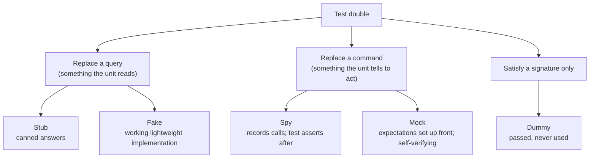
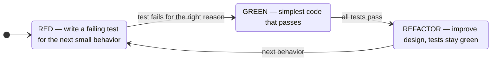
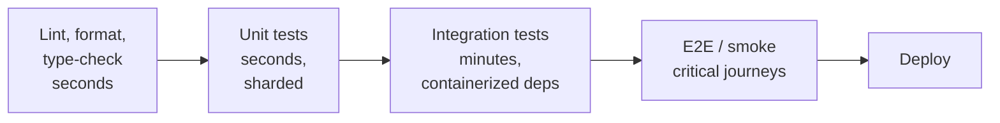
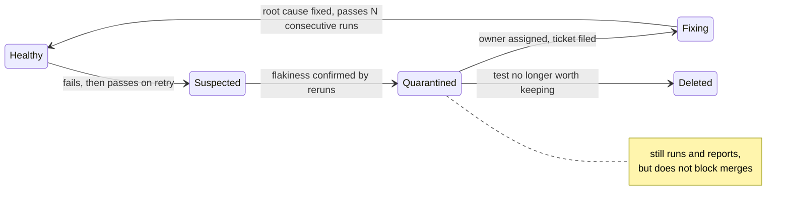

[Testing Hub](./) &raquo; Unit &amp; Integration

**Unit tests** exercise a small piece of behavior in isolation; **integration tests** wire real collaborators — databases, queues, HTTP servers — together and check the seams between them. Between them they catch the large majority of bugs a test suite ever finds. This page covers how to write both well: test structure, test doubles and when to use each, test-driven development, fixtures and test data, integration testing against real dependencies, what code coverage does and does not measure, running the suite in CI, and diagnosing flaky tests. Techniques that go beyond hand-written examples (property-based testing, fuzzing, mutation testing, contract testing) are on [Advanced Testing](advanced-testing.html); the shape of the overall suite is discussed on the [Testing Hub](./#the-shape-of-a-test-suite).

## Table of contents
{: .no_toc .text-delta }

1. TOC
{:toc}

---

## Unit Tests

A **unit test** exercises the smallest independently meaningful piece of behavior — usually one function, method, or class — and asserts that its observable result matches an expectation. What defines it is cost and determinism rather than size. A good unit test is:

- **fast** — milliseconds, so the whole unit suite runs in seconds;
- **isolated** — no network, disk, real clock, or shared mutable state;
- **deterministic** — the same code always gets the same verdict;
- **focused** — one logical reason to fail, so a failure names the broken behavior.

### Structure: Arrange–Act–Assert

The standard layout is **Arrange–Act–Assert** (AAA), equivalent to BDD's *Given–When–Then*:

```python
def test_discount_applies_to_subtotal():
    # Arrange: build the system under test and its inputs
    cart = Cart(items=[Item("book", price=Decimal("20.00")),
                       Item("pen", price=Decimal("5.00"))])

    # Act: invoke exactly one behavior
    total = cart.total_with_discount(percent=10)

    # Assert: one logical expectation
    assert total == Decimal("22.50")
```

A test that acts, asserts, then acts again is testing two behaviors and will fail for two reasons. (Note the `Decimal`: comparing money computed in binary floating point with `==` is itself a classic test bug; use `Decimal`, integer cents, or `pytest.approx` for genuinely floating-point results.)

### Test Behavior, Not Implementation

Tests should pin down *observable behavior* — return values, state visible through the public interface, and effects on collaborators the unit is responsible for — and say nothing about how that behavior is achieved. "The total is 22.50" survives any refactoring that preserves the answer; "the private `_apply_discount` helper was called with 0.10" breaks when the helper is inlined, although nothing a caller cares about changed. The first kind of test enables refactoring; the second taxes it.

### Parametrized Tests

When the same behavior should hold across several inputs, one parametrized test replaces a copy-pasted family and reports each case separately:

```python
import pytest

@pytest.mark.parametrize(
    ("percent", "expected"),
    [
        (0,   Decimal("25.00")),   # no discount
        (10,  Decimal("22.50")),
        (50,  Decimal("12.50")),   # maximum allowed
        (80,  Decimal("12.50")),   # clamped to 50%
    ],
    ids=["none", "ten", "max", "clamped"],
)
def test_discount(percent, expected):
    assert make_cart().total_with_discount(percent=percent) == expected
```

Choose cases by **equivalence partitioning** (one representative per class of input that should behave the same) and **boundary-value analysis** (values at and on either side of each boundary — here 50 and 51 would be the sharpest pair). Most off-by-one bugs live at boundaries.

### Solitary vs. Sociable Unit Tests

Practitioners disagree about what "isolated" means, and the disagreement is really about *how much* to replace:

| Style | Also called | Collaborators | Strength | Weakness |
|-------|-------------|---------------|----------|----------|
| **Solitary** | London school, mockist | Replaced with doubles, often mocks | Pinpoint failure localization; drives interface design | Tests coupled to call structure; can pass while the real parts don't fit together |
| **Sociable** | Chicago/Detroit school, classicist | Real in-process objects; only slow or nondeterministic dependencies (I/O, clock) replaced | Survives refactoring; exercises real interactions | A bug in a shared class fails many tests at once |

Most mature codebases lean sociable and reserve doubles for process boundaries — the database, the network, the clock, the random source.

### Common Frameworks

| Language | Test runner / framework | Doubles and mocking | Notes |
|----------|------------------------|---------------------|-------|
| Python | pytest (dominant), `unittest` | `unittest.mock`, `pytest-mock` | Fixtures and parametrization are pytest's core features |
| JavaScript / TypeScript | Vitest, Jest, Node's built-in `node:test` | `vi.fn` / `jest.fn`, MSW for HTTP | Vitest is the common choice for Vite-based projects |
| Java / Kotlin | JUnit (Jupiter API), TestNG, Kotest | Mockito, MockK | AssertJ for fluent assertions |
| C# | xUnit.net, NUnit, MSTest | Moq, NSubstitute | |
| Go | built-in `testing` package | Hand-written fakes, `gomock` | Table-driven tests are idiomatic |
| Rust | built-in `#[test]`, `cargo test`, `cargo-nextest` runner | `mockall` | Unit tests live in the same file as the code |

---

## Test Doubles

To test a unit without its real collaborators you substitute **test doubles** (Gerard Meszaros, *xUnit Test Patterns*). The five kinds differ in what they do and, more importantly, in what the test then asserts on.



| Double | Behavior | Verification style | Typical use |
|--------|----------|--------------------|-------------|
| **Dummy** | None | — | Filling a required parameter the test path never touches |
| **Stub** | Returns canned responses | State | Forcing a collaborator to return an error, a specific rate, a timeout |
| **Fake** | Real but simplified (in-memory repository, fake clock) | State | Data-access logic, time-dependent logic |
| **Spy** | Records calls for later inspection | Interaction | Verifying an email was sent, an event published |
| **Mock** | Pre-programmed with expected calls, fails if they don't happen | Interaction | Same as spy, when the framework's mock API is convenient |

A **stub** controls the unit's inputs:

```python
class StubRates:
    def usd_to(self, currency):
        return Decimal("0.91")

def test_converts_with_current_rate():
    assert convert(Decimal("100"), to="EUR", rates=StubRates()) == Decimal("91.00")
```

A **fake** actually works, but takes a shortcut that makes it unfit for production:

```python
class FakeUserRepo:
    def __init__(self):
        self._rows = {}

    def save(self, user):
        self._rows[user.id] = user

    def get(self, user_id):
        return self._rows.get(user_id)

def test_registration_persists_user():
    repo = FakeUserRepo()
    register(User(id=1, email="a@b.com"), repo=repo)
    assert repo.get(1).email == "a@b.com"
```

A **spy** or **mock** verifies a command the unit issues. Python's `unittest.mock` objects are spies in practice — they record everything and the test asserts afterwards:

```python
from unittest.mock import create_autospec

def test_charges_card_once():
    gateway = create_autospec(PaymentGateway, instance=True)
    checkout(cart, gateway)
    gateway.charge.assert_called_once_with(amount=Decimal("25.00"), currency="USD")
```

Prefer `create_autospec` (or `Mock(spec=...)`) over a bare `Mock()`: a bare mock accepts *any* attribute and any arguments, so a misspelled method name or a changed signature still "passes." An autospecced mock rejects calls the real class would reject.

### State vs. Interaction Verification

- **State verification** (stubs, fakes): act, then assert on the result or the resulting state. "After registering, the user is in the repository."
- **Interaction verification** (spies, mocks): act, then assert on calls made. "Registering sends exactly one welcome email."

State verification survives refactoring because it pins only the outcome. Interaction verification is necessary when the outcome *is* a call you cannot observe otherwise — sending email, charging a card, publishing an event — but it couples the test to call structure; over-mocked suites break on every refactor while catching few real bugs. Two rules of thumb:

- **Mock roles, not objects**: define a narrow interface (a port) for each external responsibility and double that.
- **Don't mock what you don't own**: mocking a third-party client's internals tests your *assumptions* about the library, which are exactly what break on upgrade. Wrap the library in your own adapter, double the adapter in unit tests, and cover the adapter with an integration test against the real thing.

---

## Test-Driven Development

**Test-driven development** (TDD), formalized by Kent Beck, writes a failing test *before* the code that makes it pass, in a short **Red–Green–Refactor** cycle:



1. **Red.** Write a small test for behavior that does not exist yet and watch it fail — for the right reason (missing behavior, not a typo). A test that passes immediately is testing nothing new.
2. **Green.** Write the least code that passes, even naively.
3. **Refactor.** With behavior pinned, clean up names, duplication, and structure, re-running tests after each step.

TDD's main payoff is *design feedback*: using an interface before it exists exposes awkward APIs, hidden dependencies, and global state early, because code that is hard to test is usually hard to use. It is less suited to exploratory work where the design is unknown; a common approach is to spike to learn, discard the spike, and rebuild test-first.

**Behavior-driven development** (BDD) is TDD with specifications written in domain language (`Given a logged-in user, When they add an item, Then the cart count is 1`), sometimes executed by tools such as Cucumber or `pytest-bdd`, so that non-engineers can read and review them.

---

## Fixtures and Test Data

A **fixture** is the known baseline a test runs against, plus the setup and teardown that create and destroy it. In pytest, fixtures are functions requested by name; code after `yield` is teardown and runs even if the test fails:

```python
import pytest

@pytest.fixture
def cart():
    c = Cart()
    yield c          # the test runs here
    c.close()        # teardown

def test_adding_item_increases_count(cart):
    cart.add(Item("book", Decimal("20.00")))
    assert cart.count == 1
```

Fixture **scope** (`function`, `class`, `module`, `session`) trades isolation for speed. A fresh per-test fixture guarantees no test sees another's leftovers; a shared session-scoped fixture (an expensive database container, say) is fast but must be immutable or reset between tests, or the suite develops **order-dependent failures** — tests that pass alone and fail together.

Anti-patterns to avoid:

- **General fixture** — one enormous setup shared by every test, so no reader can tell which parts matter.
- **Mystery guest** — the test depends on data in a remote fixture or external file that is invisible where the test is read.

### Builders and Factories

**Test data builders** (and libraries such as `factory_boy`, FactoryBot, or Faker-backed factories) supply sensible defaults so each test states only the field that matters to it:

```python
def a_user(**overrides):
    defaults = dict(id=1, email="user@example.com", role="member", active=True)
    return User(**{**defaults, **overrides})

def test_admins_can_delete():
    assert can_delete(a_user(role="admin"))
```

### Ambient Inputs: Clock, Randomness, IDs

Anything the code reads from its environment — current time, random numbers, UUIDs, locale, timezone, environment variables — makes a test nondeterministic unless the test controls it. Inject these as dependencies (a `Clock` interface, a seeded `random.Random`), or pin them with tools such as `freezegun`/`time-machine` for time. When generating random data, **log the seed** so a failure can be replayed exactly.

---

## Integration Tests

An **integration test** checks that components work *together*. It targets bugs that unit tests cannot see by construction, because each side passes its own tests against its own assumptions:

- a column renamed in a migration but not in the ORM mapping;
- a field serialized as a string by one side and parsed as an integer by the other;
- a transaction that commits a partial write, or a query that behaves differently under the real isolation level;
- a SQL dialect feature (upsert syntax, JSON operators) the in-memory substitute doesn't implement.

### Narrow and Broad Integration Tests

| Kind | What is real | Speed | Use for |
|------|--------------|-------|---------|
| **Narrow** | Your code plus *one* real dependency (repository + Postgres; HTTP client + a local test server) | Seconds | Most integration testing: the adapter layer for each external system |
| **Broad** | Several real services together | Minutes | A few flows whose correctness depends on several components cooperating |
| **Contract** | Neither side runs against the other; both verify against a shared contract | Seconds | Boundaries between independently deployed services ([details](advanced-testing.html#contract-testing)) |

Prefer narrow tests: they exercise the real serialization, schema, and protocol boundary while staying fast and localizing failures.

### Real Dependencies with Testcontainers

The old objection — "integration tests need a shared test database, so they are slow and flaky" — is largely solved by **ephemeral containerized dependencies**. Testcontainers (libraries for Java, Go, .NET, Node.js, Python, Rust, and others) starts a throwaway Postgres, Kafka, Redis, or LocalStack container for the test run, hands the test its connection details, and removes it afterwards.

```mermaid
sequenceDiagram
    participant T as Test session
    participant TC as Testcontainers
    participant D as Docker / container runtime
    participant PG as postgres:17 container
    T->>TC: start PostgresContainer
    TC->>D: pull image, create and start container
    D-->>PG: running
    TC->>PG: wait until ready (accepting connections)
    TC-->>T: connection URL
    T->>PG: apply migrations once per session
    loop each test
        T->>PG: BEGIN; exercise repository; assert; ROLLBACK
    end
    T->>TC: session ends
    TC->>D: stop and remove container
```

```python
import pytest
import sqlalchemy
from testcontainers.postgres import PostgresContainer

@pytest.fixture(scope="session")
def engine():
    with PostgresContainer("postgres:17") as pg:
        eng = sqlalchemy.create_engine(pg.get_connection_url())
        run_migrations(eng)            # the real schema, not a hand-written copy
        yield eng

@pytest.fixture
def conn(engine):
    with engine.connect() as c:
        tx = c.begin()
        yield c
        tx.rollback()                  # each test leaves no trace

def test_user_repo_round_trips(conn):
    repo = SqlUserRepo(conn)
    repo.save(User(id=1, email="a@b.com"))
    assert repo.get(1).email == "a@b.com"

def test_email_is_unique(conn):
    repo = SqlUserRepo(conn)
    repo.save(User(id=1, email="a@b.com"))
    with pytest.raises(DuplicateEmail):
        repo.save(User(id=2, email="a@b.com"))
```

The second test is the reason to use the real engine: an in-memory fake enforces only the constraints someone remembered to reimplement, and won't reproduce `UNIQUE`, `CHECK`, foreign-key, or `SERIALIZABLE` locking behavior. Use fakes where database semantics are irrelevant to the behavior under test; use the real engine when they are the behavior under test.

### Isolating Tests That Share a Database

| Strategy | How | Trade-off |
|----------|-----|-----------|
| Transaction rollback | Each test runs in a transaction rolled back at teardown (as above) | Fastest; cannot test code that commits or manages its own transactions |
| Truncate between tests | Delete from all tables after each test | Works with committing code; slower on large schemas |
| Database per test / worker | Template database clone, or one container per parallel worker | Strongest isolation, supports parallelism; most resource use |

The invariant to protect: **every test passes when run alone, and the suite passes in any order.** Randomizing order (`pytest-randomly`, JUnit's `MethodOrderer.Random`) finds violations early.

### HTTP Dependencies

For third-party HTTP APIs, run your client against a local stand-in rather than the live service: WireMock or a Testcontainers module for a simulated service, MSW (Mock Service Worker) in JavaScript, or `responses`/`respx` in Python. Record-and-replay tools (VCR-style cassettes) capture real responses once; re-record them periodically, or they silently drift from the real API.

---

## Code Coverage and Its Limits

**Code coverage** measures which parts of the code were *executed* by the tests. Common granularities, weakest to strongest:

| Metric | Question | Weakness |
|--------|----------|----------|
| Line / statement | Did each line run? | A line can run without its result being checked |
| Branch | Was each outcome of each decision taken? | Misses combinations inside compound conditions |
| Condition / MC/DC | Did each sub-condition independently affect the decision? | Required by DO-178C for the most critical avionics software; costly elsewhere |
| Path | Was every path through the function taken? | Combinatorially explosive |

Coverage measures execution, not verification. This test covers `divide` completely and checks nothing:

```python
def test_divide():
    divide(10, 2)      # executed, so "covered" — but no assertion
```

By Goodhart's law, a coverage *quota* ("90% or the build fails") produces tests written to touch lines — assertion-free tests, tests of trivial getters — while hard logic stays under-verified. Use coverage instead:

- to **find** untested code, especially untested error paths;
- as a **ratchet** on changed lines ("new code must be covered", "total must not fall"), which is harder to game than a global number;
- together with **mutation testing**, which measures whether tests would detect a fault on a covered line — see [Mutation Testing](advanced-testing.html#mutation-testing).

Tooling: Coverage.py / `pytest-cov` (Python), V8 or Istanbul coverage via Vitest/Jest (JavaScript), JaCoCo (JVM), `go test -cover`, `cargo llvm-cov` (Rust).

---

## Running Tests in CI

Tests deliver their value only when they run automatically on every change and block merges on failure (see [CI/CD Pipelines](../technology/ci-cd/)). Order stages so the cheapest, most precise checks fail first:



Practices that keep CI fast and trustworthy:

- **Parallelize and shard.** Independent tests can be split across processes and machines (`pytest-xdist`, Vitest/Jest workers, Playwright `--shard`, `cargo nextest`), balanced by recorded timings.
- **Select tests by impact.** Large monorepos run only tests whose dependency graph includes changed files (Bazel, Nx, Gradle, and similar build tools support this), with a full run on the main branch.
- **Keep runs reproducible.** Pin dependencies (lock files), seed randomness, pin container image tags, and avoid shared external environments. A test that is green locally and red in CI usually has an undeclared dependency or ambient nondeterminism.
- **Publish structured results.** JUnit XML (supported by virtually every runner) lets the CI system show per-test history, durations, and flakiness trends.
- **Gate on the right signals.** A required test job, a coverage ratchet, and a quarantine for known-flaky tests do more than any single percentage threshold.

---

## Flaky Tests

A **flaky test** passes and fails nondeterministically on the same code. Flakiness destroys the one thing a suite exists to provide — trust. Once red might mean "real bug" or "that test again," engineers re-run until green, and eventually a real regression is waved through.

Flakiness compounds with suite size. If each of $n$ tests independently fails spuriously with probability $p$, a run is falsely red with probability $1 - (1-p)^n$. For 2,000 tests each flaking just 0.01% of the time, that is $1 - 0.9999^{2000} \approx 18\%$ — nearly one run in five fails for no reason.

### Root Causes

| Cause | Symptom | Fix |
|-------|---------|-----|
| **Async waits by sleeping** | `sleep(0.1)` then assert; fails on a loaded CI machine | Await an explicit condition (poll with timeout, await the future, auto-retrying assertions) |
| **Order dependence / shared state** | Passes alone, fails in the suite (or the reverse) | Fresh fixtures, per-test transactions, no mutable globals; randomize order to expose it |
| **Ambient nondeterminism** | Fails at midnight, month end, DST change, or in another timezone | Inject clock, RNG, UUID source; pin timezone and locale |
| **Uncontrolled external services** | Fails when a shared staging database or live API changes or is slow | Hermetic per-run dependencies (containers, local stubs) |
| **Resource leaks** | Later tests fail on "port in use" or "too many open files" | Teardown that runs on failure; allocate ephemeral ports |
| **Real concurrency bugs** | Rare failures in code with threads or async tasks | Fix the production code — the test is right |

The last row matters: a "flaky" test is often a correct test catching a real, rare race in the product.

### Detect, Quarantine, Fix

Large organizations, Google and Microsoft among them, have published on managing flakiness at scale with the same basic loop:



Detection comes from rerunning failures and comparing (many CI systems and runners flag tests that fail then pass on retry — Playwright reports them as "flaky"). Quarantine keeps the build trustworthy while the test is fixed; it must have an owner and a deadline, or it becomes a place where tests go to be forgotten. Blanket automatic retries without reporting are the anti-pattern: they hide flakiness exactly when it should be diagnosed.

---

## See Also

- [Testing Hub](./) — the shape of a test suite and how the testing pages fit together
- [Advanced Testing](advanced-testing.html) — contract, property-based, fuzz, mutation, E2E, load, and chaos testing
- [Testing Distributed Systems](../distributed-systems/testing-distributed-systems.html) — deterministic simulation, Jepsen-style checking, and fault injection
- [CI/CD Pipelines](../technology/ci-cd/) — the automation that runs the suite and gates merges
- [Database Design](../technology/database-design/) — the constraints and isolation levels integration tests exercise
- [Distributed Systems Theory](../advanced/distributed-systems-theory/) — why determinism and reproducibility matter once concurrency is involved
