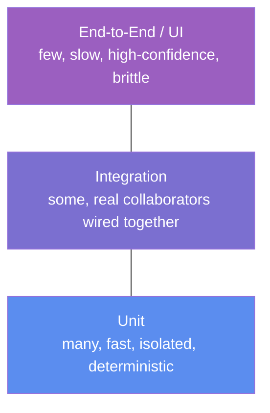
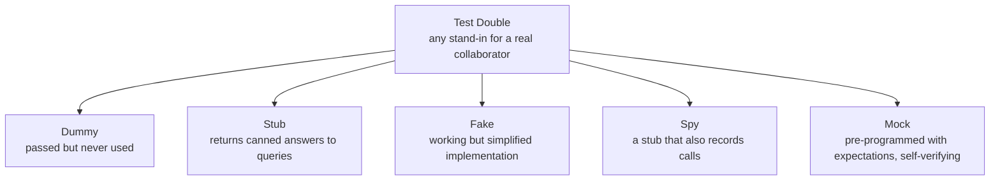
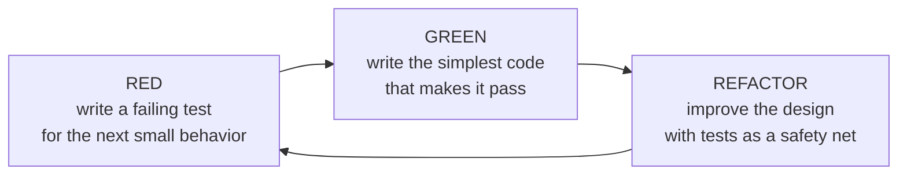
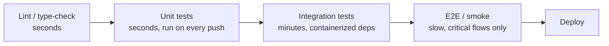

[Testing Hub](./) &raquo; Unit &amp; Integration

Almost every bug a test suite ever catches is caught by an *example-based* test: call a function with a known input, assert a known output. This page is about doing that well at two scales — the **unit**, where a single piece of code is exercised in isolation, and the **integration**, where real collaborators (databases, queues, HTTP servers) are wired together. It covers the testing pyramid that balances the two, the test doubles that make isolation possible, test-driven development, fixtures and test-data management, what code coverage does and does not tell you, how this all runs in CI, and the single biggest threat to a suite's value: flaky tests. Four ideas recur:

- **Speed is a feature.** A test you run a thousand times a day must finish in milliseconds. Fast, deterministic unit tests change how you write code; slow ones get skipped.
- **Isolate to localize.** A failing unit test names the broken function; a failing end-to-end test names "something, somewhere." Push detection as far down the pyramid as the bug allows.
- **Integration tests earn their slowness.** The bugs that live in the seams — schema mismatches, serialization, transaction boundaries — are invisible to unit tests by construction; you must wire the real things together.
- **Coverage is a floor, not a goal.** 100% coverage with weak assertions proves only that the code ran without crashing. Coverage tells you what was *executed*, never whether it was *verified*.

## Table of contents
{: .no_toc .text-delta }

1. TOC
{:toc}

---

## What a Unit Test Is

A **unit test** exercises the smallest independently meaningful piece of behavior — typically one function, method, or class — in isolation from the rest of the system, and asserts that its observable result matches an expectation. The defining properties are not about size but about *cost and determinism*: a good unit test is **fast** (milliseconds), **isolated** (no network, disk, clock, or shared global state), **deterministic** (the same input always produces the same verdict), and **focused** (one logical reason to fail).

The canonical structure is **Arrange–Act–Assert** (AAA), sometimes called Given–When–Then:

```python
def test_discount_applies_to_subtotal():
    # Arrange: construct the system under test and its inputs
    cart = Cart(items=[Item("book", price=20.00), Item("pen", price=5.00)])

    # Act: invoke exactly one behavior
    total = cart.total_with_discount(percent=10)

    # Assert: one logical expectation
    assert total == 22.50
```

The separation matters. *Arrange* establishes the precondition, *Act* triggers the behavior under test (and nothing else), and *Assert* states the postcondition. A test that interleaves the three — asserting in the middle, acting twice — is testing more than one thing and will fail for more than one reason, defeating the purpose of localization.

### Good Tests Fail for Exactly One Reason

The single most useful property of a unit test is a *specific* failure. When `test_discount_applies_to_subtotal` fails, you know the discount math is wrong, not the cart construction, not the persistence layer, not the HTTP route. This is why isolation is non-negotiable: every real collaborator a test touches is another reason it can fail for something other than the behavior it claims to verify. A test of pricing logic that talks to a real database is no longer a test of pricing logic — it is a test of pricing *and the database connection*, and it fails whenever either does.

### What to Assert: Behavior, Not Implementation

Tests should pin down *observable behavior* (the public contract) and stay silent about *how* that behavior is achieved. A test that asserts "the result is 22.50" survives any internal refactor that preserves the answer; a test that asserts "the `_apply_discount` helper was called with `0.10`" breaks the moment you inline that helper, even though nothing the user cares about changed. The first test is a safety net for refactoring; the second is a tax on it. The heuristic: **test through the public interface, assert on the return value or visible side effect, and treat the internals as a black box.**

## The Testing Pyramid

The **testing pyramid**, introduced by Mike Cohn, is a heuristic for the *shape* of a healthy test suite: many fast, cheap, isolated unit tests at the base; fewer integration tests in the middle; and very few slow, brittle end-to-end (E2E) tests at the top.



The shape is dictated by an economic trade-off along three axes that all move together as you climb:

| Level | Scope | Speed | Confidence per test | Failure localization | Brittleness |
|-------|-------|-------|--------------------|----------------------|-------------|
| **Unit** | one function/class | microseconds–ms | low (one behavior) | precise | low |
| **Integration** | a few real components | ms–seconds | medium (a seam) | a subsystem | medium |
| **End-to-end** | whole system | seconds–minutes | high (a user flow) | "somewhere" | high |

A test higher up the pyramid gives you *more confidence per test* (it exercises code closer to what a user actually does) but costs more to run, fails more often for irrelevant reasons (a slow network, a redeployed dependency), and tells you less about *where* the bug is when it fails. The pyramid says: push every bug-detection responsibility as far *down* as it can correctly go. Verify pricing math in a unit test (instant, precise); verify "the checkout endpoint persists an order" in an integration test; reserve E2E for a handful of critical user journeys you cannot afford to break.

### Anti-Patterns: The Ice-Cream Cone and the Hourglass

Two degenerate shapes recur. The **inverted pyramid** (or "ice-cream cone") has mostly E2E tests and few unit tests — common in teams that test through the UI because it "feels real." The result is a suite that is slow, flaky, and impossible to debug: a one-line logic bug surfaces as a failed ten-minute browser test with a stack trace fifteen frames deep. The **hourglass** has many unit and many E2E tests but a starved middle — the integration seams where serialization, schema, and transaction bugs live go untested, so those bugs are either missed entirely or caught only by the expensive E2E layer. The healthy distribution is the classic pyramid precisely because it catches each class of bug at the cheapest level that *can* catch it.

## Test Doubles

To test a unit in isolation you must replace its real collaborators — the database, the payment gateway, the clock — with stand-ins. Gerard Meszaros's *xUnit Test Patterns* gives these stand-ins the umbrella term **test double** (by analogy with a stunt double) and distinguishes five kinds. The distinctions are not pedantic: choosing the wrong kind is the most common cause of tests that are simultaneously brittle *and* low-value.



### Dummy

A **dummy** is an object passed only to satisfy a parameter list; it is never actually used. If a constructor requires a `Logger` but the behavior under test never logs, you pass a dummy logger to make the call compile. Dummies carry no behavior and assert nothing.

### Stub

A **stub** provides canned answers to the calls made during the test, and only to those calls. It replaces a *query* — a collaborator you read from. When testing retry logic, you stub the HTTP client so that the first call returns a 503 and the second a 200, then assert the unit eventually succeeded. The stub itself is never the thing you assert on; it merely controls the inputs your unit receives.

```python
class StubRates:
    """Returns a fixed exchange rate regardless of arguments."""
    def usd_to(self, currency):
        return 0.91  # always EUR-ish, deterministically

def test_converts_with_current_rate():
    price = convert(amount=100, to="EUR", rates=StubRates())
    assert price == 91.00
```

### Fake

A **fake** is a real, working implementation — it actually does the job — but takes a shortcut that makes it unsuitable for production. The textbook example is an **in-memory database** standing in for the real one: it genuinely stores and queries data, so code that issues real inserts and selects works against it, but it forgets everything when the process ends and skips durability, networking, and concurrency. Fakes give you integration-like fidelity at unit-like speed, which is why an in-memory repository is often the sweet spot for testing data-access logic.

```python
class FakeUserRepo:
    """A working repository backed by a dict instead of a database."""
    def __init__(self):
        self._rows = {}

    def save(self, user):
        self._rows[user.id] = user

    def get(self, user_id):
        return self._rows.get(user_id)

def test_registration_persists_user():
    repo = FakeUserRepo()
    register(User(id=1, email="a@b.com"), repo)
    assert repo.get(1).email == "a@b.com"
```

### Spy

A **spy** is a stub that *also records* how it was called — arguments, call count, ordering — so the test can inspect that record afterward. Spies are for verifying *commands* (calls that cause a side effect you can't otherwise observe). If a unit is supposed to send a confirmation email, you give it a spy mailer and, after acting, assert the spy was asked to send exactly one email to the right address.

```python
class SpyMailer:
    def __init__(self):
        self.sent = []

    def send(self, to, subject):
        self.sent.append((to, subject))

def test_registration_sends_welcome_email():
    mailer = SpyMailer()
    register(User(id=1, email="a@b.com"), mailer=mailer)
    assert mailer.sent == [("a@b.com", "Welcome")]
```

### Mock

A **mock** is the most opinionated double: it is pre-programmed before the act with the exact calls it *expects* to receive, and it **verifies those expectations itself** — a mock fails the test from the inside if the expected interaction does not happen (or an unexpected one does). The conceptual difference from a spy is *when and where* verification lives: a spy records passively and the test asserts afterward; a mock encodes the expectation up front and self-checks.

```python
from unittest.mock import Mock

def test_charges_card_once():
    gateway = Mock()
    checkout(cart, gateway)
    gateway.charge.assert_called_once_with(amount=25.00, currency="USD")
```

### Stubs vs. Mocks: State vs. Interaction Verification

The deepest distinction is not between the five nouns but between two *styles of verification* they enable:

- **State verification** (stubs, fakes): act, then assert on the resulting state or return value. "After registering, the user is in the repository." You don't care *how* it got there.
- **Interaction verification** (mocks, spies): act, then assert on the calls that were made. "Registering causes exactly one `INSERT`." You care about the conversation between objects.

State verification produces tests that survive refactoring, because it only pins the outcome. Interaction verification is necessary when the outcome is *itself* a call to a collaborator you can't see past — sending an email, charging a card, emitting an event — but it couples the test to the call structure, so over-mocking yields tests that break on every refactor while catching no real bugs. The discipline, often phrased as **"mock roles, not objects"** and **"don't mock what you don't own"**: mock at the boundaries you defined (your own ports/interfaces), and prefer a fake or the real thing for everything else. A test suite that mocks a third-party library's internals verifies your *assumptions* about that library, not its *behavior* — and those assumptions are exactly what break on upgrade.

## Test-Driven Development

**Test-driven development** (TDD), formalized by Kent Beck, inverts the usual order: you write a failing test *before* the code that makes it pass. The loop is **Red–Green–Refactor**:



1. **Red.** Write a small test for behavior that does not yet exist, and run it. It must fail — and fail for the *right reason* (a missing feature, not a typo). A test that passes immediately tested nothing.
2. **Green.** Write the *least* code that makes the test pass, even if it's embarrassingly naive ("fake it till you make it" — return the literal expected value first). Resist building beyond what the test demands.
3. **Refactor.** Now that behavior is pinned by a passing test, improve the structure — remove duplication, rename, extract — running the test after each change to confirm you preserved behavior.

The value of TDD is less about testing than about *design feedback*. Writing the test first forces you to use the code's interface before it exists, which surfaces awkward APIs early (hard-to-test code is usually hard-to-*use* code with too many dependencies or hidden state). It also guarantees, by construction, that every line of production code was written to satisfy a test — so coverage is high *and* meaningful, because each test was the reason its code exists. The discipline's cost is real: it is slower per line and ill-suited to exploratory spikes where you don't yet know the design. Many practitioners spike to learn, then delete the spike and rebuild it test-first.

A related but distinct practice, **behavior-driven development** (BDD), reframes tests in business language (`Given a logged-in user, When they add an item, Then the cart count increases`) so that non-engineers can read and contribute to the specification. BDD is TDD with a vocabulary chosen for collaboration rather than a different mechanism.

## Fixtures and Test Setup

A **fixture** is the fixed baseline state a test runs against — the arranged world before the act. Test frameworks provide setup/teardown hooks (`setUp`/`tearDown` in xUnit, `@BeforeEach`/`@AfterEach` in JUnit, fixtures in pytest) to build that baseline and tear it down afterward so tests don't leak state into one another.

```python
import pytest

@pytest.fixture
def empty_cart():
    # Setup: build the baseline state
    cart = Cart()
    yield cart            # the test runs here, receiving `cart`
    # Teardown after yield (runs even if the test failed)
    cart.close()

def test_adding_item_increases_count(empty_cart):
    empty_cart.add(Item("book", 20.00))
    assert empty_cart.count == 1
```

The central tension in fixture design is **sharing versus isolation**. A fixture rebuilt fresh for every test (a "fresh fixture") guarantees isolation — no test can be polluted by another's leftovers — at the cost of setup time. A fixture built once and shared across many tests (a "shared fixture," e.g. a class- or module-scoped database) is fast but dangerous: if any test mutates it, later tests inherit the mutation and you get **order-dependent failures** that pass alone and fail in the suite (or vice versa). The safe default is the freshest fixture you can afford; share a fixture only when it is genuinely immutable or you reset it rigorously between tests.

Two fixture anti-patterns are worth naming. The **general fixture** crams every field any test might need into one giant setup, so each test pays for state it doesn't use and readers can't tell which parts matter. The **obscure test / mystery guest** hides the arrange step in a remote shared fixture or an external file, so a test's behavior depends on data you cannot see while reading it. Prefer fixtures that are *minimal* (only what this test needs) and *local* (visible at the point of use); **object mother** and **test data builder** patterns help by giving you a readable, parameterizable way to construct just-enough test objects inline.

## Integration Testing

An **integration test** verifies that two or more components work correctly *together*, exercising the seams that unit tests deliberately stub out. The bugs it targets are, by construction, invisible to unit tests: a column renamed in the schema but not the ORM, a JSON field serialized as a string on one side and an integer on the other, a transaction that commits a partial write, an HTTP contract where the client sends `userId` and the server reads `user_id`. No amount of isolated unit testing can find these, because each side passes its own tests against its own assumptions — the bug lives in the gap *between* the assumptions.

### The Spectrum: Narrow to Broad

"Integration test" spans a range. A **narrow** (or sociable) integration test wires your code to *one* real collaborator — your repository against a real Postgres, your client against a real (test) HTTP server — and stubs the rest. A **broad** integration test stands up several real services together. Narrower is better when it suffices: it is faster, more deterministic, and localizes failures, while still exercising the real serialization/schema/protocol boundary that is the entire point. Reserve broad integration (and true E2E) for flows whose correctness genuinely depends on three or more components cooperating.

### Real Dependencies Without the Pain

The historical objection to integration tests — "they need a real database, so they're slow and flaky" — is now largely solved by **ephemeral, containerized dependencies**. Libraries like Testcontainers start a throwaway Postgres/Kafka/Redis in a container for the duration of the test run, give your test its connection string, and tear it down after, so the test runs against the *real* engine (real SQL dialect, real constraints, real isolation levels) with no shared, hand-maintained test database to corrupt.

```python
# Sketch: a containerized real database, started fresh per test session
import pytest
from testcontainers.postgres import PostgresContainer

@pytest.fixture(scope="session")
def db_url():
    with PostgresContainer("postgres:16") as pg:
        yield pg.get_connection_url()   # real Postgres, disposable

def test_user_repo_round_trips(db_url):
    repo = SqlUserRepo(db_url)
    migrate(db_url)                     # apply the real schema
    repo.save(User(id=1, email="a@b.com"))
    assert repo.get(1).email == "a@b.com"
```

This matters because a **fake or in-memory substitute can only test the behavior you remembered to replicate.** An in-memory store won't enforce a real `UNIQUE` constraint, won't reject a value that violates a `CHECK`, and won't reproduce the locking behavior of `SERIALIZABLE` isolation — so a test that passes against the fake can fail against production. Use fakes for *unit* speed where the database semantics are irrelevant; use a containerized real engine when the database's actual behavior is what you're verifying.

### Contract Testing

When the "integration" is between two independently deployed services, standing up both in every test reintroduces the broad-test cost. **Contract testing** (consumer-driven contracts, popularized by Pact) replaces that with a faster bargain: the *consumer* writes a test against a mock of the provider that records the requests it makes and the responses it expects (the **contract**); the *provider* then independently runs a test that replays that contract against its real implementation and verifies it can satisfy it. Each side tests alone, fast, yet the pair is guaranteed compatible — the contract is the shared artifact that catches a breaking API change at *build* time in the service that made it, rather than at *runtime* in production.

## Test Data Management

As tests move from unit toward integration, *test data* becomes a first-class problem. Three failure modes recur, and each has a discipline that addresses it.

- **Pollution and order dependence.** Tests that share a database can leave rows behind that the next test trips over. The fix is **isolation per test**: either run each test inside a transaction that is *rolled back* at the end (fast, but won't catch transaction-boundary bugs), or truncate/recreate the relevant tables between tests, or — with containerized dependencies — give each test session its own ephemeral instance. The invariant to protect: *any test must pass when run alone, and the suite must pass in any order.*

- **Realism vs. determinism.** Hand-written fixtures are deterministic but tedious and unrealistic; production dumps are realistic but contain PII and are huge. **Factories / test-data builders** (FactoryBot, `factory_boy`, Faker-backed builders) split the difference: you declare a template with sensible defaults and override only the one field a given test cares about, so the test reads as "a user *who is an admin*" rather than a wall of irrelevant field assignments.

```python
# A builder makes the salient difference explicit and the rest implicit
def a_user(**overrides):
    defaults = dict(id=1, email="user@example.com", role="member", active=True)
    return User(**{**defaults, **overrides})

def test_admins_can_delete():
    assert can_delete(a_user(role="admin"))     # only the relevant field is stated
```

- **Seeded randomness.** Generated data (via Faker or property-based generators) covers more of the input space than hand-picked examples, but uncontrolled randomness reintroduces flakiness — a test that fails one run in fifty is worse than no test. **Seed the generator** so a failing run is reproducible: log the seed, and on failure re-run with that seed to get the exact same data. (This is the same determinism discipline that [simulation testing](../distributed-systems/testing-distributed-systems.html#deterministic-simulation-testing) takes to its logical extreme.)

A frequent special case is **the clock and other ambient inputs.** A test that calls `datetime.now()` is non-deterministic and will eventually fail at a year boundary or under daylight-saving. Inject the clock (and the random source, and the UUID generator) so the test controls them — pass a fixed `now`, freeze time with a library like `freezegun`, or depend on an injected `Clock` interface. Ambient nondeterminism is the most common root cause of "works on my machine" flakiness.

## Code Coverage and Its Misuse

**Code coverage** measures which parts of the production code were *executed* while the tests ran. It is reported at several granularities, in roughly increasing strength:

| Metric | Asks | Weakness |
|--------|------|----------|
| **Line / statement** | Was each line run? | A line can run without its outcome being checked |
| **Branch / decision** | Was each `if`/`else` edge taken? | Misses compound-condition subtleties |
| **Condition** | Was each boolean sub-expression evaluated both true and false? | Still says nothing about assertions |
| **Path** | Was each path through the function exercised? | Combinatorially explosive; rarely fully achievable |
| **Mutation** | If we corrupt the code, does a test *notice*? | Slow to compute |

The crucial limitation is in the definition: coverage measures *execution*, not *verification*. A test that calls every line but asserts nothing — or asserts something trivially true — yields 100% coverage and catches nothing. Coverage answers "did a test run this code?"; it never answers "did a test *check* that this code is correct?"

```python
# This test gives full line coverage of `divide` and verifies nothing useful
def divide(a, b):
    return a / b

def test_divide():
    divide(10, 2)        # executes the line -> "covered"
    # ...but there is no assertion: a bug returning a+b would pass
```

### Coverage as a Floor, Not a Target

The single most important rule, a corollary of **Goodhart's Law** ("when a measure becomes a target, it ceases to be a good measure"): use coverage to find code that is tested *not at all*, never as a quota to hit. A coverage report's value is the *red* — the un-executed branches that reveal an untested error path or an entire forgotten module. Mandating "90% coverage" as a gate predictably produces tests written to touch lines rather than to verify behavior: assertion-free tests, tests of trivial getters, and tests gerrymandered to clip the cheapest uncovered lines while the hard, important logic stays under-verified. The number went up; the suite got worse.

### Mutation Testing: Coverage with Teeth

**Mutation testing** repairs coverage's central blind spot. A mutation-testing tool (Stryker, PIT, `mutmut`, `cosmic-ray`) systematically introduces small faults into the production code — flips a `<` to `<=`, replaces `+` with `-`, deletes a statement, negates a condition — and reruns the suite for each mutant. If a test *fails*, the mutant is "killed" — good, your tests would have caught that bug. If every test still *passes*, the mutant "survived" — your tests executed that code but did not actually verify its behavior. The **mutation score** (fraction of mutants killed) measures assertion *quality*, not mere execution, which is exactly what line coverage cannot do. It is far more expensive to compute (the suite runs once per mutant), so it is typically run on critical modules or nightly rather than on every commit — but a surviving mutant is the most honest signal there is that a test is theater.

## Running Tests in CI

Tests deliver their value only when they run *automatically* on every change. A continuous-integration pipeline (see [CI/CD Pipelines](../technology/ci-cd/)) runs the suite on each push and pull request and blocks merge on failure, so a regression is caught by the author within minutes rather than by a teammate days later.

The pyramid maps naturally onto CI *stages*, ordered fastest-and-most-localizing first so the pipeline **fails fast**:



Several practices keep CI useful rather than a bottleneck:

- **Fail fast, cheap first.** Run linters and unit tests before the expensive integration and E2E stages, so the 90% of breakages that a unit test catches are reported in seconds, not after a ten-minute E2E run.
- **Parallelize and shard.** Because well-isolated tests are independent, split the suite across workers (by file, by timing) to keep wall-clock time bounded as the suite grows.
- **Make every run reproducible.** Pin dependency versions, seed every random generator, and use ephemeral containerized services so a CI failure can be reproduced locally — a green-on-my-machine / red-in-CI gap is itself a bug (usually ambient nondeterminism or an undeclared dependency).
- **Gate on quality signals, but choose them wisely.** Coverage *as a ratchet* (don't let it drop) is more honest than coverage as a quota; a flaky-test quarantine and a required-status-check on the test job matter more than any single percentage.

## Flaky Tests

A **flaky test** is one that passes and fails *non-deterministically* on the same code. Flakiness is the single most corrosive failure mode a suite can have, because it destroys the property the suite exists to provide: **trust**. Once a red build might mean "real bug" or might mean "that flaky test again," engineers start ignoring red builds — and the day a flaky red hides a genuine regression, the suite has failed at its one job. A test that fails 1% of the time on a 2,000-test suite means roughly one in five CI runs fails for no reason, which is enough to train a whole team to hit "re-run" reflexively.

The common root causes, in rough order of frequency:

- **Ambient nondeterminism** — reading `now()`, the system clock, a random source, a UUID, or locale/timezone without injecting and pinning it. The fix is to inject every such input (a `Clock` interface, a seeded RNG) so the test controls it.
- **Order dependence and shared state** — a test relies on (or pollutes) global state, a singleton, a shared database row, or a leftover file, so it passes alone but fails after another test ran first. The fix is isolation: fresh fixtures, per-test transactions or truncation, no mutable globals.
- **Timing / async races** — `sleep(0.1)` "waiting" for an async result is a bet on machine speed that CI loses under load. The fix is to *await an explicit condition* (poll for the result, await the future, use the framework's async assertions) rather than sleeping a guessed duration.
- **Test interdependence via external services** — a shared staging database or a live third-party API that other runs or other people mutate. The fix is hermetic, containerized, per-run dependencies.
- **Resource leaks and pollution** — unclosed connections, un-deleted temp files, ports left bound — that accumulate across a run and eventually break a later test. The fix is rigorous teardown (and fixtures whose teardown runs even on failure).

The operational response, as documented by teams running enormous suites (Google, Microsoft), is a **detect–quarantine–fix** loop: a system flags tests that fail-then-pass-on-rerun, automatically **quarantines** them (still run and reported, but not blocking merge) so the build stays trustworthy, and tracks the quarantine as a debt to be *fixed*, not a place to hide tests forever. The cardinal sin is the silent re-run-until-green retry policy: it masks flakiness at exactly the moment you should be diagnosing it, and a "flaky" test is very often a *real, rare* concurrency bug in the production code that the test correctly caught.

## See Also

- **[Testing Hub](./)** — the full testing landscape, of which unit and integration are the foundation
- **[Testing Distributed Systems](../distributed-systems/testing-distributed-systems.html)** — property-based, deterministic-simulation, Jepsen-style, and chaos testing for the emergent bugs unit and integration tests cannot reach
- **[CI/CD Pipelines](../technology/ci-cd/)** — the automation that runs this suite on every change and gates merges on it
- **[Database Design](../technology/database-design/)** — the schemas, constraints, and isolation levels that integration tests exercise against real engines
- **[Distributed Systems Theory](../advanced/distributed-systems-theory/)** — why determinism and reproducibility matter so much once concurrency enters the picture
