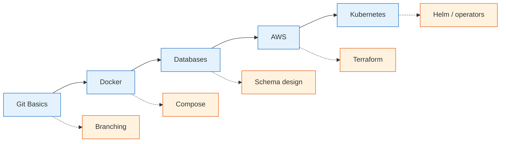
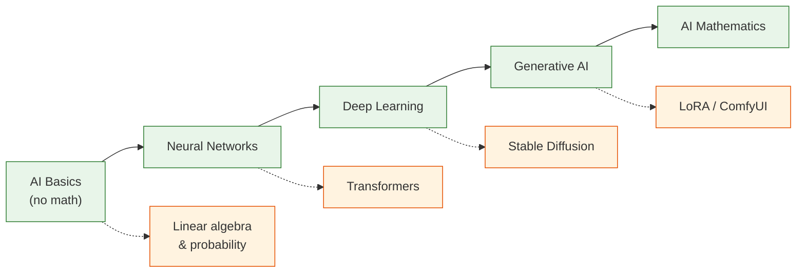
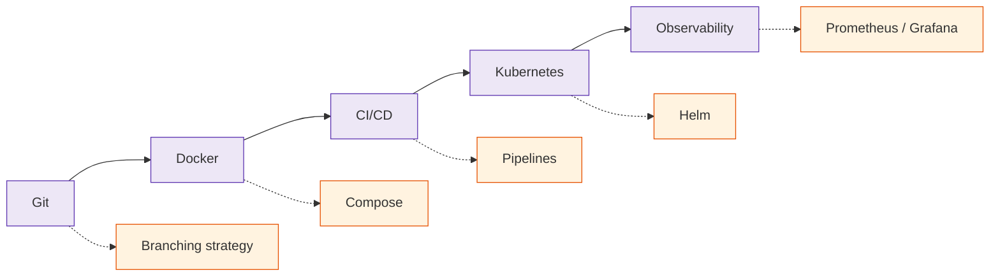

  <h1 style="color: white; margin: 0; font-size: 2.5rem;">Interactive Learning Map</h1>
  
Discover your personalized learning path through the documentation.

  
Every expert was once a beginner. This interactive map helps you navigate from wherever you are to wherever you want to be &mdash; drag the nodes, follow the connections, and chart your own route through the documentation. Prefer a plain list? See the <a href="./">complete documentation index</a>. Already know the topic? <a href="../search.html">Search</a> jumps you straight there.



## Pick Your Level

Not sure where to jump in? Each track below collects a handful of pages at the right depth. Start anywhere &mdash; the map above shows how they connect.

  

    <h3>Complete Beginner</h3>
    
No prior experience needed &mdash; short, friendly crash courses:

    <ul>
      <li><a href="technology/git-reference.html">Git Quick Start</a></li>
      <li><a href="technology/docker-essentials.html">Docker Quick Start</a></li>
      <li><a href="technology/database-design/">Database Basics</a></li>
      <li><a href="technology/ai-fundamentals-simple.html">AI for Beginners</a> (no math)</li>
    </ul>
  

  

    <h3>Intermediate</h3>
    
You know the basics &mdash; build real working knowledge:

    <ul>
      <li><a href="technology/branching.html">Git Branching Strategies</a></li>
      <li><a href="technology/docker/">Docker Deep Dive</a></li>
      <li><a href="technology/database-design/">Database Design Patterns</a></li>
      <li><a href="technology/ai/">AI &amp; Neural Networks</a></li>
    </ul>
  

  

    <h3>Advanced</h3>
    
Comfortable already &mdash; dive into theory and research:

    <ul>
      <li><a href="technology/git/">Git Internals &amp; Theory</a></li>
      <li><a href="technology/kubernetes/">Kubernetes Architecture</a></li>
      <li><a href="advanced/distributed-systems-theory/">Distributed Systems Theory</a></li>
      <li><a href="advanced/ai-mathematics/">AI Mathematics</a></li>
    </ul>
  

## How to Navigate This Map

### Interactive Features
- **Click and drag** nodes to explore the visualization
- **Click any topic** to see details and available content
- **Use difficulty filters** to focus on your level
- **Follow connections** to discover related topics
- **Zoom and pan** to explore different knowledge domains

### Understanding Connections

  

    
    <strong>Progressive Learning</strong> - Natural path from easier to harder
  

  

    
    <strong>Related Topics</strong> - Similar concepts at the same level
  

  

    
    <strong>Cross-Domain</strong> - Interdisciplinary connections
  

## Suggested Learning Paths

Three example routes through the site. Each top row is the spine; the row beneath lists the deeper companion topic for each step.

### Path 1: Full-Stack / Cloud Developer

### Path 2: AI / ML Engineer

### Path 3: DevOps Engineer

#### Getting the most from these paths
- **Start small.** Pick one spine and follow it; resist learning five things at once.
- **Follow the dotted lines later.** The companion topics deepen each step once the basics click.
- **Build as you go.** Apply each topic to a tiny real project before moving on.
- **Revisit.** The advanced pages reward a second read after you've used the basics in anger.

---

  <h2>Ready to Start Your Journey?</h2>
  
Pick a topic that interests you and dive in. Remember, every expert started exactly where you are now.

  <a href="#pick-your-level" class="btn btn-primary">Choose Your Starting Point</a>
  <a href="/" class="btn btn-secondary">Back to Documentation Home</a>

