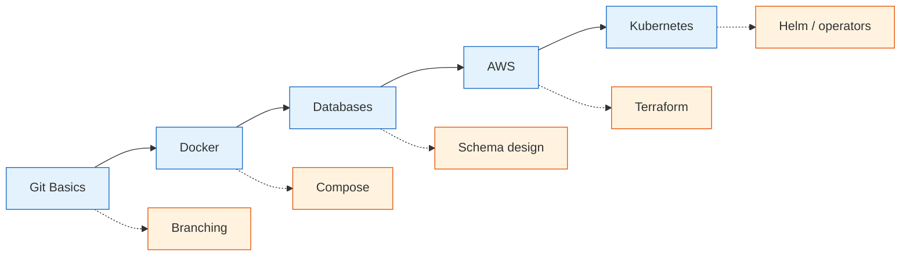
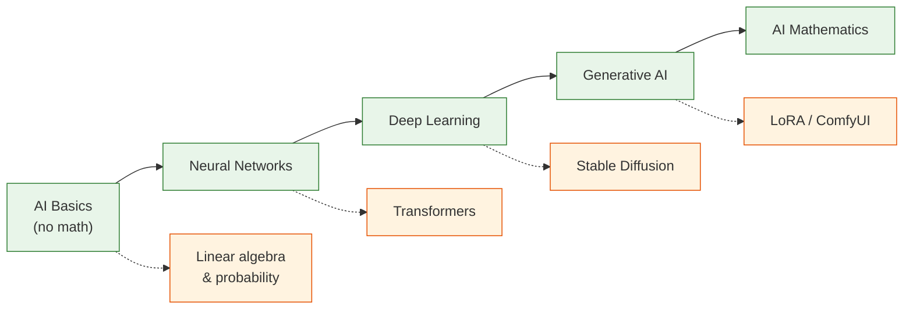
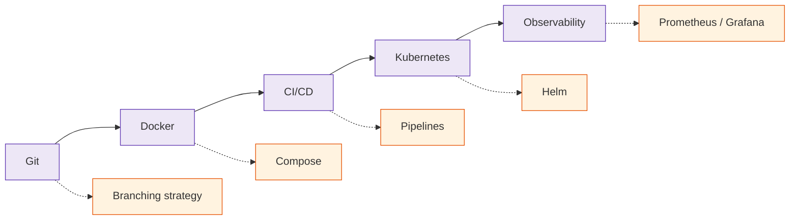

  <h1 style="color: white; margin: 0; font-size: 2.5rem;">Interactive Learning Map</h1>
  
Discover your personalized learning path through the documentation.

Drag the nodes, follow the connections, and chart a route through the documentation. Prefer a plain list? See the [complete documentation index](./). Already know the topic? [Search](../search.html) jumps you straight there.



## Pick Your Level

Each track collects a handful of pages at the right depth; the map above shows how they connect.

  

    <h3>Complete Beginner</h3>
    
No prior experience needed &mdash; short, friendly crash courses:

    <ul>
      <li><a href="technology/git-reference.html">Git Quick Start</a></li>
      <li><a href="technology/docker-essentials.html">Docker Quick Start</a></li>
      <li><a href="technology/database-design/">Database Basics</a></li>
      <li><a href="technology/ai-fundamentals-simple.html">AI for Beginners</a> (no math)</li>
    </ul>
  

  

    <h3>Intermediate</h3>
    
You know the basics &mdash; build real working knowledge:

    <ul>
      <li><a href="technology/branching.html">Git Branching Strategies</a></li>
      <li><a href="technology/docker/">Docker Deep Dive</a></li>
      <li><a href="technology/database-design/">Database Design Patterns</a></li>
      <li><a href="technology/ai/">AI &amp; Neural Networks</a></li>
    </ul>
  

  

    <h3>Advanced</h3>
    
Comfortable already &mdash; dive into theory and research:

    <ul>
      <li><a href="technology/git/">Git Internals &amp; Theory</a></li>
      <li><a href="technology/kubernetes/">Kubernetes Architecture</a></li>
      <li><a href="advanced/distributed-systems-theory/">Distributed Systems Theory</a></li>
      <li><a href="advanced/ai-mathematics/">AI Mathematics</a></li>
    </ul>
  

## How to Navigate This Map

### Interactive Features
- **Click and drag** nodes to explore the visualization
- **Click any topic** to see details and available content
- **Use difficulty filters** to focus on your level
- **Follow connections** to discover related topics
- **Zoom and pan** to explore different knowledge domains

### Understanding Connections

  

    
    <strong>Progressive Learning</strong> - Natural path from easier to harder
  

  

    
    <strong>Related Topics</strong> - Similar concepts at the same level
  

  

    
    <strong>Cross-Domain</strong> - Interdisciplinary connections
  

## Suggested Learning Paths

Three example routes through the site. Each top row is the spine; the row beneath lists the deeper companion topic for each step.

### Path 1: Full-Stack / Cloud Developer

### Path 2: AI / ML Engineer

### Path 3: DevOps Engineer

#### Getting the most from these paths
- **Start small.** Pick one spine and follow it; resist learning five things at once.
- **Follow the dotted lines later.** The companion topics deepen each step once the basics click.
- **Build as you go.** Apply each topic to a tiny real project before moving on.
- **Revisit.** The advanced pages reward a second read after you've used the basics in anger.

## Learning Paths by Role

Role-focused reading lists &mdash; the pages that matter most for each discipline, in order.

  

    <h3>Full-Stack / Cloud Developer</h3>
    
Ship a service end to end, from repo to cloud:

    <ul>
      <li><a href="technology/git-reference.html">Git Reference</a></li>
      <li><a href="technology/docker/">Docker Deep Dive</a></li>
      <li><a href="technology/database-design/">Database Design</a></li>
      <li><a href="api-design/rest.html">REST API Design</a></li>
      <li><a href="technology/aws/">AWS Cloud Services</a></li>
    </ul>
  

  

    <h3>AI / ML Engineer</h3>
    
From neural-network basics to production models:

    <ul>
      <li><a href="technology/ai-fundamentals-simple.html">AI for Beginners</a></li>
      <li><a href="technology/ai/">AI &amp; Neural Networks</a></li>
      <li><a href="ai-ml/">Generative AI &amp; Diffusion</a></li>
      <li><a href="ai-ml/mlops-production.html">MLOps in Production</a></li>
      <li><a href="advanced/ai-mathematics/">AI Mathematics</a></li>
    </ul>
  

  

    <h3>DevOps Engineer</h3>
    
Build, ship, and run software reliably:

    <ul>
      <li><a href="technology/branching.html">Git Branching Strategies</a></li>
      <li><a href="technology/docker/">Docker</a></li>
      <li><a href="technology/ci-cd/">CI/CD Pipelines</a></li>
      <li><a href="technology/kubernetes/">Kubernetes</a></li>
      <li><a href="observability/">Observability</a></li>
    </ul>
  

  

    <h3>Game Developer</h3>
    
From engine fundamentals to shipping a game:

    <ul>
      <li><a href="gamedev/">Game Development Overview</a></li>
      <li><a href="graphics/3d-rendering.html">3D Rendering</a></li>
      <li><a href="graphics/shaders.html">Shaders</a></li>
      <li><a href="gamedev/multiplayer-networking.html">Multiplayer Networking</a></li>
      <li><a href="gamedev/procedural-generation.html">Procedural Generation</a></li>
    </ul>
  

  

    <h3>Data Engineer</h3>
    
Move, model, and serve data at scale:

    <ul>
      <li><a href="technology/database-design/">Database Design</a></li>
      <li><a href="technology/database-design/distributed-and-nosql.html">Distributed &amp; NoSQL Stores</a></li>
      <li><a href="event-driven/">Event-Driven Architecture</a></li>
      <li><a href="api-design/grpc-and-protobuf.html">gRPC &amp; Protobuf</a></li>
      <li><a href="distributed-systems/">Distributed Systems</a></li>
    </ul>
  

  

    <h3>Security Engineer</h3>
    
Defend systems across the stack:

    <ul>
      <li><a href="technology/cybersecurity/">Cybersecurity Overview</a></li>
      <li><a href="technology/cybersecurity/attacks-and-defense.html">Attacks &amp; Defense</a></li>
      <li><a href="technology/cybersecurity/cryptography.html">Applied Cryptography</a></li>
      <li><a href="technology/cybersecurity/cloud-and-container-security.html">Cloud &amp; Container Security</a></li>
      <li><a href="technology/networking/performance-and-security.html">Network Security</a></li>
    </ul>
  

  

    <h3>SRE / Platform Engineer</h3>
    
Keep distributed systems healthy and observable:

    <ul>
      <li><a href="technology/kubernetes/">Kubernetes</a></li>
      <li><a href="technology/terraform/">Terraform (IaC)</a></li>
      <li><a href="observability/">Observability</a></li>
      <li><a href="distributed-systems/resilience-patterns.html">Resilience Patterns</a></li>
      <li><a href="testing/">Software Testing</a></li>
    </ul>
  

---

  <a href="#pick-your-level" class="btn btn-primary">Choose a starting point</a>
  <a href="/" class="btn btn-secondary">Documentation home</a>

