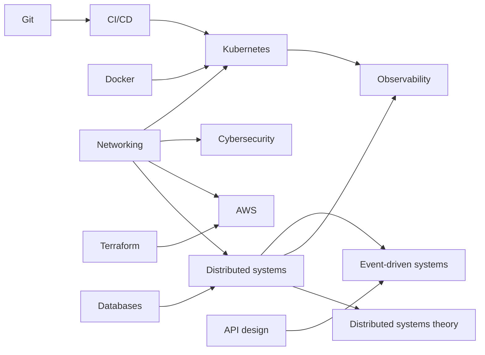
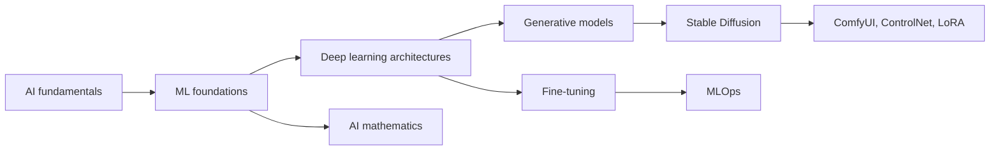
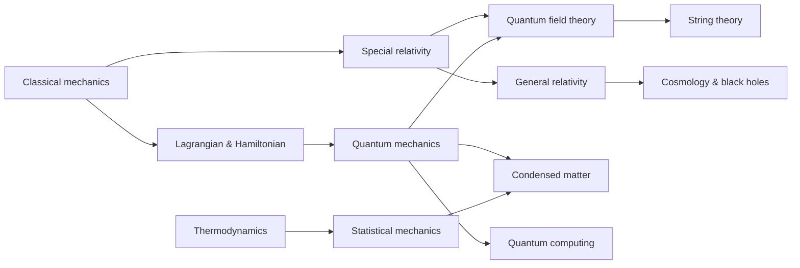
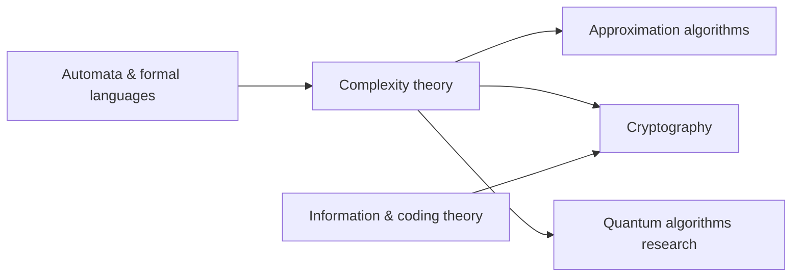

  <h1 style="color: white; margin: 0; font-size: 2.5rem;">Topic Map</h1>
  
How the core topics build on one another, and reading paths through them.

This page shows how the site's topics depend on one another. The interactive map below covers the core topics in technology, AI, and physics; the [prerequisite graphs](#prerequisite-graph) that follow add the architecture and theory sections; and [reading paths by role](#reading-paths-by-role) turn the graphs into ordered lists of pages. For a flat listing of every page, see the [documentation index](./).



## Reading the interactive map

Each circle is a topic. Clicking one highlights its direct connections and opens a panel with a short description, its related topics, and a link to the page.

| Element | Meaning |
|---------|---------|
| Node color and letter (B, I, A) | Level: beginner, intermediate, or advanced (see the legend in the map) |
| Solid line | Progression: the source topic is a natural prerequisite for the target |
| Dashed line | Related: the topics share ideas but neither is required for the other, often across domains |

| Control | Action |
|---------|--------|
| Drag a node | Reposition it; the layout settles around it |
| Scroll or pinch | Zoom in and out |
| Drag the background | Pan |
| Filter by level | Show only beginner, intermediate, or advanced topics |
| Reset View / Fullscreen | Restore the default zoom, or expand the map to fill the screen |

The map works best on a wide screen. On a phone, the static graphs below carry the same information.

## Prerequisite graph

A static view of the main dependencies, one diagram per area. Arrows point from a prerequisite to the topic that builds on it.

**Technology and architecture**

**AI and machine learning**

**Physics**

**Theory and research**

Several links cross these areas: statistical mechanics supplies much of the vocabulary of machine learning (energy-based models, entropy, free energy); quantum mechanics and complexity theory together underpin quantum algorithms; and applied cybersecurity leads naturally into the theory of cryptography.

## Reading paths by role

Each path is an ordered list; read left to right, and branch into a topic's sub-pages once its overview makes sense. The [Getting Started](../getting-started.html#where-to-start) page gives a shorter first step for each role.

| Role | Reading path |
|------|--------------|
| Full-stack / cloud developer | [Git Crash Course](technology/git-crash-course.html) → [Docker](technology/docker/) → [Database Design](technology/database-design/) → [REST API Design](api-design/rest.html) → [AWS Cloud Services](technology/aws/) → [AWS Architecture Patterns](technology/aws/architecture.html) |
| DevOps engineer | [Branching Strategies](technology/branching.html) → [Docker](technology/docker/) → [CI/CD](technology/ci-cd/) → [Kubernetes](technology/kubernetes/) → [Terraform](technology/terraform/) → [Observability](observability/) |
| SRE / platform engineer | [Kubernetes: Operations](technology/kubernetes/operations.html) → [Observability](observability/) → [Resilience Patterns](distributed-systems/resilience-patterns.html) → [Testing & Chaos Engineering](distributed-systems/testing-distributed-systems.html) → [Performance Optimization](optimization/) |
| Data engineer | [Database Design](technology/database-design/) → [Distributed & NoSQL Databases](technology/database-design/distributed-and-nosql.html) → [Replication & Consensus](technology/database-design/replication-and-consensus.html) → [Event-Driven Architecture](event-driven/) → [Message Brokers & Streaming](event-driven/message-brokers.html) → [Distributed Systems](distributed-systems/) |
| Security engineer | [Cybersecurity](technology/cybersecurity/) → [Cryptography](technology/cybersecurity/cryptography.html) → [Attacks & Network Defense](technology/cybersecurity/attacks-and-defense.html) → [Application Security](technology/cybersecurity/application-and-cloud-security.html) → [Cloud & Container Security](technology/cybersecurity/cloud-and-container-security.html) → [Incident Response & Forensics](technology/cybersecurity/incident-response.html) |
| ML engineer | [AI Fundamentals](technology/ai-fundamentals-simple.html) → [ML Foundations](technology/ai/ml-foundations.html) → [Deep Learning Architectures](technology/ai/deep-learning-architectures.html) → [Fine-Tuning & Transfer Learning](technology/ai/fine-tuning.html) → [MLOps & Production](ai-ml/mlops-production.html) → [Advanced AI Mathematics](advanced/ai-mathematics/) |
| Generative-AI practitioner | [Stable Diffusion Fundamentals](ai-ml/stable-diffusion-fundamentals.html) → [Model Types Explained](ai-ml/model-types.html) → [Base Models Comparison](ai-ml/base-models-comparison.html) → [ComfyUI Guide](ai-ml/comfyui-guide.html) → [ControlNet](ai-ml/controlnet.html) → [LoRA Training](ai-ml/lora-training.html) → [Production Pipelines](ai-ml/production-pipelines.html) |
| Game developer | [Game Development](gamedev/) → [3D Graphics & Rendering](graphics/3d-rendering.html) → [Shader Programming](graphics/shaders.html) → [Game AI](ai-ml/game-ai.html) → [Multiplayer Networking](gamedev/multiplayer-networking.html) → [GPU Optimization](optimization/gpu-optimization.html) |
| Physics student | [Classical Mechanics](physics/classical-mechanics/) → [Lagrangian & Hamiltonian Mechanics](physics/classical-mechanics/lagrangian-hamiltonian.html) → [Thermodynamics](physics/thermodynamics.html) → [Special Relativity](physics/relativity/special-relativity.html) → [Quantum Mechanics](physics/quantum-mechanics/) → [Statistical Mechanics](physics/statistical-mechanics/) → [Quantum Field Theory](physics/quantum-field-theory.html) |
| Quantum computing | [Quantum Mechanics](physics/quantum-mechanics/) → [QM: Quantum Computing](physics/quantum-mechanics/qm-computing.html) → [Quantum Computing](technology/quantumcomputing.html) → [Quantum Computing Hub](quantum-computing/) → [Quantum Algorithms Research](advanced/quantum-algorithms-research/) |
| Theoretical computer science | [Automata Theory & Formal Languages](advanced/automata-and-formal-languages/) → [Computational Complexity Theory](advanced/complexity-theory/) → [Approximation Algorithms & Hardness](advanced/approximation-algorithms/) → [Information & Coding Theory](advanced/information-coding-theory/) → [Cryptography: Foundations & Post-Quantum](advanced/cryptography/) |
