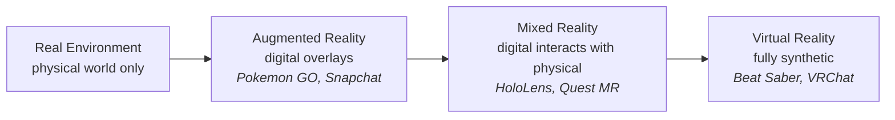

<div class="hero-section" style="background: linear-gradient(135deg, #f093fb 0%, #f5576c 100%); color: white; padding: 3rem 2rem; margin: -2rem -3rem 2rem -3rem; text-align: center;">
  <h1 style="color: white; margin: 0; font-size: 2.5rem;">VR & AR Development</h1>
  <p style="font-size: 1.25rem; margin-top: 1rem; opacity: 0.9;">Building immersive spatial computing experiences for virtual and augmented reality</p>
</div>

Welcome to the guide for Extended Reality (XR) development. From standalone VR experiences to mobile AR applications, this resource covers the technical foundations and best practices for building immersive spatial computing experiences. Virtual Reality fully replaces the user's perception of reality; Augmented Reality enhances it. Both demand specialized development approaches, strict performance budgets, and careful attention to human factors. Four ideas dominate XR work:

- **Latency is comfort.** Motion-to-photon latency under ~20 ms and a rock-steady frame rate are not nice-to-haves — they are the difference between immersion and nausea.
- **Render twice, every frame.** Stereo rendering doubles the work. Single-pass stereo, foveation, and reprojection exist to claw that cost back.
- **Interaction is spatial.** Hands, controllers, and gaze replace mouse and keyboard. Comfortable locomotion and reachable UI define the experience.
- **AR must understand reality.** Plane detection, occlusion, and light estimation anchor virtual content believably in the physical world.

## Explore This Hub

Start with [Understanding XR Technologies](#understanding-xr-technologies) for the landscape, then dive into the strand that matches your work. Everything on this page is self-contained; the cards below are an orientation map, not a prerequisite chain.

| Topic | What it covers |
|-------|----------------|
| [Understanding XR Technologies](#understanding-xr-technologies) | The reality-virtuality continuum and the current hardware landscape |
| [VR Development Fundamentals](#vr-development-fundamentals) | Stereo rendering, motion-sickness prevention, and spatial interaction |
| [AR Development](#ar-development) | Spatial understanding, ARKit vs ARCore, and WebXR |
| [XR Development Platforms](#xr-development-platforms) | Unity XR, Unreal, and native SDKs |
| [Performance Optimization for XR](#performance-optimization-for-xr) | Frame budgets, foveated rendering, and reprojection |
| [UX Design for XR](#ux-design-for-xr) | Spatial UI, comfort guidelines, and accessibility |
| [Mixed Reality Features](#mixed-reality-features) | Passthrough, spatial anchors, and hand/body tracking |

### Prerequisites

You will move fastest with **3D math and transforms**, hands-on **game-engine experience** (Unity C# or Unreal C++; see the [Game Development Hub](../gamedev/)), a working grasp of **rendering pipelines** ([3D Graphics & Rendering](../graphics/3d-rendering.html)), and **profiling/optimization** skills ([Performance Optimization](../optimization/)). For mobile AR, add native iOS (Swift) or Android (Kotlin). A feel for human perception and ergonomics pays off everywhere.

## Learning Paths

Pick the card closest to your goal. Each lists the on-page sections to read in order plus the best external companions.

<div class="takeaway-grid">
  <div class="nav-card">
    <h4><i class="fas fa-gamepad"></i> VR Game Developer</h4>
    <p>Immersive games for Quest, PSVR2, or PC VR.</p>
    <p><strong>Read:</strong> <a href="#vr-development-fundamentals">VR Fundamentals</a> &rarr; <a href="#performance-optimization-for-xr">Performance for XR</a> &rarr; <a href="#spatial-ui-design">Spatial UI</a> &rarr; <a href="#unity-xr">Unity XR</a>.</p>
    <p><strong>Then:</strong> <a href="../gamedev/">Game Development Hub</a>, <a href="../technology/unreal.html">Unreal Engine Guide</a>.</p>
  </div>
  <div class="nav-card">
    <h4><i class="fas fa-mobile-alt"></i> Mobile AR Developer</h4>
    <p>Smartphone AR with ARKit (iOS) or ARCore (Android).</p>
    <p><strong>Read:</strong> <a href="#spatial-understanding">Spatial Understanding</a> &rarr; <a href="#arkit-vs-arcore">ARKit vs ARCore</a> &rarr; <a href="#performance-optimization-for-xr">Performance for XR</a>.</p>
    <p><strong>Then:</strong> <a href="../graphics/3d-rendering.html">3D Graphics &amp; Rendering</a>, <a href="../optimization/">Performance Optimization</a>.</p>
  </div>
  <div class="nav-card">
    <h4><i class="fas fa-building"></i> Enterprise XR Developer</h4>
    <p>Productivity and training apps for HoloLens, Magic Leap, or enterprise VR.</p>
    <p><strong>Read:</strong> <a href="#mixed-reality-features">Mixed Reality Features</a> &rarr; <a href="#spatial-ui-design">Spatial UI</a> &rarr; <a href="#hand-and-body-tracking">Hand &amp; Body Tracking</a>.</p>
    <p><strong>Then:</strong> <a href="../technology/unreal.html">Unreal Engine Guide</a>, <a href="../optimization/">Performance Optimization</a>.</p>
  </div>
  <div class="nav-card">
    <h4><i class="fas fa-globe"></i> WebXR Developer</h4>
    <p>Zero-install, browser-based XR on any device.</p>
    <p><strong>Read:</strong> <a href="#webxr">WebXR</a> &rarr; <a href="#understanding-xr-technologies">XR Technologies</a> &rarr; <a href="#spatial-ui-design">Spatial UI</a>.</p>
    <p><strong>Then:</strong> <a href="../graphics/3d-rendering.html">3D Graphics &amp; Rendering</a>, <a href="../gamedev/">Game Development Hub</a>.</p>
  </div>
</div>

## Understanding XR Technologies

### The Reality-Virtuality Continuum

First described by Milgram & Kishino (1994), XR spans a continuum from the fully physical world to the fully synthetic, with AR and MR occupying the blended middle:



The further right on the continuum, the more the system must render and the less it relies on the real world — pushing performance demands up and shifting the design challenge from *world understanding* (AR) to *presence and comfort* (VR).

### XR Hardware Landscape

**VR Headsets:**

| Device | Type | Resolution (per eye) | Refresh Rate | Tracking |
|--------|------|---------------------|--------------|----------|
| Meta Quest 3 | Standalone | 2064x2208 | 120Hz | Inside-out |
| Valve Index | PC VR | 1440x1600 | 144Hz | Outside-in |
| PlayStation VR2 | Console | 2000x2040 | 120Hz | Inside-out |
| Apple Vision Pro | Standalone | 3660x3200 | 90Hz | Inside-out |
| HTC Vive XR Elite | Standalone/PC | 1920x1920 | 90Hz | Inside-out |

**AR Devices:**
- **Meta Ray-Ban**: Consumer smart glasses
- **Microsoft HoloLens 2**: Enterprise AR
- **Magic Leap 2**: Enterprise/industrial
- **Smartphones**: ARKit (iOS) / ARCore (Android)

## VR Development Fundamentals

### Rendering Requirements

VR demands exceptional performance:

```
Target Metrics:
- Frame Rate: 90Hz minimum (72-120Hz typical)
- Latency: <20ms motion-to-photon
- Resolution: 2K+ per eye
- Stereo Rendering: 2x geometry passes

Effective load:
90 FPS × 2 eyes × 4MP per eye = 720M pixels/second
(vs 60 FPS × 1 view × 2MP = 120M pixels/second for traditional)
```

**Stereo Rendering Techniques:**

| Technique | Description | Performance |
|-----------|-------------|-------------|
| Multi-pass | Render scene twice | Baseline |
| Instanced Stereo | Single draw, dual viewports | 1.5-2x faster |
| Single Pass Stereo | Geometry shader duplication | Variable |
| Variable Rate Shading | Lower resolution periphery | 20-30% savings |

### Motion Sickness Prevention

Causes and mitigations:

**Vestibular Mismatch:**
- Visual motion without physical motion
- Worse with acceleration, rotation
- Accumulates over time

**Mitigation Strategies:**
```
1. Locomotion Design
   - Teleportation (safest)
   - Snap turning (reduce smooth rotation)
   - Comfort vignette during movement
   - User-controlled movement speed

2. Technical Requirements
   - Maintain target frame rate always
   - Minimize latency
   - Lock horizon/reference points
   - Avoid camera shake

3. User Options
   - Comfort settings exposed
   - Gradual exposure modes
   - Session length recommendations
```

### Interaction Design

VR-specific input paradigms:

**Hand Tracking:**
```
Gestures:
- Pinch: Select/grab
- Point: Direct manipulation
- Open palm: Menu/UI
- Fist: Grip objects
- Thumbs up: Confirm

Hand presence adds:
- Natural object manipulation
- Social expression
- Accessibility without controllers
```

**Controller Interactions:**
- Trigger: Primary action
- Grip: Grab/hold objects
- Thumbstick: Locomotion/menu navigation
- Buttons: Context actions
- Haptics: Tactile feedback

**Gaze-Based:**
- Dwell time selection
- Head-tracked cursor
- Eye tracking for foveated rendering
- Natural social cues

## AR Development

### Spatial Understanding

AR requires understanding the physical world:

**Plane Detection:**
```
Types:
- Horizontal (floors, tables)
- Vertical (walls)
- Arbitrary angle (stairs)

Quality:
- Boundaries refinement over time
- Hole detection
- Classification (floor vs table)
```

**Scene Understanding:**
- Mesh reconstruction (real-time 3D scanning)
- Semantic segmentation (identify objects)
- Occlusion (virtual behind real)
- Light estimation (match virtual to real lighting)

### ARKit vs ARCore

**Apple ARKit (iOS):**
```
Features:
- World Tracking (6DoF)
- Plane Detection
- Image/Object Recognition
- Face Tracking (TrueDepth)
- Body Tracking
- LiDAR (Pro devices)
- RoomPlan API
```

**Google ARCore (Android):**
```
Features:
- Motion Tracking
- Environmental Understanding
- Light Estimation
- Cloud Anchors (shared experiences)
- Augmented Faces
- Depth API
- Geospatial API (outdoor positioning)
```

### WebXR

Browser-based XR experiences:

```javascript
// Basic WebXR session
async function startXR() {
    if (navigator.xr) {
        const session = await navigator.xr.requestSession(
            'immersive-vr',  // or 'immersive-ar'
            {
                requiredFeatures: ['local-floor'],
                optionalFeatures: ['hand-tracking']
            }
        );

        // Set up render loop
        session.requestAnimationFrame(onXRFrame);
    }
}

function onXRFrame(time, frame) {
    const pose = frame.getViewerPose(referenceSpace);

    if (pose) {
        for (const view of pose.views) {
            renderView(view);
        }
    }

    frame.session.requestAnimationFrame(onXRFrame);
}
```

## XR Development Platforms

### Unity XR

Cross-platform XR development:

**XR Interaction Toolkit:**
- Standardized input handling
- Locomotion systems
- Grab/socket interactions
- UI interaction

**Supported Platforms:**
- Meta Quest (native, PC VR)
- SteamVR (Index, Vive)
- PlayStation VR2
- Apple Vision Pro (visionOS)
- ARKit/ARCore

### Unreal Engine VR

Enterprise-grade XR:

**Features:**
- OpenXR support
- Motion controller support
- VR Template projects
- Stereo instancing
- Forward renderer (better for VR)

See our [Unreal Engine Guide](../technology/unreal.html) for details.

### Native Development

Platform-specific SDKs:

**Meta Quest (Oculus SDK):**
- Native Android development
- Best performance on Quest hardware
- Access to all platform features

**Apple Vision Pro (visionOS):**
- SwiftUI for spatial computing
- RealityKit for 3D
- ARKit for world understanding

**SteamVR (OpenVR):**
- C++ SDK
- Works with any SteamVR headset
- Room-scale and seated configurations

## Performance Optimization for XR

### Frame Budget

Strict timing requirements. At 90 Hz you have just **11.1 ms per frame** to fit everything:

| Stage | Typical budget |
|-------|----------------|
| Game logic | 2–3 ms |
| Physics | 1–2 ms |
| Animation | 1 ms |
| Rendering (CPU) | 3–4 ms |
| Rendering (GPU) | 8–10 ms |
| OS/Driver overhead | 1–2 ms |

Note: the GPU renders the previous frame while the CPU prepares the next (pipelining), so CPU and GPU budgets overlap rather than simply summing.

### Foveated Rendering

Reduce peripheral detail. Shading resolution drops with distance from the center of vision:

| Region | Angle from center | Shading |
|--------|-------------------|---------|
| Fovea | Central 10–15° | Full resolution |
| Mid | 15–45° | Medium |
| Periphery | 45°+ | Low |

**Types:**
- **Fixed**: Static regions (most compatible)
- **Dynamic**: Follows gaze (requires eye tracking)
- **Application-based**: Content-aware

Savings: 30–50% GPU time.

### Application SpaceWarp (ASW) / Reprojection

Frame synthesis when performance drops:

```
Normal: Render at 90 FPS, display at 90 FPS
ASW: Render at 45 FPS, synthesize to 90 FPS

How it works:
1. Detect missed frame deadline
2. Take previous frame
3. Apply motion vectors
4. Reproject to new head position
5. Display synthesized frame

Artifacts:
- Edge shimmer
- Disocclusion errors
- Latency perception
```

### Optimization Techniques

**Rendering:**
- Single-pass stereo rendering
- Aggressive LOD
- Occlusion culling
- Baked lighting where possible
- Forward rendering (simpler, faster)

**Assets:**
- Mobile-quality textures
- Simplified materials
- Instance static meshes
- Compress and stream textures

**Code:**
- Object pooling
- Avoid GC allocations
- Multithreaded physics
- Job system for parallel work

## UX Design for XR

### Spatial UI Design

UI in 3D space:

```
Placement:
- Comfortable viewing: 1-2m distance
- Avoid extremes of vision
- World-locked vs head-locked
- Hand-anchored for tools

Sizing:
- Minimum text: 1.5° of visual angle
- Comfortable text: 2-3°
- Touch targets: 2cm minimum

Depth:
- Avoid UI at arm's length (focus conflict)
- Match UI depth to content
- Use subtle depth cues
```

### Comfort Guidelines

**Physical Comfort:**
- Session length recommendations
- Break reminders
- Adjust for IPD (interpupillary distance)
- Standing vs seated options

**Visual Comfort:**
- Avoid vergence-accommodation conflict
- Maintain stable frame rate
- Limit bright flashing
- Provide reference points

**Motion Comfort:**
- Offer locomotion options
- Gradual exposure for new users
- User-controlled speed
- Comfort vignettes

### Accessibility

Inclusive XR design:

- **Seated play mode**: For mobility limitations
- **One-handed mode**: Controller remapping
- **Subtitles**: Spatial audio visualization
- **Colorblind modes**: Visual indicators
- **Eye tracking alternatives**: Head gaze fallback
- **Adjustable text size**: Readability options

## Mixed Reality Features

### Passthrough

Seeing the real world in VR:

**Types:**
- Grayscale (older devices)
- Color (Quest 3, Vision Pro)
- High-resolution (Vision Pro)

**Uses:**
- Room awareness
- Mixed reality games
- AR mode in VR headset
- Safety boundaries

### Spatial Anchors

Persistent placement in space:

```
Local Anchors:
- Saved to device
- Persist across sessions
- Limited to original location

Cloud Anchors:
- Shared across devices
- Multi-user experiences
- Azure Spatial Anchors, ARCore Cloud Anchors

World Anchors:
- GPS + visual positioning
- Outdoor AR experiences
- City-scale applications
```

### Hand and Body Tracking

Natural interaction:

```
Hand Tracking Capabilities:
- 26 joints per hand
- Finger gestures
- Hand poses
- Pinch detection

Body Tracking:
- Full body (Quest 3 experimental)
- Upper body (common)
- Inverse kinematics for legs
- Social presence in VR
```

## Development Workflow

### Testing and Iteration

XR-specific challenges:

**Device Testing:**
- Regular on-device testing essential
- Simulator has limitations
- Performance differs significantly
- Comfort only testable in VR

**Play Testing:**
- Recruit diverse testers
- Track comfort metrics
- Observe natural behaviors
- Iterate on feedback

### Tools and Debugging

**In-VR Tools:**
- Performance HUD overlays
- Debug visualization
- Console access in VR
- Screenshot/recording

**External Tools:**
- OVR Metrics Tool (Quest)
- RenderDoc (GPU debugging)
- PIX (Windows)
- Unity Profiler

## Future Directions

### Emerging Technologies

- **Neural interfaces**: Direct brain input
- **Haptic suits**: Full-body feedback
- **Varifocal displays**: Natural focus depth
- **Wider FOV**: 200°+ field of view
- **Higher resolution**: 8K+ per eye
- **Lighter form factors**: Glasses-like devices

### Market Trends

- Enterprise adoption accelerating
- Consumer VR gaming maturing
- AR glasses approaching viability
- Spatial computing as new paradigm
- AI integration for scene understanding

## Key Takeaways

- **Comfort is the prime directive.** Hold target frame rate and minimize latency. Teleport locomotion, snap turning, and comfort vignettes prevent motion sickness.
- **Optimize for stereo.** Single-pass stereo, aggressive LOD, foveated rendering, and forward rendering reclaim the cost of drawing two eyes 90+ times a second.
- **AR needs world understanding.** Plane detection, occlusion, and light estimation (ARKit/ARCore) make virtual objects feel physically present.
- **Choose the right stack.** Unity XR and Unreal cover most platforms; WebXR enables zero-install reach; native SDKs squeeze out maximum performance.
- **Design UI in 3D space.** Place UI 1–2 m away, size text by visual angle, and avoid focus conflicts at arm's length.
- **Test on real hardware.** Emulators cannot teach comfort. On-device testing with diverse users is non-negotiable.

## See Also

- [Performance Optimization](../optimization/) - Frame-budget and profiling techniques; XR's hard 11.1 ms-per-frame target makes the [GPU optimization](../optimization/gpu-optimization.html) and [CPU optimization](../optimization/cpu-optimization.html) pages essential reading for hitting 90+ Hz
- [3D Graphics & Rendering](../graphics/3d-rendering.html) - The rendering pipeline behind stereo, single-pass, and foveated rendering
- [Shaders](../graphics/shaders.html) - Variable-rate shading and the GPU programming that drives XR rendering cost
- [Game Development](../gamedev/) - Game development fundamentals for interactive XR experiences
- [Unreal Engine](../technology/unreal.html) - UE5 VR development with the forward renderer and stereo instancing
