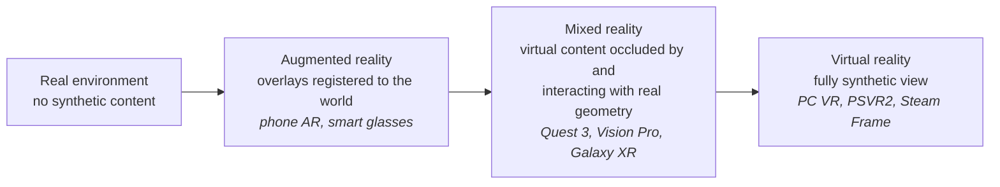
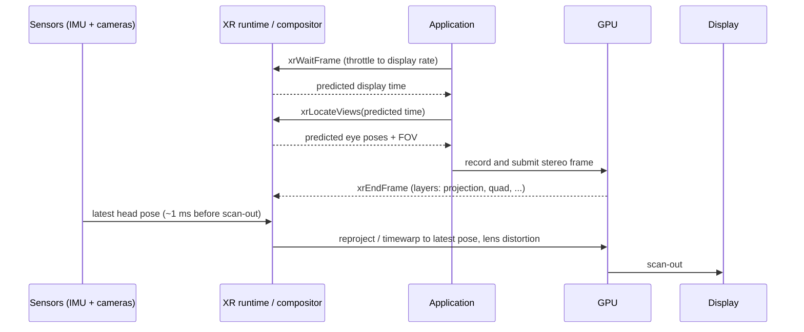
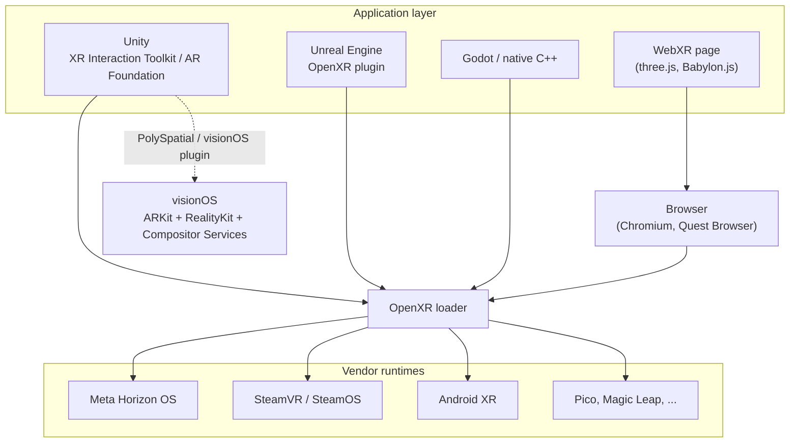
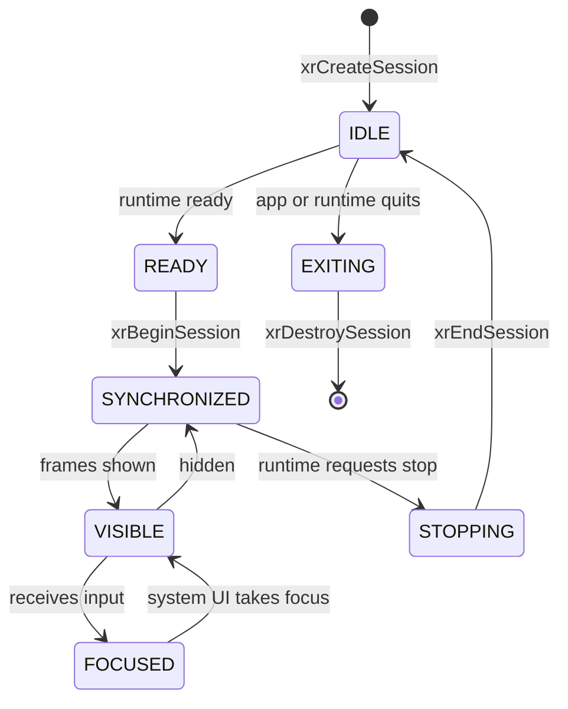
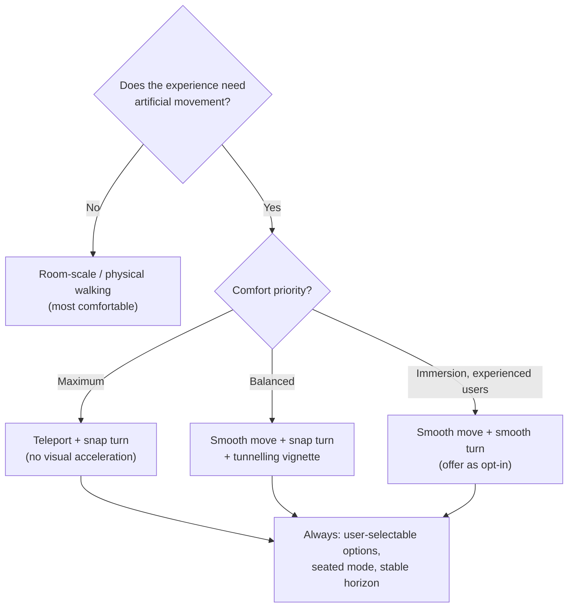
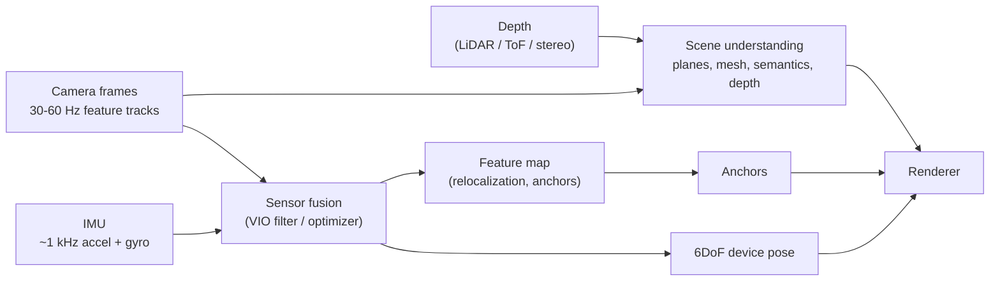

<div class="hero-section" style="background: linear-gradient(135deg, #f093fb 0%, #f5576c 100%); color: white; padding: 3rem 2rem; margin: -2rem -3rem 2rem -3rem; text-align: center;">
  <h1 style="color: white; margin: 0; font-size: 2.5rem;">VR & AR Development</h1>
  <p style="font-size: 1.25rem; margin-top: 1rem; opacity: 0.9;">Building immersive spatial computing experiences for virtual and augmented reality</p>
</div>

**Extended reality (XR)** is the umbrella term for virtual reality (VR), which replaces the user's view of the world, and augmented/mixed reality (AR/MR), which layers synthetic content onto it. This page is a self-contained reference to the engineering side of XR as of late 2026: the device landscape, how a frame gets from the application to the eye, the runtime and engine stack (OpenXR, Unity, Unreal, native SDKs, WebXR), mobile and headset AR, and the human-factors rules that decide whether an experience is comfortable.

Four constraints shape almost every XR design decision:

| Constraint | Why it matters |
|------------|----------------|
| **Latency is comfort** | Motion-to-photon latency above roughly 20 ms, or a dropped frame, is perceived as the world "swimming" and is a leading cause of simulator sickness. |
| **Every frame is rendered twice** | Two eyes at 72–120 Hz and 2–4K per eye. Multiview, foveation and reprojection exist to claw back that cost. |
| **Input is spatial** | Hands, tracked controllers, eyes and voice replace mouse and keyboard; UI lives at a depth and angle, not at pixel coordinates. |
| **AR must understand the room** | Tracking, plane and mesh detection, occlusion, anchors and light estimation make virtual objects appear physically present. |

**Prerequisites.** 3D math (vectors, quaternions, homogeneous transforms), a game engine ([Game Development Hub](../gamedev/)), the rendering pipeline ([3D Graphics & Rendering](../graphics/3d-rendering.html)) and profiling ([Performance Optimization](../optimization/)). For phone AR add Swift (ARKit) or Kotlin (ARCore).

### Reading paths

| Goal | Read in this order |
|------|--------------------|
| VR game developer (Quest, PSVR2, PC VR, Steam Frame) | [Frame pipeline](#the-xr-frame-pipeline) → [Stereo rendering](#stereo-rendering) → [Performance](#performance-optimization) → [Locomotion and comfort](#locomotion-and-comfort) → [Engines](#engines-and-sdks) |
| Mobile AR developer | [Tracking](#how-tracking-works) → [Scene understanding](#scene-understanding) → [ARKit vs ARCore](#arkit-vs-arcore) → [Anchors](#spatial-anchors-and-shared-space) |
| Mixed-reality / enterprise developer | [Passthrough MR](#passthrough-mixed-reality) → [Anchors](#spatial-anchors-and-shared-space) → [Hand and eye input](#input-modalities) → [Spatial UI](#spatial-ui) |
| WebXR developer | [WebXR](#webxr) → [OpenXR and runtimes](#openxr-and-the-runtime-stack) → [Spatial UI](#spatial-ui) |

## The XR Landscape

### The reality–virtuality continuum

Milgram and Kishino (1994) described a continuum from the unmodified physical world to a fully synthetic one. Modern devices blur the categories: a passthrough headset such as Quest 3 or Vision Pro spans the whole range in software.



Moving right, the system renders more and relies less on the real world: the engineering problem shifts from *world understanding* (AR) toward *rendering throughput and comfort* (VR).

### Headsets (late 2026)

| Device | Released | Platform / OS | Per-eye resolution | Refresh | Eye tracking | Notes |
|--------|----------|---------------|--------------------|---------|--------------|-------|
| Meta Quest 3 | Oct 2023 | Meta Horizon OS (Android-based) | 2064 × 2208 | 72–120 Hz | No | Pancake lenses, colour passthrough, depth sensor; the reference standalone MR device |
| Meta Quest 3S | Sep 2024 | Meta Horizon OS | 1832 × 1920 | 72–120 Hz | No | Budget model with Fresnel lenses, same XR2 Gen 2 chip as Quest 3 |
| Apple Vision Pro (M5) | Oct 2025 | visionOS | ~3660 × 3200 (micro-OLED) | up to 120 Hz | Yes | M5 refresh of the 2024 M2 model (which topped out at 100 Hz); eyes-and-pinch input |
| Samsung Galaxy XR | Oct 2025 | Android XR | 3552 × 3840 (micro-OLED) | 60–90 Hz | Yes | First Android XR headset; Snapdragon XR2+ Gen 2 |
| Valve Steam Frame | 2026 | SteamOS (Arm) | 2160 × 2160 LCD | 72–144 Hz | Yes | Standalone and PC-streaming; eye-tracked *foveated streaming* spends encoder bitrate where the user looks |
| PlayStation VR2 | Feb 2023 | PS5 (PC via adapter) | 2000 × 2040 OLED | 90/120 Hz | Yes | Eye-tracked foveated rendering in shipping titles |

Specifications change with firmware; treat the table as orientation, not a procurement sheet. Older devices still common in the field include Quest 2 and Quest Pro (both discontinued), Valve Index and HTC Vive-family PC headsets.

### AR glasses and phones

| Category | Examples | Development surface |
|----------|----------|---------------------|
| Phone / tablet AR | iPhone and iPad (ARKit), Android (ARCore) | ARKit + RealityKit, ARCore, Unity AR Foundation, WebXR (Android Chrome) |
| Optical see-through MR | Magic Leap 2, HoloLens 2 | OpenXR. Microsoft ended HoloLens 2 production in 2024 and supports it only through 2027, so it is a maintenance target, not a new-project target |
| Display smart glasses | Meta Ray-Ban Display (2025, monocular HUD with an EMG "Neural Band" wristband) | Limited third-party surfaces; primarily glanceable UI and AI assistant |
| Camera/audio glasses | Ray-Ban Meta, Oakley Meta | No display; camera and assistant integrations |

## The XR Frame Pipeline

The core engineering loop of any headset is: predict where the head (and eyes, and hands) will be when photons leave the display, render for that pose, then correct the image at the last moment for whatever the prediction got wrong.



Key terms:

- **Motion-to-photon latency** – time from a head movement to light reflecting it. Pose prediction makes the *effective* latency far lower than the raw pipeline depth; the target is imperceptible (about 20 ms or less).
- **Pose prediction** – the runtime extrapolates head motion to the predicted display time it hands the app. Always render with the pose from that call, never a pose you sampled yourself.
- **Late latching** – some runtimes (Meta Quest) patch the pose into GPU constant buffers after the CPU has recorded commands, shaving a frame of latency.
- **Compositor** – the runtime process that owns the display. Apps submit *layers*; the compositor applies lens distortion and chromatic-aberration correction, reprojection, and draws system UI.
- **Compositor layers** – text and UI submitted as separate quad or cylinder layers are sampled once at display resolution by the compositor, so they stay sharper than the same content rendered into the eye buffer.

### Frame budgets

$$
t_{\text{frame}} = \frac{1000\ \text{ms}}{f_{\text{refresh}}}
$$

| Refresh rate | Budget per frame | Typical use |
|--------------|------------------|-------------|
| 72 Hz | 13.9 ms | Quest default for heavy content |
| 90 Hz | 11.1 ms | PC VR baseline, Vision Pro, Galaxy XR |
| 120 Hz | 8.3 ms | Quest 3, PSVR2, Vision Pro (M5) |
| 144 Hz | 6.9 ms | Steam Frame, high-end PC VR |

CPU and GPU work are pipelined (the GPU renders frame *N* while the CPU simulates *N + 1*), so each must fit the budget independently rather than summed. On standalone hardware leave headroom: thermal throttling and the compositor itself consume part of the GPU.

### Reprojection and frame synthesis

When an app misses its deadline the runtime shows a corrected old frame rather than a stutter. The techniques differ in what they can correct:

| Technique | Corrects | Inputs | Where |
|-----------|----------|--------|-------|
| Rotational timewarp (ATW) | Head rotation only | Last frame + new orientation | Every runtime, every frame |
| Positional timewarp | Head rotation and translation | Last frame + depth buffer | Runtimes that receive depth (submit it) |
| Asynchronous SpaceWarp (ASW, PC) | Motion of objects and head | Frame history; motion estimated by the runtime | Meta PC runtime, SteamVR *Motion Smoothing* |
| Application SpaceWarp (AppSW) | Motion of objects and head | App-supplied motion vectors and depth | Meta Quest; app deliberately renders at half rate (for example 36 → 72 Hz) |

All frame synthesis produces artifacts in disoccluded regions (content revealed behind moving objects), on transparent surfaces and on fast-moving thin geometry. Treat it as a safety net or a deliberate budget tool, not a substitute for hitting frame rate.

## Rendering for XR

### Stereo rendering

Each eye needs its own view and projection matrix; the naive approach draws the scene twice.

| Technique | How it works | Cost relative to multi-pass |
|-----------|--------------|-----------------------------|
| Multi-pass | Full scene submitted once per eye | Baseline; doubles CPU draw-call cost |
| Single-pass instanced | One draw call with instance count doubled; the vertex shader selects the eye and render-target array slice | Roughly halves CPU submission cost |
| Multiview (`OVR_multiview`, `VK_KHR_multiview`, Metal vertex amplification) | Driver broadcasts one draw to two array layers; shader reads a view index | Same CPU saving, preferred on mobile/tile GPUs |
| Legacy single-pass (double-wide) | Both eyes side by side in one wide target, often via geometry shader | Superseded; avoid |

Engines expose this as a setting (Unity *Render Mode: Single Pass Instanced / Multiview*, Unreal *Instanced Stereo* / *Mobile Multi-View*). The GPU still shades both eyes' pixels, which is why pixel-side techniques matter more.

### Foveated rendering

The eye resolves fine detail only in the central ~2° of the fovea; acuity falls off steeply outside it. Foveated rendering spends shading work accordingly.

| Variant | Mechanism | Hardware |
|---------|-----------|----------|
| Fixed foveated rendering (FFR) | Lower shading rate toward lens edges, where lens blur hides it anyway | Quest family, most standalone headsets |
| Eye-tracked (dynamic) foveated rendering (ETFR / DFR) | High-rate region follows the measured gaze point | PSVR2, Vision Pro, Galaxy XR, Quest Pro |
| Foveated streaming / transport | Encoder allocates more bitrate where the user looks | Steam Frame PC streaming |

Mechanisms include variable-rate shading (VRS), fragment density maps (Vulkan) and Metal rasterization-rate maps. Savings depend on how pixel-bound the app is; eye-tracked foveation gives larger savings than fixed because the full-rate region can be much smaller. Eye-tracking latency and saccades are the limiting factor: the high-detail region must be large enough to cover gaze-prediction error.

### Performance optimization

| Area | Practices |
|------|-----------|
| Rendering path | Forward (or forward+) rendering with MSAA rather than deferred plus post-process AA; deferred G-buffers are expensive on tile-based mobile GPUs and TAA smears under head motion |
| Geometry | Aggressive LOD, occlusion culling, GPU instancing, static batching |
| Shading | Baked or mixed lighting, few real-time shadowed lights, cheap materials, avoid full-screen post-processing and overdraw from transparency |
| Resolution | Use the runtime's recommended eye-buffer size; use dynamic resolution rather than letting frames drop |
| CPU | Avoid garbage-collection spikes (pooling, no per-frame allocations), move work to job systems, keep physics tick cost bounded |
| Thermals (standalone) | Choose CPU/GPU performance levels explicitly and profile after the device is warm |

Profiling tools: OVR Metrics Tool and Meta Quest Developer Hub (Quest), RenderDoc and vendor GPU profilers (Snapdragon Profiler, Arm Performance Studio), Xcode Instruments / RealityKit Trace (visionOS), Unity Profiler and Unreal Insights, PIX on Windows PC VR.

## OpenXR and the Runtime Stack

**OpenXR** (Khronos) is the cross-vendor API between applications and XR runtimes. Version 1.0 shipped in 2019 and 1.1 in April 2024, which folded several widely used extensions into core; the SDK now receives roughly monthly 1.1.x revisions. Meta, Valve (SteamVR), Pico, HTC, Magic Leap, Microsoft and Google's Android XR all ship conformant OpenXR runtimes, and Unity, Unreal and Godot use OpenXR as their primary XR backend. Apple's visionOS is the notable exception: it uses its own ARKit/RealityKit/Compositor Services APIs.



Core OpenXR concepts:

| Object | Role |
|--------|------|
| `XrInstance` / `XrSystemId` | Connection to a runtime and the device it drives |
| `XrSession` | Lifecycle of rendering to the device (see state machine below) |
| `XrSpace` | Coordinate frames: `VIEW`, `LOCAL`, `LOCAL_FLOOR` (core in 1.1), `STAGE`, plus action and anchor spaces |
| `XrSwapchain` | Images the app renders into and hands to the compositor |
| Actions and action sets | Abstract input ("grab", "teleport") bound to physical controls through *interaction profiles*, so apps do not hard-code controller buttons |
| Extensions | Hand tracking (`XR_EXT_hand_tracking`, 26 joints per hand), eye gaze, passthrough, and the multi-vendor spatial-entity family (`XR_EXT_spatial_entity`, `XR_EXT_spatial_plane_tracking`, anchors, persistence) that is replacing per-vendor scene APIs |

Session state machine — apps must only render and submit frames in the states the runtime allows:



## Engines and SDKs

| Stack | Targets | Notes |
|-------|---------|-------|
| **Unity** + OpenXR plugin, XR Interaction Toolkit 3.x, AR Foundation | Quest, Android XR, SteamVR, PSVR2, Pico; iOS/Android AR; visionOS via PolySpatial | Most XR titles ship on Unity. XRI provides interactors/interactables, locomotion providers and XR UI input; AR Foundation abstracts ARKit/ARCore/OpenXR AR features |
| **Meta XR SDKs** (Core, Interaction, Movement, Platform) for Unity and Unreal; Meta Spatial SDK (Android/Kotlin) | Quest | Built on OpenXR; add Meta-specific features (Scene API, shared spatial anchors, passthrough camera access, body tracking). Legacy OVR/"Oculus" plugins are superseded by the OpenXR-based path |
| **Unreal Engine 5** + OpenXR plugin | Quest, SteamVR, PSVR2, Android XR | Use the Forward Shading renderer with MSAA and Instanced Stereo / Mobile Multi-View; start from the VR Template. See the [Unreal Engine Guide](../technology/unreal.html) |
| **Godot 4** | OpenXR devices | Open-source; OpenXR built in, with vendor plugin for Meta/Pico extras |
| **Android XR** (Jetpack XR SDK, Jetpack Compose for XR, ARCore for Jetpack XR) | Galaxy XR and future Android XR devices | Existing Android apps run as 2D panels; spatial apps use Compose "spatial panels" and SceneCore, or Unity/OpenXR for games |
| **visionOS** (SwiftUI, RealityKit, ARKit, Reality Composer Pro) | Apple Vision Pro | Apps are windows, volumes, or full *immersive spaces*; privacy model hides raw camera and gaze data from apps (hover effects are rendered by the system) |
| **WebXR** (three.js, Babylon.js, A-Frame, PlayCanvas) | Browsers on Quest, Android XR, Android phones (AR), PC; Safari on visionOS (VR) | Zero-install distribution; see [WebXR](#webxr) |

## Input Modalities

| Modality | Strengths | Weaknesses | Typical mapping |
|----------|-----------|------------|-----------------|
| Tracked controllers | Precise, low-latency, haptics, buttons for reliable discrete actions | Must be picked up; less natural | Trigger = select/fire, grip = grab, thumbstick = locomotion or snap turn |
| Hand tracking | Natural, controller-free, social expression | Occlusion when hands overlap, no haptics, fatigue ("gorilla arm") | Pinch = select, pinch-and-drag = move, palm-up = system menu; *poke* for near UI |
| Eye gaze + pinch | Fast targeting with minimal motion (visionOS default, Android XR) | "Midas touch" risk: looking must not act by itself | Look to target, pinch to confirm |
| Head gaze + dwell | Works everywhere; accessibility fallback | Slow, fatiguing | Reticle plus dwell timer |
| Voice | Hands-free, good for text and commands | Noisy environments, privacy | Search, dictation, system commands |

Design principles: provide a *ray* for far interaction and *direct touch/poke* for near interaction; give every interaction visual (and where possible haptic or audio) feedback on hover, press and release; never require precision that hand tracking cannot deliver (targets smaller than about 1.5–2 cm are unreliable).

### Hand and body tracking

OpenXR and WebXR report **26 hand joints** (palm, wrist, and four or five joints per finger including tips) with position, orientation and radius. Gesture recognition is usually done in the app or SDK from joint poses (pinch strength from thumb–index tip distance). Full-body avatars on consumer headsets are mostly *inferred*: upper body from head and hand poses via inverse kinematics, legs synthesised by learned models (Meta's Movement SDK generates legs on Quest 3) rather than directly tracked.

## Locomotion and Comfort

### Why XR makes people sick

Simulator sickness is mostly a **visual–vestibular conflict**: the eyes report self-motion that the inner ear does not. Linear and especially angular *acceleration* are the strongest triggers; constant-velocity motion is tolerated better. Sensitivity varies widely between users and decreases with exposure.

A second, independent discomfort source is the **vergence–accommodation conflict (VAC)**: the eyes converge on the virtual depth of an object while focusing (accommodating) on the fixed optical focal plane of the display, typically 1–2 m. Content far from the focal distance, especially very close to the face, causes eye strain. Varifocal and light-field displays remain research and prototype technology.

### Locomotion options



| Rule | Rationale |
|------|-----------|
| Never move the camera without user intent; never add camera shake, head bob or forced rotation | Unexpected visual motion is the strongest trigger |
| Keep the horizon level and provide static reference frames (cockpit, nose, floor grid) | Stable references reduce perceived self-motion |
| Snap turn in 30–45° increments by default | Removes angular acceleration entirely |
| Vignette (reduce peripheral FOV) during smooth locomotion | Peripheral optic flow drives vection |
| Use constant velocity; avoid ramps and sudden stops | Acceleration, not speed, is the problem |
| Hold frame rate; handle frame drops by degrading quality, not frame rate | Judder and swimming break comfort for everyone |

## Spatial UI

### Placement and sizing

Size UI by **visual angle**, not by metres or pixels. An element subtending angle $\theta$ at distance $d$ has height

$$
h = 2d \tan\left(\frac{\theta}{2}\right)
$$

so body text at about 1° at 1.5 m is roughly 2.6 cm tall; minimum legible sizes depend on the headset's pixels per degree.

| Guideline | Typical value |
|-----------|---------------|
| Comfortable UI distance | 1–2 m for reading panels (near the display focal plane, minimizing VAC) |
| Near (touch/poke) UI | 0.4–0.6 m, within arm's reach; short sessions only |
| Horizontal placement | Primary content within about ±30° of forward; avoid requiring head turns for routine tasks |
| Vertical placement | Slightly below eye level (about 10–15° down) |
| Text | Large, high-contrast, avoid thin fonts; submit as a compositor layer where supported |

### Anchoring

| Anchoring | Behaviour | Use for |
|-----------|-----------|---------|
| World-locked | Fixed in the room | Primary panels, objects, most UI |
| Body-locked (lazy follow) | Follows the user with damping, stays upright | Menus the user should not lose |
| Hand-anchored | Attached to a wrist or palm | Tool palettes, watches, quick menus |
| Head-locked | Fixed relative to the view | Brief alerts only; locked UI in the view is uncomfortable and blocks vision |

### Accessibility

Provide seated and standing modes with height calibration, one-handed and remappable controls, alternatives to every motion or gesture requirement, subtitles positioned in world space with speaker direction indicators, colour-blind-safe indicators, adjustable text size, and head-gaze fallbacks for eye or hand tracking. The XR Accessibility User Requirements (W3C) and platform guidelines (Meta, Apple Human Interface Guidelines for visionOS) are the standard references.

## AR Development

### How tracking works

Phones and headsets both use **visual–inertial odometry (VIO)**: high-rate IMU integration gives smooth short-term motion, and camera feature tracking corrects the drift. Building and re-localizing against a map of visual features (SLAM) lets content stay in place across the session.



Tracking degrades on textureless surfaces (white walls), in low light, with fast motion blur, and in dynamic scenes; good apps surface tracking state ("move your device slowly") instead of failing silently.

### Scene understanding

| Capability | What it gives you |
|------------|-------------------|
| Plane detection | Horizontal and vertical (and on some platforms arbitrary) planes, refined over time, with semantic classification (floor, wall, table, ceiling) |
| Scene mesh | Triangle mesh of the environment from depth sensors (LiDAR iPhones/iPads, Vision Pro, Quest 3) for physics and occlusion |
| Depth / occlusion | Per-pixel depth so real objects hide virtual ones; people occlusion via segmentation |
| Light estimation | Ambient intensity and colour, or environment probes/HDR cube maps, so virtual materials match real lighting |
| Image, object and face tracking | Anchors attached to known images, scanned objects, or faces |
| Room capture | Structured room models (Apple RoomPlan, Meta Scene API room layout) |

### ARKit vs ARCore

| Area | ARKit (Apple) | ARCore (Google) |
|------|---------------|-----------------|
| Platforms | iPhone, iPad, Vision Pro (with visionOS-specific data providers) | Android phones, Android XR (via Jetpack XR) |
| Rendering | RealityKit (SceneKit for legacy apps) | Bring your own (Filament, Sceneform community fork, Unity, Unreal) |
| Depth | LiDAR Scene Reconstruction and scene depth on LiDAR devices | Depth API from motion stereo or ToF on supported phones |
| Faces and bodies | Face tracking (TrueDepth), body motion capture | Augmented Faces |
| Room scanning | RoomPlan | — |
| Geolocation | Location anchors (supported cities) | Geospatial API (Visual Positioning System using Street View data; broad global coverage), Streetscape Geometry, rooftop anchors |
| Shared/persistent anchors | Collaborative sessions, world maps saved on device | Cloud Anchors (persistent up to 365 days) |
| Cross-platform layer | Unity AR Foundation, WebXR (not in iOS Safari) | Unity AR Foundation, WebXR (Chrome for Android) |

### Spatial anchors and shared space

An **anchor** pins a pose to features of the real environment so the runtime can keep correcting it as its map improves. Rules: anchor content near where it was placed (error grows with distance from the anchor), use one anchor per cluster of content rather than one per object, and never assume anchor poses are fixed between frames.

| Scope | Examples |
|-------|----------|
| Session / local | ARKit `ARAnchor`, ARCore anchors, OpenXR spatial anchors |
| Persistent on device | Saved ARKit world maps, visionOS `WorldAnchor`, Meta persisted spatial anchors, OpenXR anchor persistence |
| Shared across users/devices | ARCore Cloud Anchors, Meta shared spatial anchors / colocation discovery, ARKit collaborative sessions |
| Geospatial | ARCore Geospatial anchors, ARKit location anchors |

Microsoft **Azure Spatial Anchors was retired in November 2024**; apps that depended on it must migrate to platform-native or vendor anchor services.

### Passthrough mixed reality

Video-passthrough headsets (Quest 3, Vision Pro, Galaxy XR, Steam Frame) reconstruct the real world from cameras and reproject it to the eyes, which allows full occlusion and relighting but adds latency and distortion that optical see-through (HoloLens, Magic Leap) avoids. MR apps on these devices combine passthrough with scene data (room mesh, planes) so virtual objects sit on real tables and are hidden by real furniture. Raw camera access for computer vision is now available with user permission on some platforms (Meta's Passthrough Camera API on Quest 3/3S, Android XR camera access, visionOS enterprise entitlements); otherwise apps receive only derived data.

### WebXR

The **WebXR Device API** exposes `immersive-vr` and `immersive-ar` sessions to web pages. It is supported in Chromium browsers (Chrome/Android, Edge, Quest Browser, Android XR) via OpenXR, and in Safari on visionOS for `immersive-vr`; iOS Safari does not support WebXR. Feature modules add hand input, hit testing, anchors, plane detection, depth sensing, layers and DOM overlays; availability varies per browser. Sessions must be started from a user gesture (a click on an "Enter VR" button).

A minimal session with WebGL:

```javascript
const canvas = document.createElement('canvas');
const gl = canvas.getContext('webgl2', { xrCompatible: true });
let refSpace;

async function enterXR() {
  if (!navigator.xr || !(await navigator.xr.isSessionSupported('immersive-vr'))) {
    return; // show a non-XR fallback
  }
  // Must be called from a user-activation event handler.
  const session = await navigator.xr.requestSession('immersive-vr', {
    requiredFeatures: ['local-floor'],
    optionalFeatures: ['hand-tracking', 'bounded-floor'],
  });
  session.updateRenderState({ baseLayer: new XRWebGLLayer(session, gl) });
  refSpace = await session.requestReferenceSpace('local-floor');
  session.addEventListener('end', () => { refSpace = null; });
  session.requestAnimationFrame(onXRFrame);
}

function onXRFrame(time, frame) {
  const session = frame.session;
  session.requestAnimationFrame(onXRFrame);

  const pose = frame.getViewerPose(refSpace);
  if (!pose) return; // tracking lost this frame

  const layer = session.renderState.baseLayer;
  gl.bindFramebuffer(gl.FRAMEBUFFER, layer.framebuffer);
  gl.clear(gl.COLOR_BUFFER_BIT | gl.DEPTH_BUFFER_BIT);

  for (const view of pose.views) {           // one view per eye
    const vp = layer.getViewport(view);
    gl.viewport(vp.x, vp.y, vp.width, vp.height);
    drawScene(view.projectionMatrix, view.transform.inverse.matrix);
  }
}

document.querySelector('#enter-vr').addEventListener('click', enterXR);
```

In practice most WebXR work uses three.js (`renderer.xr`), Babylon.js (`WebXRDefaultExperience`) or A-Frame, which wrap this loop, controller input and hit testing.

## Development Workflow

| Practice | Notes |
|----------|-------|
| Test on device early and often | Simulators (Meta XR Simulator, visionOS Simulator, Android XR emulator, Immersive Web Emulator) are for logic and layout; performance, comfort and tracking behaviour can only be judged in a headset |
| Profile on the lowest-spec target | A Quest 3S or phone budget, not a desktop GPU |
| Instrument frame timing | Log app CPU/GPU time and dropped/synthesised frames per build; regressions are comfort bugs |
| Playtest with new users | Experienced developers are desensitised to motion sickness and gestures; track comfort ratings per session |
| Automate what you can | Record-and-replay of head and hand input enables repeatable performance captures |

## Emerging Directions

- **Display glasses and AI assistants.** Lightweight glasses with monocular or binocular HUDs (Meta Ray-Ban Display, Android XR glasses partners) shift design toward glanceable, context-aware UI driven by multimodal AI rather than full 3D scenes.
- **Neural and EMG input.** Wrist-worn surface EMG (Meta Neural Band) reads motor-neuron signals for subtle finger gestures without cameras.
- **Eye tracking as a default.** Eye-tracked foveated rendering and streaming, gaze-based targeting and social eye contact are standard on higher-end headsets and spreading downward.
- **Open cross-vendor spatial APIs.** Ratified OpenXR spatial-entity extensions (planes, anchors, markers, persistence) are replacing vendor-specific scene APIs.
- **Display research.** Varifocal and holographic optics to resolve VAC, and wider fields of view in thinner pancake and waveguide optics.

## See Also

- [Performance Optimization](../optimization/) — profiling and frame-budget work; see [GPU optimization](../optimization/gpu-optimization.html) and [CPU optimization](../optimization/cpu-optimization.html) for hitting 90–120 Hz
- [3D Graphics & Rendering](../graphics/3d-rendering.html) — the rasterization pipeline behind stereo, multiview and foveated rendering
- [Shaders](../graphics/shaders.html) — variable-rate shading and GPU programming
- [Game Development](../gamedev/) — engine fundamentals for interactive XR; [UI design](../gamedev/ui-design.html) and [audio design](../gamedev/audio-design.html) for spatial UI and sound
- [Unreal Engine](../technology/unreal.html) — UE5 VR development with the forward renderer and instanced stereo
