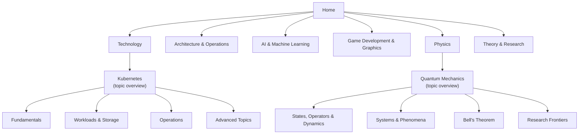

Andrew's Notebook is a reference wiki covering software infrastructure, distributed systems, machine learning, physics, and theoretical computer science. This page explains how the site is organized, the kinds of pages you will meet, the tools for finding a page, and where to start for common roles.

## How the site is organized

Content is arranged in three levels. Each **section** covers a broad field and has a **hub** page that orients you and recommends reading orders. Each section contains **topics**, and each topic has an **overview page** that introduces the core ideas and links to its **sub-pages**, which each treat one aspect in depth.

The six sections and their entry points:

| Section | Covers | Start at |
|---------|--------|----------|
| Technology | Docker, Kubernetes, Terraform, AWS, CI/CD, Git, databases, networking, cybersecurity | [Technology Hub](docs/technology/) |
| Architecture & Operations | Distributed systems, API design, event-driven systems, observability, testing, performance | [Distributed Systems Hub](docs/distributed-systems/) |
| AI & Machine Learning | ML concepts and theory; hands-on diffusion image models (Stable Diffusion, FLUX, ComfyUI, LoRA) | [AI Hub](docs/artificial-intelligence/) · [Generative AI Hub](docs/ai-ml/) |
| Game Development & Graphics | Game architecture, rendering, shaders, multiplayer, XR, Unreal Engine | [Game Development](docs/gamedev/) |
| Physics | Classical mechanics, thermodynamics, relativity, quantum mechanics, QFT, condensed matter, string theory, computational physics | [Physics Hub](docs/physics/) |
| Theory & Research | Complexity, automata, cryptography, information theory, category theory, learning theory | [Advanced Topics Hub](docs/advanced/) |

The [documentation index](docs/index.html) lists every page, grouped the same way.

## Page types

Pages follow a small number of patterns. Recognizing the type tells you how to read the page.

| Type | Purpose | How to recognize it | Examples |
|------|---------|---------------------|----------|
| Hub | Orients a whole section and suggests reading paths | Section landing page; mostly short summaries and links | [Physics Hub](docs/physics/), [Distributed Systems Hub](docs/distributed-systems/) |
| Topic overview | Introduces one topic: the core idea, the vocabulary, and a map of its sub-pages | Title is the bare topic name | [Docker](docs/technology/docker/), [Relativity](docs/physics/relativity/) |
| Sub-page | Treats one aspect of a topic in depth | Title is prefixed with the topic, e.g. "Kubernetes: Operations" | [Kubernetes: Operations](docs/technology/kubernetes/operations.html), [Relativity: Black Holes](docs/physics/relativity/black-holes.html) |
| Crash course | A linear first pass for newcomers, meant to be read top to bottom | "Crash Course" in the title, or billed as a no-math introduction | [Git Crash Course](docs/technology/git-crash-course.html), [Database Crash Course](docs/technology/database-crash-course.html), [AI Fundamentals](docs/technology/ai-fundamentals-simple.html) |
| Cheat sheet | Lookup material organized by task, meant to be scanned | Dense tables and short command blocks | [Git Command Reference](docs/technology/git-reference.html), [Docker Essentials](docs/technology/docker-essentials.html), [Quick Reference](docs/reference/) |
| Research page | Graduate-level, proof-oriented treatment | Lives under Advanced Topics; opens with a level note and its prerequisites | [Computational Complexity Theory](docs/advanced/complexity-theory/), [Advanced AI Mathematics](docs/advanced/ai-mathematics/) |

## Finding a page

| Tool | Best for | Notes |
|------|----------|-------|
| Sidebar | Browsing within a section | Expands to show each topic's sub-pages |
| [Documentation index](docs/index.html) | Finding any specific page | Complete listing, one row per topic |
| [Topic map](docs/topic-map.html) | Seeing prerequisites and choosing a reading order | Interactive map plus role-based reading paths |
| [Search](search.html) | Keyword lookup | Indexes the text of the main hub and overview pages; sub-pages are reached from those or from the index |
| "See also" and inline links | Moving sideways to related material | Most substantial pages end with links to related topics |

## Reading conventions

- **Mathematics** is written in LaTeX and rendered with MathJax, inline as $E = mc^2$ and in display blocks for longer derivations.
- **Diagrams** are drawn with Mermaid or inline SVG and adapt to light and dark themes.
- **Code blocks** have a Copy button that appears on hover. Where behavior depends on a tool version, the page names the version.
- **Theme**: the site follows your operating system's light or dark preference until you choose one with the theme toggle; the choice is remembered in your browser.
- **Depth** increases within each topic: the overview page assumes little background, sub-pages build on it, and research pages state their prerequisites at the top.

## Where to start

Pick the row closest to what you do. The [Topic Map](docs/topic-map.html#reading-paths-by-role) extends each of these into a full ordered reading path.

| If you are... | Start with | Then read |
|---------------|------------|-----------|
| New to software tooling | [Git Crash Course](docs/technology/git-crash-course.html) | [Database Crash Course](docs/technology/database-crash-course.html), [Docker: Fundamentals](docs/technology/docker/fundamentals.html) |
| An application developer | [Docker](docs/technology/docker/) | [Database Design](docs/technology/database-design/), [API Design](docs/api-design/), [Unit & Integration Testing](docs/testing/unit-and-integration.html) |
| A DevOps or platform engineer | [Kubernetes](docs/technology/kubernetes/) | [Terraform](docs/technology/terraform/), [CI/CD](docs/technology/ci-cd/), [Observability](docs/observability/) |
| A cloud architect | [AWS Cloud Services](docs/technology/aws/) | [AWS Architecture Patterns](docs/technology/aws/architecture.html), [Cloud Networking](docs/technology/networking/cloud-networking.html), [Resilience Patterns](docs/distributed-systems/resilience-patterns.html) |
| A security engineer | [Cybersecurity](docs/technology/cybersecurity/) | [Cryptography](docs/technology/cybersecurity/cryptography.html), [Cloud & Container Security](docs/technology/cybersecurity/cloud-and-container-security.html) |
| Learning machine learning | [AI Fundamentals](docs/technology/ai-fundamentals-simple.html) | [ML Foundations](docs/technology/ai/ml-foundations.html), [Deep Learning Architectures](docs/technology/ai/deep-learning-architectures.html) |
| Generating images with diffusion models | [Stable Diffusion Fundamentals](docs/ai-ml/stable-diffusion-fundamentals.html) | [Base Models Comparison](docs/ai-ml/base-models-comparison.html), [ComfyUI Guide](docs/ai-ml/comfyui-guide.html), [LoRA Training](docs/ai-ml/lora-training.html) |
| A game developer | [Game Development](docs/gamedev/) | [3D Graphics & Rendering](docs/graphics/3d-rendering.html), [Multiplayer Networking](docs/gamedev/multiplayer-networking.html) |
| Studying physics | [Classical Mechanics](docs/physics/classical-mechanics/) | [Quantum Mechanics](docs/physics/quantum-mechanics/), [Relativity](docs/physics/relativity/), [Statistical Mechanics](docs/physics/statistical-mechanics/) |
| Studying theoretical computer science | [Automata Theory & Formal Languages](docs/advanced/automata-and-formal-languages/) | [Computational Complexity Theory](docs/advanced/complexity-theory/), [Information & Coding Theory](docs/advanced/information-coding-theory/) |

## Corrections and contributions

The site is maintained in the [AndrewAltimit/Documentation](https://github.com/AndrewAltimit/Documentation) repository on GitHub. Report errors or suggest additions by opening an issue; corrections are also welcome as pull requests.
